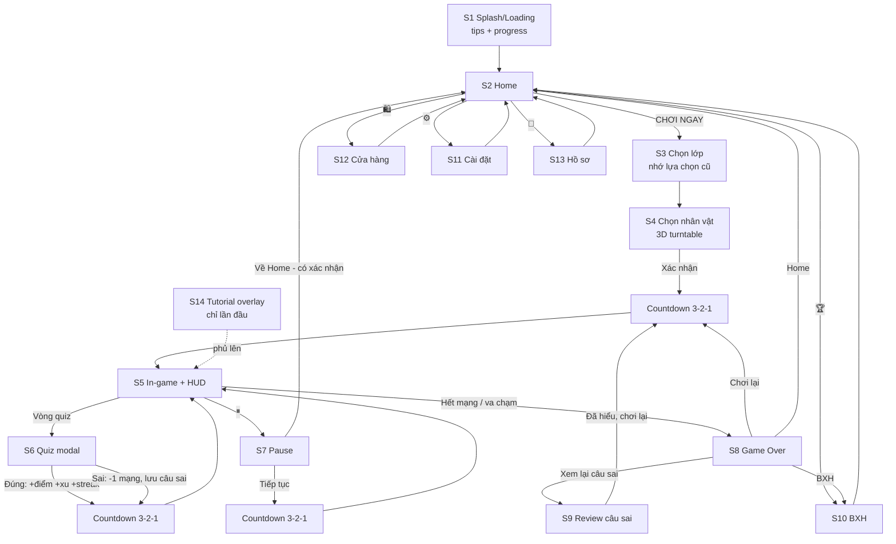

# B4 — Research UI/UX cho V2-Next (Sonic Math Runner)

> Đối tượng: học sinh VN 11–14 tuổi (lớp 6–8). Nền tảng: trình duyệt — PC phòng tin học (landscape, chuột + bàn phím) và điện thoại (portrait, chạm). Kiến trúc hiện tại: không bundler, HTML/CSS/JS thuần + Three.js, deploy Vercel.

---

## 1. Hệ thống màn hình đầy đủ

### 1.1. Danh sách màn hình

| # | Màn hình | Nội dung chính | Ghi chú so với hiện trạng |
|---|----------|----------------|---------------------------|
| S1 | **Splash / Loading** | Logo game, thanh progress THẬT (theo asset đã tải), tips học tập xoay vòng ("Mẹo: Trả lời đúng 3 câu liên tiếp để nhận x2 xu!"), animation nhân vật chạy tại chỗ | Mới hoàn toàn — hiện tại vào thẳng game |
| S2 | **Home** | Logo, nút **CHƠI NGAY** to nhất giữa màn, nhân vật 3D xoay chậm (turntable idle) phía sau/dưới logo, hàng nút phụ: BXH 🏆, Cửa hàng 🛍, Cài đặt ⚙, Hồ sơ 👤; hiển thị xu + best score | Mới — hiện tại index.html chỉ là màn chọn lớp |
| S3 | **Chọn lớp** | 3 thẻ lớn Lớp 6 / Lớp 7 / Lớp 8, nhớ lựa chọn lần trước (localStorage), có thể gộp thành bước đầu của luồng Play | Nâng cấp từ index.html hiện có |
| S4 | **Chọn nhân vật** | Preview 3D turntable (kéo/vuốt để xoay), carousel thẻ nhân vật, trạng thái: Đang dùng / Mở khóa / 🔒 Khóa (kèm giá xu hoặc điều kiện "Đạt 500 điểm lớp 7"), nút XÁC NHẬN | Nâng cấp màn chọn nhân vật hiện có; model trong `characters/` |
| S5 | **HUD in-game** | Điểm (góc trên trái, tabular numbers), xu 🪙, streak 🔥 (x2, x3...), tim/mạng ❤❤❤, thanh tiến độ tới câu hỏi kế tiếp, nút Pause (góc trên phải), khu vực toast nhỏ | Nâng cấp HUD trong EndlessRunner.htm |
| S6 | **Quiz modal (in-run)** | Game pause + blur nền, đề toán chữ to, 4 đáp án dạng nút lớn, đồng hồ thời gian (chỉ nổi bật 5s cuối), phản hồi đúng/sai tại chỗ | Đã có — cần redesign theo ngôn ngữ hình ảnh mới |
| S7 | **Pause** | Overlay mờ: Tiếp tục (to nhất), Chơi lại, Âm thanh on/off nhanh, Về trang chính (có xác nhận) | Đã có dạng thô |
| S8 | **Game Over** | Điểm vừa đạt (đếm số chạy lên), Best (badge "KỶ LỤC MỚI!" nếu phá), hạng trên BXH lớp, xu kiếm được, số câu đúng/tổng, nút **CHƠI LẠI** to, nút "Xem lại câu sai", nút Home, nút BXH | Nâng cấp lớn |
| S9 | **Review câu sai** | Danh sách câu trả lời sai trong lượt chạy: đề bài, đáp án em chọn (đỏ), đáp án đúng (xanh), lời giải ngắn nếu có; nút "Đã hiểu, chơi lại!" | Mới — giá trị giáo dục cốt lõi |
| S10 | **BXH (Leaderboard)** | Tab theo lớp 6/7/8, top 20, hàng của mình được ghim + highlight, huy chương 🥇🥈🥉 cho top 3, biệt danh + nhân vật avatar | Đã có backend — redesign UI |
| S11 | **Cài đặt** | Nhạc nền / SFX (2 toggle riêng), Rung (chỉ Android), Chất lượng đồ họa (Thấp/Vừa/Cao — ảnh hưởng shadow, particle, pixel ratio), Đổi biệt danh, Xem hướng dẫn lại | Mới |
| S12 | **Cửa hàng** | Chỉ dùng XU trong game (KHÔNG tiền thật — bối cảnh trường học), mở khóa nhân vật/skin/trail effect, hiển thị rõ giá và số xu đang có | Mới |
| S13 | **Hồ sơ** | Biệt danh + avatar nhân vật, thống kê: tổng câu đúng, độ chính xác theo chủ đề (từ skill_profiles đã có), best score, tổng xu | Mới — tận dụng dữ liệu AI thích ứng sẵn có |
| S14 | **Tutorial / FTUE** | Overlay lần chơi đầu: bàn tay animation gợi ý vuốt/né, dạy từng cơ chế một, learn-by-doing, có nút Bỏ qua, cờ `localStorage` | Mới |
| S15 | **Admin** | GIỮ NGUYÊN admin.html (chỉ cần đồng bộ token màu nếu tiện) | Không đụng |
| S16 | Overlay phụ trợ | Màn "Đang nâng cấp" (đã có), thông báo offline (PWA worker.js đã có), gợi ý xoay máy, prompt cài PWA | Tận dụng cái đã có |

### 1.2. Sơ đồ luồng màn hình (mermaid)

Nguyên tắc điều hướng (theo best practice mobile game UI): **mọi màn hình con đều có nút Quay lại rõ ràng**, luồng chính (Home → Chơi) không quá 2 chạm, các hành động phá hủy tiến trình (thoát giữa lượt chạy) phải có bước xác nhận.

---

## 2. Ngôn ngữ hình ảnh — "Playful Cartoon" cho thiếu niên 11–14

Lưu ý độ tuổi: 11–14 là nhóm "giữa" — thích màu sắc, hiệu ứng vui, NHƯNG rất ghét bị coi là trẻ con. Tránh style mẫu giáo (bo tròn quá mềm, mascot ngây ngô); nhắm tới cảm giác **năng động kiểu Subway Surfers / Brawl Stars**: màu bão hòa cao, outline đậm, tốc độ, "cool" hơn là "cute".

### 2.1. Palette đề xuất (mã màu cụ thể)

Cấu trúc 60-30-10: 60% nền sáng, 30% màu chủ đạo, 10% accent. Sáng và bão hòa cao để nhìn rõ trên màn hình điện thoại ngoài trời/sân trường.

| Vai trò | Mã màu | Dùng cho |
|---------|--------|----------|
| **Primary (xanh dương trời)** | `#2E86FF` (đậm hơn: `#1B6BE0`) | Nút chính, header, brand |
| **Primary gradient** | `#4FC3F7 → #2E86FF` | Nền menu, nút CHƠI NGAY |
| **Accent CTA (cam san hô)** | `#FF7A1A` (hover/press: `#E86400`) | Nút CHƠI NGAY, badge KỶ LỤC MỚI |
| **Vàng xu / thưởng** | `#FFC93C` (viền `#E8A800`) | Xu, sao, streak |
| **Tím phụ** | `#8B5CF6` | Cửa hàng, hiệu ứng đặc biệt, huy hiệu hiếm |
| **Đúng (xanh lá)** | `#22C55E` (nền nhạt `#DCFCE7`) | Feedback đúng — LUÔN kèm icon ✓ |
| **Sai (đỏ)** | `#EF4444` (nền nhạt `#FEE2E2`) | Feedback sai — LUÔN kèm icon ✗ |
| **Chữ chính (navy đậm)** | `#1B2A4A` | Thay cho đen thuần — thân thiện hơn mà vẫn tương phản cao trên nền trắng (~14:1) |
| **Chữ phụ** | `#5A6B8C` | Mô tả, caption |
| **Nền surface** | `#FFFFFF` / `#F4F8FF` | Card, panel, modal |
| **Nền sky (in-menu)** | `#EAF4FF` | Nền tổng |

Quy tắc tương phản: chữ trên nền phải đạt **≥ 4.5:1** (WCAG); chữ trắng chỉ đặt trên `#1B6BE0`, `#E86400`, `#1B2A4A` — KHÔNG đặt chữ trắng trên vàng `#FFC93C` (dùng navy `#1B2A4A` trên vàng). Không truyền nghĩa bằng màu đơn thuần (mù màu đỏ–lục phổ biến ở nam sinh ~8%): đúng/sai luôn có icon ✓/✗ + hình dạng khác nhau.

### 2.2. Font tiếng Việt (đã kiểm tra hỗ trợ dấu)

- **Display/Heading: [Baloo 2](https://fonts.google.com/specimen/Baloo+2)** — Google Fonts, subset **Vietnamese chính thức** (Latin, Latin Extended, Vietnamese), 5 weight (Regular→ExtraBold), dáng tròn mập rất hợp game cartoon. Dùng weight 700–800 cho tiêu đề, số điểm, tên nút.
- **Body/UI: [Nunito](https://fonts.google.com/specimen/Nunito?subset=vietnamese)** — subset Vietnamese chính thức, dễ đọc ở cỡ nhỏ, hợp cho đề toán và nội dung dài. (Nunito Sans cũng có Vietnamese nếu muốn trung tính hơn.)
- Kỹ thuật: **self-host woff2** subset `vietnamese+latin` (mạng trường học chậm/chặn CDN), `font-display: swap`, preload 2 file chính. Với số điểm chạy trong HUD: `font-variant-numeric: tabular-nums` để số không "nhảy" bề ngang.
- Fallback stack: `"Baloo 2", "Nunito", system-ui, -apple-system, "Segoe UI", sans-serif`.

### 2.3. Nút, hiệu ứng, chất liệu

- **Nút to bo tròn**: radius 14–20px (không tròn full — tròn full trông "bé"), có "đáy" đậm 3–4px (`box-shadow: 0 4px 0 <màu đậm>`) tạo cảm giác nút vật lý bấm được; khi press: dịch xuống 3px + bỏ đáy (hiệu ứng nhấn thật).
- **Bounce/scale khi bấm**: `transform: scale(0.96)` khi `:active`, trở về bằng `transition: transform 120ms cubic-bezier(.34,1.56,.64,1)` (overshoot nhẹ = cảm giác đàn hồi). Khi xuất hiện: keyframe `pop-in` scale 0.8→1.05→1 trong 250ms.
- **Gradient + glow tiết chế**: gradient chỉ trên nút chính và nền menu (2 stop, cùng hue); glow chỉ cho trạng thái đặc biệt (nhân vật mới mở khóa, KỶ LỤC MỚI) — không glow đại trà gây rối và tốn GPU mobile.
- **Iconography**: bộ icon outline đậm 2.5–3px stroke, bo tròn đầu nét, tô màu phẳng bên trong (kiểu "sticker"); dùng emoji có sẵn cho prototype (🏆🪙⚙❤🔥) rồi thay bằng SVG inline đồng bộ (khuyến nghị vẽ theo grid 24px, hoặc dùng bộ mở như Phosphor/Lucide bold + tô màu). Icon LUÔN kèm nhãn chữ ở màn menu (trẻ 11–14 đọc tốt, nhãn giúp không đoán mò).
- **Card/panel**: nền trắng, radius 20–24px, viền 2px màu nhạt hoặc shadow mềm `0 8px 24px rgba(27,42,74,.12)`.

---

## 3. UI stack kỹ thuật

### 3.1. HTML/CSS overlay vs in-engine UI → **Khuyến nghị: HTML/CSS overlay (DOM) cho ~95% UI**

Lý do (khớp research + hiện trạng repo):
- Repo không có bundler, toàn bộ UI hiện tại đã là DOM inline trong EndlessRunner.htm — overlay DOM là con đường ít rủi ro nhất.
- DOM cho miễn phí: text tiếng Việt có dấu render chuẩn, wrap dòng, font, accessibility, CSS transition/hover, media query responsive — những thứ làm trong WebGL (three-mesh-ui, sprite text) rất tốn công và render dấu tiếng Việt kém.
- HUD DOM đè trên canvas không tốn draw call của scene; game vẫn 60fps miễn là tránh reflow liên tục (cập nhật điểm bằng `textContent` + transform, không đổi layout).
- **Ngoại lệ dùng in-engine (Three.js)**: nhân vật 3D turntable ở Home/Chọn nhân vật (chính là scene 3D — render vào canvas riêng hoặc viewport phụ của renderer chính), các vật thể thế giới (cổng quiz, xu, particle 3D). KHÔNG làm nút bấm trong WebGL.
- Kiến trúc gợi ý: 1 canvas WebGL full-screen + 1 lớp `#ui-root` `position:fixed; inset:0; pointer-events:none;` — từng panel con bật `pointer-events:auto`. Quản lý màn hình bằng state machine đơn giản (`data-screen="home|game|pause|..."` trên root, CSS điều khiển hiện/ẩn kèm transition).

### 3.2. Animation UI: **CSS transitions/keyframes là đủ, chưa cần GSAP**

- Research 2026 thống nhất: CSS lo ~80% nhu cầu UI animation với 0KB bundle, chạy trên compositor thread nên không bị JS game loop block; GSAP chỉ đáng khi cần timeline phối hợp phức tạp.
- Khuyến nghị cụ thể:
  - CSS transition/keyframes: press, pop-in, slide panel, fade, pulse, shake sai, countdown scale.
  - **Web Animations API (WAAPI)** — có sẵn trong trình duyệt — cho các chuỗi cần điều khiển bằng JS: đếm số điểm chạy lên ở Game Over, floating text "+10", confetti burst.
  - Chỉ thêm GSAP core (~28KB gzip, load từ file tự host vì không có bundler) NẾU sau này cần celebration sequence nhiều bước; không phải dependency bắt buộc của V2.
  - Tôn trọng `prefers-reduced-motion` (xem mục 5).

### 3.3. Responsive & orientation: **Hỗ trợ CẢ HAI, portrait-first trên mobile**

- Chuẩn thể loại: Subway Surfers/Temple Run chạy **portrait** — cầm 1 tay, vuốt ngón cái, nhìn xa sâu vào đường chạy. Trên PC phòng tin học màn hình 16:9 → landscape với phím mũi tên/WASD. Vậy **không khóa portrait**, mà:
  - Mobile portrait = layout chính (thiết kế trước).
  - Landscape (PC + máy tính bảng + điện thoại xoay ngang) = layout thứ hai: HUD dàn 2 góc trên, quiz modal 2 cột (đề trái, đáp án phải) nếu đủ rộng.
  - Camera/FOV Three.js điều chỉnh theo aspect ratio (portrait tăng FOV dọc hoặc lùi camera để thấy đủ 3 làn).
- **Vì sao không khóa cứng**: `screen.orientation.lock()` chỉ hoạt động trong Fullscreen API và **không được iOS Safari hỗ trợ** — tức không thể khóa trên iPhone. Giải pháp thực dụng: hỗ trợ cả hai + overlay "Xoay dọc máy để chơi thoải mái hơn 📱" (chỉ gợi ý, có nút bỏ qua) khi phát hiện điện thoại đang landscape ở màn menu; PWA manifest đặt `"orientation": "portrait"` (có tác dụng khi cài lên màn hình chính — worker.js/manifest đã có sẵn nền PWA).
- **Safe-area notch**: bắt buộc meta `viewport-fit=cover` (không có thì mọi `env(safe-area-inset-*)` = 0 và Safari letterbox màn ngang); HUD và nút Pause padding `max(12px, env(safe-area-inset-top))` v.v.; canvas game vẫn tràn full màn, chỉ đẩy UI khỏi vùng tai thỏ.
- **Touch target**: tối thiểu 48×48px (chuẩn Android/Material; Apple 44pt; WCAG 2.5.8 AA chỉ đòi 24px nhưng với thiếu niên dùng chuẩn cao hơn), khoảng cách giữa các target ≥ 8px; nút đáp án quiz cao **≥ 56–64px** full-width; nút CHƠI NGAY ≥ 64px cao.

---

## 4. Juice & Feedback

### 4.1. Trả lời ĐÚNG
- Nút đáp án nháy nền xanh `#22C55E` + icon ✓ scale-pop; viền glow xanh 400ms.
- Particle burst sao/confetti từ nút (15–25 hạt, DOM hoặc canvas 2D overlay — không cần particle 3D cho UI).
- Floating text "+10 điểm" (+ "🔥 Streak x3!" nếu có) bay lên rồi mờ (WAAPI, 700ms).
- Âm: "ding" sáng, ngắn <300ms; streak cao thì pitch tăng dần (rất "juicy", dễ làm với WebAudio `playbackRate`).
- Rung nhẹ `navigator.vibrate(40)` — **chỉ Android/Chrome; iOS Safari không hỗ trợ Vibration API → luôn feature-detect và im lặng bỏ qua**, đừng coi là kênh feedback chính.
- Nhịp chuyển: sau feedback ~800ms → countdown → chạy tiếp (giữ flow nhanh).

### 4.2. Trả lời SAI
- CHỈ nút đã chọn shake ngang + nền đỏ `#FEE2E2` + ✗; **đồng thời highlight đáp án đúng màu xanh** (giá trị học tập).
- Vignette đỏ mỏng viền màn 300ms; **KHÔNG screen-shake toàn màn** (research về "juice problem": phạt quá tay gây ức chế, đặc biệt với trẻ em).
- Âm "buzz" trầm ngắn, không chế giễu; rung `navigator.vibrate([30,50,30])` (Android).
- Hiện 1 dòng giải thích ngắn nếu câu hỏi có, kèm nút "Hiểu rồi" → câu sai tự lưu vào danh sách Review (S9).
- Mất tim: icon ❤ vỡ/xám kèm scale-down — thấy rõ nhưng không kịch tính hóa.

### 4.3. Countdown 3-2-1
- Dùng ở 3 chỗ: bắt đầu lượt chạy, sau khi đóng quiz, sau khi resume pause (chuẩn Temple Run/Subway Surfers — người chơi cần thời gian đặt lại phản xạ).
- Mỗi số ~700ms: scale 1.6→1 + fade, đổi màu 3 (vàng) → 2 (cam) → 1 (xanh) → "CHẠY!"; kèm tick âm. Test kỹ để không bị lỗi kinh điển "bắt đầu từ 2" ở lần pause đầu.

### 4.4. Tutorial lần đầu (FTUE)
- Learn-by-doing, mỗi lần dạy 1 cơ chế: overlay tối 40% + bàn tay SVG animation vuốt (loop), chữ ngắn "Vuốt để né!"; game chạy chậm/tạm dừng chờ người chơi làm đúng rồi mới sang cơ chế kế.
- Highlight glow vào phần tử cần chú ý (nút pause, thanh câu hỏi) thay vì viết đoạn văn.
- Có nút "Bỏ qua" (nhóm 11–14 nhiều em chơi runner rồi, ép xem sẽ gây khó chịu); cờ `tutorialDone` trong localStorage; Cài đặt có "Xem hướng dẫn lại".

### 4.5. Toast & unlock
- Toast trượt từ trên xuống (dưới safe-area), icon + 1 dòng: "🎉 Mở khóa Robot!", auto tắt 3s, chạm để mở Cửa hàng/Chọn nhân vật; tối đa 1 toast một lúc, hàng đợi.
- Unlock lớn (nhân vật mới) ở Game Over: card riêng với glow + confetti, KHÔNG chen vào giữa lượt chạy.

---

## 5. Accessibility & thiết kế cho trẻ em

- **Cỡ chữ**: HUD tối thiểu 16px (điểm/xu nên 20–24px vì liếc khi đang chạy); đề toán trong quiz **20–24px**, đáp án 18–20px, line-height 1.5; tiêu đề 28–40px. Mọi text đạt contrast ≥ 4.5:1.
- **Thời gian đọc đề toán**: game đã pause khi quiz (đúng hướng — giữ nguyên). Thời gian đếm ngược cấu hình được qua Admin (đã có sẵn) — khuyến nghị mặc định theo công thức: `10s + 1s/10 ký tự đề`, tối thiểu 15s lớp 6; **đồng hồ chỉ đổi màu đỏ + pulse ở 5 giây cuối** (áp lực thời gian liên tục làm học sinh yếu đọc chậm bị thiệt kép); và **khóa nút đáp án 400ms đầu** sau khi modal hiện để chống bấm nhầm do đang vuốt né.
- **Chống bấm nhầm**: nút Pause đặt góc trên (xa vùng vuốt giữa màn); thoát giữa lượt chạy phải xác nhận 2 bước; debounce mọi nút 300ms; không đặt 2 nút hệ quả ngược nhau (Chơi lại / Về Home) sát nhau dưới 16px.
- **Không dark pattern** (bối cảnh trường học + FTC/COPPA ngày càng siết): không tiền thật, không quảng cáo, không fake-urgency ("Chỉ còn 5 phút!"), không lối "lắc đầu buồn" khi từ chối, không notification dụ quay lại; Cửa hàng ghi giá xu rõ ràng, nút Đóng luôn dễ thấy; dữ liệu cá nhân chỉ biệt danh + deviceId (đang đúng hướng).
- **Giảm chuyển động**: `@media (prefers-reduced-motion: reduce)` → tắt confetti/shake/parallax menu, giữ đổi màu + icon.
- **Mù màu**: đúng/sai luôn có icon ✓/✗ và vị trí/hình dạng phân biệt, không chỉ màu.
- **Bàn phím (PC phòng tin học)**: chọn đáp án bằng phím 1–4, Enter xác nhận, Esc = pause; focus ring rõ (viền 3px vàng `#FFC93C`).
- **Âm thanh không bắt buộc**: mọi feedback âm đều có kênh hình ảnh tương đương (nhiều máy phòng tin học không loa/tai nghe).

---

## 6. CHECKLIST component UI cần build (V2)

### Nền tảng (làm trước tiên)
- [ ] `ui-tokens.css` — CSS custom properties: bảng màu mục 2.1, spacing scale (4/8/12/16/24/32), radius (14/20/24), shadow, z-index layer (canvas 0 / hud 10 / modal 50 / toast 60 / overlay hệ thống 100)
- [ ] Nạp font tự host: Baloo 2 (700, 800) + Nunito (400, 600, 700) subset vietnamese+latin, woff2, preload, `font-display: swap`
- [ ] `#ui-root` overlay + screen state machine (`data-screen`), transition giữa màn 200–300ms
- [ ] SafeArea utility class (`padding: max(12px, env(safe-area-inset-*))`) + meta `viewport-fit=cover`
- [ ] Helper `haptic(pattern)` (feature-detect `navigator.vibrate`) + SFX manager (WebAudio, preload, toggle riêng nhạc/SFX)
- [ ] Hỗ trợ `prefers-reduced-motion` xuyên suốt

### Component tái sử dụng
- [ ] `Button` — biến thể: primary (gradient + đáy 4px), secondary (viền), icon-button 48px, danger; press scale 0.96 + bounce; trạng thái disabled
- [ ] `Card/Panel` bo tròn 20–24px + shadow mềm
- [ ] `Modal` (nền blur/tối 50%, pop-in, khóa input 400ms đầu, đóng bằng nút rõ ràng — không đóng khi chạm nền với modal quan trọng)
- [ ] `Toast` (hàng đợi, auto-dismiss 3s, tap-action)
- [ ] `Badge/Chip` (KỶ LỤC MỚI, streak, 🔒 khóa)
- [ ] `Tabs` (BXH lớp 6/7/8)
- [ ] `Toggle` + `Slider` (Cài đặt) — target ≥ 48px
- [ ] `ConfirmDialog` 2 bước cho hành động phá hủy
- [ ] `CountUpNumber` (WAAPI/rAF, tabular-nums) cho điểm Game Over

### HUD in-game
- [ ] `ScoreCounter` (tabular-nums, tween khi cộng)
- [ ] `CoinCounter` 🪙 + hiệu ứng hút xu về counter
- [ ] `StreakMeter` 🔥 x2/x3 (pulse khi tăng)
- [ ] `LivesHearts` ❤ (anim vỡ khi mất)
- [ ] `QuestionProgressBar` (tiến độ tới cổng quiz kế)
- [ ] `PauseButton` góc trên phải trong safe-area
- [ ] `FloatingText` (+10, +xu) và `ParticleBurst` (confetti/sao, DOM hoặc canvas 2D overlay)
- [ ] `Vignette` flash đỏ/xanh viền màn

### Màn hình
- [ ] S1 LoadingScreen: progress thật theo asset + mảng tips xoay vòng (đặt tips trong file JS/JSON để admin bổ sung sau)
- [ ] S2 HomeScreen: logo, CHƠI NGAY, viewport nhân vật 3D idle-turntable, 4 nút phụ có nhãn chữ
- [ ] S3 GradeSelect: 3 thẻ lớn, nhớ lựa chọn (localStorage)
- [ ] S4 CharacterSelect: 3D turntable (kéo xoay + auto-rotate), carousel thẻ, lock state + điều kiện mở, nút Xác nhận
- [ ] S6 QuizModal: đề 20–24px, 4 nút đáp án ≥56px, timer đổi màu 5s cuối, feedback đúng/sai + highlight đáp án đúng, phím 1–4
- [ ] S7 PauseMenu + CountdownOverlay 3-2-1 (dùng chung cho start/resume/sau-quiz)
- [ ] S8 GameOverScreen: điểm count-up, best/badge kỷ lục, hạng BXH, xu, câu đúng/tổng, 4 nút điều hướng
- [ ] S9 WrongAnswerReview: list câu sai (đề, đáp án chọn, đáp án đúng, giải thích), lưu theo lượt chạy
- [ ] S10 Leaderboard: tabs lớp, top 20, hàng của mình ghim + highlight, huy chương top 3
- [ ] S11 SettingsScreen: nhạc/SFX/rung/chất lượng đồ họa/đổi biệt danh/xem lại tutorial
- [ ] S12 ShopScreen: grid item, giá xu, trạng thái sở hữu, xác nhận mua
- [ ] S13 ProfileScreen: thống kê từ skill_profiles + best + tổng xu
- [ ] S14 TutorialOverlay: bàn tay SVG animation vuốt, highlight glow, từng bước, nút Bỏ qua, cờ localStorage
- [ ] OrientationHint (gợi ý xoay dọc trên mobile-landscape, bỏ qua được) + cập nhật manifest PWA `"orientation": "portrait"`

### QA checklist UI
- [ ] Test portrait 360×640 (điện thoại phổ thông VN), 390×844 (iPhone), landscape 1366×768 & 1920×1080 (PC phòng tin học)
- [ ] Kiểm tra contrast mọi cặp màu bằng công cụ (mục tiêu ≥ 4.5:1)
- [ ] Test notch iOS (safe-area) + test không loa + test không rung (iOS)
- [ ] Test countdown không bị lỗi "bắt đầu từ 2" ở pause đầu tiên
- [ ] Touch target audit ≥ 48px toàn bộ

---

## Nguồn tham khảo (Sources)

- [A Technical Guide to Mobile Game UI/UX Design — Appnality](https://www.appnality.com/blog/guide-to-mobile-game-ui-ux-design/)
- [Mobile Game UI/UX Top 10 Best Practices — LinkedIn/Troy Dunniway](https://www.linkedin.com/pulse/mobile-game-uiux-top-10-best-practices-troy-dunniway)
- [Game UI Database — Subway Surfers](https://www.gameuidatabase.com/gameData.php?id=1311)
- [Design analysis: Plants vs. Zombies & Subway Surfers — Medium](https://medium.com/@writer_angel/design-analysis-of-my-favorite-childhood-desktop-games-plants-vs-zombies-and-subway-surfers-c72ff0b3fcae)
- [Navigating The Dark Patterns Of Subway Surfer's UI — Medium](https://akinadesign.medium.com/navigating-the-dark-patterns-of-subway-surfers-user-interface-ab3af0f97edb)
- [Mixing HTML and WebGL — Three.js Journey](https://threejs-journey.com/lessons/mixing-html-and-webgl)
- [HTML and WebGL Integration with Three.js — IGC](https://www.intelligentgraphicandcode.com/development/threejs-interfaces/html-integration)
- [three-mesh-ui (UI in-engine cho Three.js)](https://github.com/gonnavis/three-mesh-ui)
- [Baloo 2 — Google Fonts (hỗ trợ Vietnamese)](https://fonts.google.com/specimen/Baloo+2)
- [Nunito — Google Fonts (subset Vietnamese)](https://fonts.google.com/specimen/Nunito?subset=vietnamese)
- [Screen: orientation property — MDN](https://developer.mozilla.org/en-US/docs/Web/API/Screen/orientation)
- [Screen Orientation API — W3C](https://www.w3.org/TR/screen-orientation/)
- [env() CSS function — MDN](https://developer.mozilla.org/en-US/docs/Web/CSS/Reference/Values/env)
- [Using safe-area-inset — Polypane](https://polypane.app/blog/using-safe-area-inset-to-build-mobile-safe-layouts/)
- [A Guide To Full Screen WebView And Notch/Cutout](https://ruoyusun.com/2020/10/21/webview-fullscreen-notch.html)
- [All accessible touch target sizes — LogRocket](https://blog.logrocket.com/ux-design/all-accessible-touch-target-sizes/)
- [Accessible Target Sizes Cheatsheet — Smashing Magazine](https://www.smashingmagazine.com/2023/04/accessible-tap-target-sizes-rage-taps-clicks/)
- [Touch target size — Android Accessibility Help](https://support.google.com/accessibility/android/answer/7101858?hl=en)
- [Juice in Game Design — Blood Moon Interactive](https://www.bloodmooninteractive.com/articles/juice.html)
- [The "Juice" Problem — Wayline](https://www.wayline.io/blog/the-juice-problem-how-exaggerated-feedback-is-harming-game-design)
- [Game feedback: Flash, Shake, Floating Text, Sound, Particle — BetterLink](https://eastondev.com/blog/en/posts/dev/20260521-game-feedback-feel/)
- [Vibration API — Can I use (iOS Safari không hỗ trợ)](https://caniuse.com/mdn-api_navigator_vibrate)
- [Best practice countdown timer khi resume — Unity Discussions](https://discussions.unity.com/t/best-practice-for-countdown-timer-on-game-resume/67768)
- [Game Design Rules: Loading Screens — Game Developer](https://www.gamedeveloper.com/design/game-design-rules-loading-screens)
- [Mobile Game Onboarding: Top UX Strategies — Medium](https://medium.com/@amol346bhalerao/mobile-game-onboarding-top-ux-strategies-that-boost-retention-6ef266f433cb)
- [Best Practices For Mobile Game Onboarding — Adrian Crook](https://adriancrook.com/best-practices-for-mobile-game-onboarding/)
- [UX Design for Teenagers (13–17) — NN/g](https://www.nngroup.com/reports/teenagers-on-the-web/)
- [UX Design for Children (3–12) — NN/g](https://www.nngroup.com/reports/children-on-the-web/)
- [Designing for Kids: Cognitive Considerations — NN/g](https://www.nngroup.com/articles/kids-cognition/)
- [Deceptive patterns in apps for children — ScienceDirect](https://www.sciencedirect.com/science/article/pii/S2212868926000024)
- [FTC Scrutiny of Dark Patterns & Children's Privacy — Bloomberg Law](https://news.bloomberglaw.com/us-law-week/ftc-is-escalating-scrutiny-of-dark-patterns-childrens-privacy)
- [Use an easily readable default font size — Game Accessibility Guidelines](https://gameaccessibilityguidelines.com/use-an-easily-readable-default-font-size/)
- [Font Size Guidelines for Mobile Readability — Robust Branding](https://robustbranding.com/font-size-guidelines-for-mobile-readability/)
- [GSAP vs CSS Animation — Animation Machine](https://animation-machine.com/articles/gsap-vs-css-animation-guide)
- [CSS and JavaScript animation performance — MDN](https://developer.mozilla.org/en-US/docs/Web/Performance/Guides/CSS_JavaScript_animation_performance)
- [Kids Color Palette Ideas — Media.io](https://www.media.io/color-palette/kids-color-palette.html)
