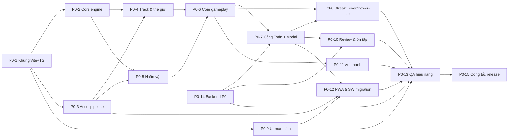

# TASKS V2 — Bảng công việc chi tiết cho AI agents ("Toán Runner")

> **Phiên bản:** 1.0 — soạn 2026-07-26. Tài liệu cặp đôi của [plan-version2.md](plan-version2.md) (đọc plan TRƯỚC khi nhận task).
> **Cách dùng:** mỗi task có mã `P{phase}-{số}`, mô tả việc, file đích, phụ thuộc, và **Tiêu chí nghiệm thu (DoD)**. Agent nhận task → đọc mục "Tham chiếu" → làm theo checklist → tự chạy test/DoD → đánh dấu `[x]` vào checklist trong file này kèm commit.

---

## 0. Quy tắc vàng cho mọi agent (đọc trước khi làm bất kỳ task nào)

1. **Không mở lại quyết định thiết kế** — 18 quyết định Q1–Q18 trong plan §3 là chốt. Muốn đổi: dừng, nêu ở PR, chờ duyệt.
2. **Hợp đồng tích hợp (plan §7.3) là bất khả xâm phạm:** chữ ký `window.QuestionBank`, 13 API endpoint, 5 khóa localStorage `-v1`, ngữ nghĩa `gameSpeed` admin, kịch bản chuyển tiếp Service Worker. Mọi key/bảng/route MỚI đều là bổ sung (`-v2`, `IF NOT EXISTS`, route mới).
3. **Tầng chạm `window.QuestionBank` duy nhất là `client/src/integration/questionBridge.ts`.** Không import/gọi QuestionBank ở bất kỳ file nào khác.
4. **Không sửa** `questionBank.js`, `shared/questionModel.js`, `server/*`, `vercel.json` trừ khi task ghi rõ. PR chạm `shared/` hoặc `server/` bắt buộc chạy full test.
5. **Mọi hằng số game-feel** (tốc độ, thời lượng, khoảng cách, hệ số…) đặt trong `client/src/tuning.ts` — không rải magic number.
6. **Cấm cấp phát trong game loop:** không `new`, không `dispose`, không tạo closure/array mới mỗi frame trong đường nóng — dùng pool.
7. **Asset:** chỉ dùng nguồn đã thẩm định trong docs/v2/B1 (CC0/OFL) hoặc tự dựng. **Cấm mọi asset Sonic/SEGA và fan-art IP.** Mỗi asset thêm mới phải ghi vào `docs/LICENSE-ASSETS.md`.
8. **Ngân sách hiệu năng (plan §6.3):** initial ≤10MB, nhân vật ≤500KB, biome ≤3MB, <100 draw calls. CI có budget-check; đừng chờ CI — tự kiểm bằng `?debug`.
9. **Tiếng Việt là ngôn ngữ chính của UI** (giữ khung i18n vi/en như V1 nếu tiện, vi là bắt buộc). Text đề bài luôn là DOM, không canvas (trừ chữ trên cổng 3D).
10. **Định nghĩa hoàn thành (DoD chung), áp cho MỌI task:** code TypeScript strict qua `tsc --noEmit`; `npm test` xanh (gồm contract-test khi đã có); không lỗi console khi chạy happy path; cập nhật checklist task này; commit message tiếng Anh `feat(v2)/fix(v2)/chore(v2): ...`.
11. **Nhánh làm việc:** `v2/<mã-task>-<mô-tả-ngắn>` (vd `v2/p0-07-quiz-gate`). Không commit thẳng vào nhánh chính của đợt V2.
12. **Khi task ghi "port từ V1":** mở `EndlessRunner.htm` theo số dòng trong docs/v2/A1, dịch logic sang TS — không copy nguyên `var`/global style.

### Trạng thái & phụ thuộc tổng quát

Có thể chạy song song: (P0-2 ∥ P0-3), (P0-4 ∥ P0-5), (P0-7 ∥ P0-9 ∥ P0-11), (P0-8 ∥ P0-10). P0-14 (backend) độc lập, làm sớm được ngay sau P0-1. **P0-15 (công tắc release) luôn làm CUỐI CÙNG, sau khi P0-13 nghiệm thu.**

---

## 1. GIAI ĐOẠN CHUẨN BỊ (M0) — trước khi code

### [ ] M0-1 · Chốt 6 câu hỏi với khách hàng — *chủ dự án (con người), 0.5 ngày*
Gửi khách 6 câu hỏi ở plan §11. Nếu sau 3 ngày chưa có trả lời → toàn đội dùng khuyến nghị mặc định, ghi rõ vào PR đầu tiên.
**DoD:** file `docs/v2/DECISIONS-KHACH.md` ghi câu trả lời (hoặc "dùng mặc định từ ngày …").

### [ ] M0-2 · Thiết bị baseline & môi trường QA — *0.5 ngày*
Ghi nhận cấu hình PC phòng tin học yếu nhất + điện thoại phổ biến (từ khách, hoặc mặc định: i3 gen 6/4GB/Chrome ≥100, Android 9+/2GB, iOS 15+). Thiết lập cách đo: Chrome DevTools CPU throttle 4×, viewport 360×640 và 1366×768.
**DoD:** mục "Baseline" trong `docs/v2/DECISIONS-KHACH.md`; mọi task QA sau này đo trên cấu hình đó.

### [ ] M0-3 · Khóa văn bản phạm vi P0 — *0.25 ngày*
Sau M0-1: rà lại danh sách task P0 dưới đây, gạch bỏ/bổ sung theo trả lời của khách, tag git `v2-scope-p0-locked`.
**DoD:** tag tồn tại; mọi ý tưởng mới sau thời điểm này vào mục "Backlog P2+" cuối file.

---

## 2. PHASE P0 — "Bản thay thế V1" (≈40 ngày-agent — bảng dưới cộng 40.5)

### [x] P0-1 · Khung dự án Vite + TypeScript + contract-test — *2 ngày*
**Mục tiêu:** monorepo-lite: client Vite mới sống cạnh backend cũ, CI chạy test + build, contract-test bảo vệ hợp đồng V1.
**Việc cần làm:**
- [x] Tạo `client/` theo cây thư mục plan §7.2; `npm create vite` (vanilla-ts), `tsconfig` strict, alias `@/` → `client/src`.
- [x] Cài `three@0.185.x`, `howler`, `postprocessing`; devDeps: `vite-plugin-pwa`, `@gltf-transform/cli`.
- [x] Vite MPA 2 entry (`client/index.html`, `client/admin.html` — admin tạm thời chỉ là trang redirect sang `/admin.html` legacy, sẽ thay ở P2); `server.proxy` `/api` → `http://localhost:3000`.
- [x] Script npm mới ở root: `dev:client`, `build:client`, `assets:build` (stub), `test:contract`.
- [x] Sửa `scripts/vercel-build.js`: thứ tự mới `vite build → outDir public/v2/` (điều khiển bằng env `V2_ROOT`, mặc định `v2`; **chuyển outDir về `public/` chỉ thực hiện ở P0-15**) + copy legacy **đúng danh sách staticFiles hiện có** (12 file — gồm cả `EndlessRunner.htm/.js`, `index.html`, `worker.js`: V1 còn phục vụ tại `/` cho tới P0-15) + **bổ sung `shared/questionModel.js`** (hiện chưa được copy — lỗ hổng ghi ở docs/v2/A3 §3.2). **KHÔNG copy `questions/` ra public** (server đang chặn 404 có chủ đích — `server/app.js:158-179`). KHÔNG sửa `vercel.json`.
- [x] **Contract-test** (`test/contract.test.js`, chạy bằng `node --test` như test hiện có):
  - shape 13 endpoint (đối chiếu docs/v2/A2 §2): gọi qua supertest, assert field bắt buộc của response;
  - khóa localStorage khai báo tập trung trong 1 module hằng số (`client/src/core/storageKeys.ts`); luật test: **5 khóa `-v1` phải khớp CHÍNH XÁC danh sách vàng bất biến** (`endlessrunner-question-progress-v1`, `endlessrunner-device-id-v1`, `endlessrunner-nickname-v1`, `endlessrunner-skill-profile-v1`, `endlessrunner-character-v1`); **mọi khóa mới chỉ cần đúng hậu tố `-v2`** (khởi tạo sẵn: `wallet-v2`, `review-queue-v2`, `settings-v2`, `ftue-v2`; P1 sẽ thêm `unlocks-v2`, `missions-v2`);
  - chữ ký `window.QuestionBank` (load `questionModel.js` + `questionBank.js` trong môi trường test, assert `typeof` **16 member — danh sách vàng:** `getLevelBundle`, `getAdaptiveSpeedFactor`, `filterAvailableQuestions`, `orderQuestionsBySkill`, `getAnsweredIdMap`, `markQuestionShown`, `markQuestionResult`, `updateSkillProfileAfterGame`, `submitScore`, `getLeaderboard`, `getNickname`, `setNickname`, `LEVEL_LABELS`, `GAME_SPEED_DEFAULT`, `GAME_SPEED_MIN`, `GAME_SPEED_MAX`).
- [x] GitHub Actions (hoặc script `npm run ci`): `tsc --noEmit` + `node --test` + `vite build` + budget-check stub. *(Chọn phương án `npm run ci` — script tại root, không phụ thuộc GitHub.)*
**Tham chiếu:** plan §7.1–7.3; docs/v2/A3 (build pipeline), A2 (API/SW).
**DoD:** `npm run dev:client` mở trang trắng có canvas ba chiều quay 1 cube (smoke); `npm run ci` xanh; deploy preview Vercel vẫn phục vụ V1 bình thường (V2 chưa chiếm route `/` — build tạm ra `public/v2/` cho đến P0-15, cấu hình bằng env `V2_ROOT`).

### [x] P0-2 · Core engine: loop, renderer, input, quality, tuning — *3 ngày* (phụ thuộc P0-1)
**Việc cần làm:**
- [x] `core/Engine.ts`: fixed timestep 60Hz (accumulator), `update(dt)`/`render(alpha)` tách bạch, clamp dt ≤ 1/30, pause khi `visibilitychange` + reset clock (cơ chế tương đương `resetAnimationClock` V1 đã có — `EndlessRunner.htm:533-542`; V2 gom về Engine).
- [x] `core/Renderer.ts`: WebGLRenderer (antialias theo preset), `outputColorSpace = SRGBColorSpace`, `toneMapping = ACESFilmicToneMapping`, shadowMap PCF, `setPixelRatio(min(devicePixelRatio, 2))`, resize theo container. Renderer là module duy nhất biết WebGL (Q18).
- [x] `core/Quality.ts`: 3 preset Thấp/Vừa/Cao (bảng: DPR, shadow size on/off, bloom on/off, mật độ particle); auto-detect lần đầu (đo fps 3s đầu ván); **auto-quality runtime: tụt fps → hạ DPR 2→1.5→1 trước, rồi shadow, rồi bloom**; lưu lựa chọn tay vào `endlessrunner-settings-v2`.
- [x] `core/Input.ts`: Pointer Events (swipe 4 hướng, ngưỡng 30–50px hoặc vận tốc, `touch-action:none`, `pointercancel`) + bàn phím (mapping plan §4.1) → phát action trừu tượng `laneLeft/laneRight/jump/slide/pause/answer(n)`; **input buffer 150ms**.
- [x] `tuning.ts`: khởi tạo mọi hằng số đã nêu trong plan §4 (lane x, thời gian tween/nhảy/trượt, ramp, telegraph…), kèm chú thích đơn vị.
- [x] `?debug` overlay: fps/frame-time đồ thị mini, draw calls (`renderer.info`), số object pool, panel chỉnh nóng các giá trị `tuning.ts` (dat-gui tự viết tối giản bằng DOM, không thêm lib).
**Tham chiếu:** docs/v2/B2 (mục renderer/perf); A1 §1 (lỗi V1 cần tránh).
**Ghi chú thực thi:** DoD được nghiệm bằng **test tất định** `test/engine-core.test.js` (10 test, chạy dưới `node --test` qua harness esbuild `test-helpers/clientModule.js`) — trình duyệt nhúng của môi trường agent đóng băng `requestAnimationFrame` nên không đo được fps thật ở đây; đo fps trên máy thật thuộc P0-13. Panel `?debug` đã kiểm trực tiếp trên trang: 102 nút chỉnh nóng, sửa `player.jumpDurationSec` 0.55→0.95 ăn ngay, bộ lọc hoạt động.

**DoD:** demo scene (cube + sàn) chạy 60fps; kéo thả throttle CPU 4× vẫn không đổi tốc độ vật lý (fixed timestep); bấm giữ ←→ liên tục không nuốt lệnh; `?debug` hiển thị và chỉnh được 1 giá trị tuning thấy hiệu quả ngay.

### [ ] P0-3 · Asset pipeline + tải bộ asset P0 + hồ sơ license — *2 ngày* (phụ thuộc P0-1; làm sớm tuần 1 — rủi ro R9)
**Việc cần làm:**
- [ ] Tải bộ asset P0 theo danh mục plan §6.2 (nguồn + URL trong docs/v2/B1): KayKit Adventurers (Knight) + Character Animations; Quaternius Animal Pack (chọn 2 con: gợi ý Ngựa/Sói + Chim); Kenney City Kit Roads + Suburban + Nature Kit + Platformer Kit + Particle Pack + Game Icons; audio Tallbeard + Kenney (4 nhóm); font Baloo 2 + Nunito WOFF2 subset vietnamese+latin (dùng gwfh.mranftl.com).
- [ ] Lưu file NGUỒN vào `assets-src/` (gitignore nếu >50MB, kèm script tải lại `assets-src/MANIFEST.md` ghi URL); script `scripts/assets-build.mjs`: convert → GLB, `gltf-transform optimize --compress meshopt`, texture resize ≤1024, xuất vào `client/public/models|audio|textures|fonts`.
- [ ] Ghép animation: Knight + clip KayKit (Running, Jumping, Dodging→đặt tên `slide`, Death, Idle, Hit) thành **1 GLB đa clip** tên chuẩn `idle/run/jump/slide/death/hit` (Blender headless hoặc gltf-transform merge — ghi lại quy trình vào `assets-src/MANIFEST.md`). Tương tự chuẩn hóa tên clip 2 con vật + RobotExpressive (map `Running→run`…). Thiếu clip nào ghi rõ fallback (dùng `run` thay).
- [ ] `docs/LICENSE-ASSETS.md`: bảng từng asset + URL + license + ngày tải + ảnh chụp trang license (lưu `docs/v2/license-proofs/`).
- [ ] Budget-check thật trong CI: fail nếu GLB nhân vật >500KB, tổng preload >10MB.
- [ ] Xóa asset Sonic khỏi bản build V2 (KHÔNG xóa file V1 trên repo cho tới P0-15 — V1 còn phục vụ người dùng).
**DoD:** `npm run assets:build` tái lập được toàn bộ `client/public/` từ `assets-src/`; viewer nhanh (`?debug&model=knight`) xoay được từng GLB và phát đủ clip; LICENSE-ASSETS.md đủ dòng cho mọi file trong `client/public/models|audio`.

### [ ] P0-4 · Track, thế giới & biome ① — *4 ngày* (phụ thuộc P0-2, P0-3)
**Việc cần làm:**
- [ ] `systems/Track.ts`: segment pool 6–8 chunk × 30–50m, tái chế vòng tròn theo z; mỗi chunk = mặt đường 3 làn + dải trang trí 2 bên (nhà/cây Kenney đặt theo bảng bố cục ngẫu nhiên có seed).
- [ ] `fx/CurvedWorld.ts`: vertex shader bẻ cong world theo khoảng cách (`onBeforeCompile` áp cho mọi material của track/props; hệ số cong trong `tuning.ts`).
- [ ] `fx/Sky.ts`: gradient sky (SphereGeometry + ShaderMaterial 2–3 màu theo biome ①) + `scene.fog` **cùng màu chân trời**; HemisphereLight + 1 DirectionalLight castShadow bám player (shadow camera hẹp), preset Thấp → blob shadow (mesh tròn mờ dưới chân).
- [ ] InstancedMesh cho: mảnh đường lặp, cây, hàng rào, coin (chuẩn bị matrix update batch cho coin — P0-6 dùng).
- [ ] `systems/Collision.ts`: va chạm lane-based — obstacle đăng ký `{lane, zStart, zEnd, type: low|high|full}`; check player theo lane hiện tại + trạng thái jump/slide + khoảng z. Không Box3.
- [ ] Biome ① hoàn chỉnh về hình: skyline phố + công viên xen kẽ, props không đụng làn chạy.
**Tham chiếu:** docs/v2/B2 (curved world, instancing, fog); B1 (Kenney kits).
**DoD:** chạy tự động (auto-run camera) qua 2.000m không khựng (frame-time ổn trên baseline giả lập CPU 4×); draw calls <100 hiển thị ở `?debug`; bật/tắt curved-world bằng tuning thấy rõ khác biệt; không z-fighting/pop-in lộ liễu ở tầm nhìn.

### [ ] P0-5 · Nhân vật & CharacterAnimator — *3 ngày* (phụ thuộc P0-2, P0-3)
**Việc cần làm:**
- [ ] `entities/Player.ts` + `core/CharacterAnimator.ts`: nạp GLB đa clip; AnimationMixer, `crossFadeTo` 0.15–0.2s giữa `idle/run/jump/slide/death/hit`; tốc độ clip `run` scale theo tốc độ game (giữ hiệu ứng tốt của V1 — docs/v2/A1 §3.2).
- [ ] Chuẩn hóa scale bằng `targetHeight` (port cách làm V1 A1 §3.2 — đo Box3 một lần lúc nạp, không mỗi frame).
- [ ] Bảng `CHARACTERS` mới 4 nhân vật, **map id cũ:** `sonic→knight`, `robot→robot`, `horse→<animal1>`, `parrot→<animal2>`; đọc `endlessrunner-character-v1`, nếu giá trị cũ → tự map, ghi lại giá trị mới (giữ nguyên KEY).
- [ ] Chuyển động player: tween đổi làn 0.15–0.2s ease-out (được cắt ngang bởi lệnh mới), nhảy parabol 0.55s, trượt 0.6s hạ hitbox 50%, fast-fall; squash-stretch nhẹ khi tiếp đất + bụi chân (particle pool).
- [ ] Trạng thái bất tử nhấp nháy (tái dùng logic V1 A1 §2.8, viết lại TS).
**DoD:** đổi qua lại 4 nhân vật ở menu và trong ván (dev), animation chuyển mượt không T-pose; localStorage cũ `{"sonic"}` mở lên thành Knight; jump/slide cảm giác đúng nhịp trên bàn phím + swipe (video ngắn đính PR).

### [ ] P0-6 · Core gameplay: làn, pattern, coin, tim, tốc độ — *3.5 ngày* (phụ thuộc P0-4, P0-5)
**Việc cần làm:**
- [ ] `systems/Spawn.ts`: nạp `client/src/data/patterns.json` (**≥20 pattern** tự thiết kế: mảng event `{lane, type, offset}` theo chuẩn 3 loại chướng ngại plan §4.2); luật công bằng (≥1 lối thoát — viết validator chạy trong unit test; khoảng phản xạ ≥ tốc độ×0.6s; không lặp pattern 2 lần liền; relief valley 5–8s sau cụm khó).
- [ ] Coin lines: đường thẳng làn an toàn + cung theo quỹ đạo nhảy; magnet-ready (coin có state `attracted`).
- [ ] `systems/Score.ts`: điểm quãng đường ×1/m + placeholder cộng điểm câu hỏi (P0-7 nối); HUD cập nhật qua event bus, không query DOM mỗi frame.
- [ ] 3 tim + grace period 3s + giảm mật độ sau mất tim; va chạm → `hit` anim + shake 100ms + flash; hết tim → sang `Result` scene.
- [ ] Tốc độ: nền = `clamp(gameSpeed × adaptiveFactor, 0.5, 2.0)` (lấy qua `questionBridge`), ramp +5%/30s, trần nền×1.4 (≤2.0), hồi tốc 3s sau va chạm; toast "Tốc độ hiện tại: x…" khi vào ván (hợp đồng plan §7.3.4).
- [ ] Unit test: validator pattern (mọi pattern có lối thoát ở mọi tốc độ trong dải), công thức tốc độ, score.
**DoD:** chơi tay 5 ván liên tiếp không gặp pattern "chết chắc"; chết chỉ vì phản xạ; test xanh; tốc độ admin 0.5 vs 2.0 cảm nhận rõ (video PR).

### [ ] P0-7 · Cổng Toán + Modal + tích hợp QuestionBank — *4.5 ngày* (phụ thuộc P0-6, P0-14)
**Nhiệm vụ đinh của V2 — làm kỹ.**
**Việc cần làm:**
- [ ] `integration/questionBridge.ts` (+`questionBank.d.ts`): bọc 16 member theo **danh sách vàng trong P0-1**, nạp script legacy đúng thứ tự, guard `typeof`.
- [ ] Nạp đề: port `loadQuestionsDataForLevel` V1 (A1 §2.9.1) — `getLevelBundle(level,{forceReload:true})` lúc bắt đầu ván; hàng đợi = `orderQuestionsBySkill(filterAvailableQuestions(...))`, **pop cuối mảng**; hết câu → chế độ "chạy thuần + ôn câu sai" (đọc P0-10 queue) + toast như V1.
- [ ] `systems/QuizGate.ts` — chu trình: hẹn giờ 25–40s → **telegraph 3–4s** (chuông + banner HUD + dọn obstacle vùng trạm + coin rải đều 3 làn) → **trạm slow-mo** `timeScale 0.35–0.45` → dựng cổng (khung emissive + canvas text đáp án) → chạy xuyên cổng = trả lời → tung feedback (đúng: confetti+jingle+coin+streak; sai: cổng đúng lóe xanh + explanation 2.5s, vấp 1s) → resume tốc độ.
- [ ] **Luật số cổng (⚠ dữ liệu thật):** dựng `min(số availableAnswers, 3)` cổng — đáp án đúng luôn có mặt, nhiễu bốc ngẫu nhiên từ đáp án còn lại. Bank lớp 6/7 hiện **100% câu chỉ có 2 đáp án** → 2 cổng, làn còn lại để TRỐNG (chạy qua làn trống không tính là trả lời, trạm vẫn đếm giờ). Không tự bịa đáp án nhiễu.
- [ ] Thời lượng trạm: `clamp(4 + đềDài/12, 6, 14) × clamp(avgAnswerMs/8000, 0.8, 1.3)` (đọc avgAnswerMs từ skill profile qua bridge; thiếu → 1.0).
- [ ] **Cổng mềm:** hết trạm chưa chọn → lần 1 mỗi ván: mở modal 10s không tính timeout; lần 2+: tính `timeout`.
- [ ] **Router:** đề >120 ký tự (ngưỡng trong `tuning.ts`; lưu ý bank hiện tại max 109 ký tự — nhánh này phòng đề mới của giáo viên) hoặc `quizMode:"modal"` từ level settings → modal thay vì cổng.
- [ ] Modal (S6b): port nguyên luồng V1 (A1 §2.9.4–6: `markQuestionShown`, đếm ngược `q.time`, `answerQuestion`, timeout) với UI mới (đề 20–24px, nút ≥56px, phím 1–4, khóa nút 400ms, timer đỏ 5s cuối). Sai/timeout ở modal thường: KHÔNG mất tim (Q2).
- [ ] Ghi nhận: mọi con đường (gate/modal) đều gọi `markQuestionShown` → `markQuestionResult(correct|wrong|timeout)` → `recordSessionAnswer` (session stats nội bộ V2, cấu trúc như V1 A1 §2.10); log thêm `mode:"gate"|"modal"` vào session stats nội bộ (chưa gửi server — P1).
- [ ] Game over: `updateSkillProfileAfterGame(level, session)` + `submitScore(level, stats)` → nhận `rank` cho S8. Điểm câu đúng = `question.point × streakMultiplier` cộng vào Score.
- [ ] Unit test: router độ dài (dùng câu mock >120 ký tự), luật số cổng `min(N,3)` với N=2/3/4 (đáp án đúng luôn có mặt, vị trí ngẫu nhiên), công thức thời lượng trạm, cổng mềm 1 lần/ván.
**Tham chiếu:** plan §4.3–4.5; docs/v2/B3 §2 (căn cứ thiết kế); A1 §2.9 (luồng V1 + số dòng).
**DoD:** chơi 1 ván lớp 6 đủ: ≥3 cổng (dạng 2-cổng vì bank lớp 6 chỉ có 2 đáp án) + 1 lần cổng mềm; nhánh modal kiểm bằng (a) unit test router với câu mock >120 ký tự và (b) set `quizMode:"modal"` tạm cho 1 lớp qua admin → cả ván chạy modal; sau ván, `endlessrunner-question-progress-v1` và skill profile được cập nhật đúng (kiểm bằng devtools); điểm lên leaderboard thật (local server); contract-test xanh.

### [ ] P0-8 · Streak, Fever Mode, Power-up — *2.5 ngày* (phụ thuộc P0-7)
**Việc cần làm:**
- [ ] `systems/Combo.ts`: streak đúng 3→×1.5, 5→×2 (trần); sai/timeout → ×1 + hiệu ứng "vỡ"; HUD lửa theo mức.
- [ ] **Fever:** streak 5 → 8s bất tử + hút coin toàn màn + coin×2 + tốc độ +10% + layer nhạc trống (Howler track thứ 2 đồng bộ) + glow (preset Cao); kết thúc êm (cảnh báo 2s cuối).
- [ ] `systems/Powerup.ts` + `entities/Powerup.ts`: 3 loại Magnet 8s / Khiên 1 va chạm (vỡ như kính) / ×2 điểm 10s; spawn billboard glow 1/30–45s trên làn an toàn; icon từ Kenney Game Icons; timer HUD.
- [ ] 10s "đoạn phạt" sau khi sai: không rơi coin (cờ trong Spawn).
- [ ] Unit test: máy trạng thái streak/fever, stack quy tắc (Fever + Khiên…).
**DoD:** quay video 1 chuỗi 5 đúng → Fever nổ đã mắt; mỗi power-up hoạt động + hết hạn đúng; không mất fps khi hút 50 coin (pool).

### [ ] P0-9 · Bộ UI màn hình + design tokens — *5 ngày* (phụ thuộc P0-1; song song từ sớm, ghép số liệu thật sau P0-7)
**Việc cần làm:**
- [ ] `ui/ui-tokens.css`: biến màu plan §5.2, spacing, radius, shadow, font-face Baloo 2/Nunito self-host; nút "có đáy" + bounce; `prefers-reduced-motion`.
- [ ] `ui/Screens.ts`: state machine màn hình theo `data-screen` trên `#ui-root`; transition CSS/WAAPI; API `show(screen, params)`.
- [ ] Components: Button, IconButton, Panel, Toast, ModalShell, ProgressBar, CountUp số, TabBar.
- [ ] Màn hình: S1 splash (progress thật từ AssetManager, tips); S2 home (turntable nhân vật render riêng viewport nhỏ, nút CHƠI NGAY ≥64px); S3 chọn lớp + **bắt buộc biệt danh ≤24 ký tự** (get/setNickname qua bridge — hợp đồng); S4 chọn nhân vật (kéo xoay); S5 HUD (**2 layout portrait/landscape**, safe-area, tabular-nums); S7 pause + countdown 3-2-1 dùng chung; S8 game over (count-up, KỶ LỤC MỚI, rank từ submitScore, coin, đúng/tổng, CHƠI LẠI 1 chạm, nút Review); S10 leaderboard (tab lớp, top20, hàng mình ghim — dữ liệu `getLeaderboard`); S11 cài đặt (nhạc/SFX, preset chất lượng, đổi biệt danh, xem lại tutorial); S16 overlays (boot-error port từ V1, offline, gợi ý xoay, PWA prompt).
- [ ] S14 FTUE: learn-by-doing 4 bước (vuốt né → nhảy → trượt → cổng demo với câu mẫu dễ), bàn tay SVG, bỏ qua được, cờ `endlessrunner-ftue-v2`.
- [ ] Migrate best score: đọc cookie `highscoresonic` 1 lần → `endlessrunner-wallet-v2.bestScore` (per level dùng dữ liệu leaderboard nếu có).
**Tham chiếu:** docs/v2/B4 (checklist component + chuẩn accessibility); plan §5.
**DoD:** đi trọn luồng màn hình **với mock data** (S8 nhận params giả; không gồm gameplay thật và S9 — luồng đầy đủ có chơi + S9 nghiệm thu ở P0-13) S1→S2→S3→S4→countdown→S8→CHƠI LẠI không lỗi trên 360×640 và 1366×768; audit nhanh: touch ≥48px, contrast ≥4.5:1 (Lighthouse a11y ≥90 cho trang menu); 100% điều khiển được bằng bàn phím trên PC.

### [ ] P0-10 · Review câu sai + explanation + hàng đợi ôn tập — *2.5 ngày* (phụ thuộc P0-7, P0-14)
**Việc cần làm:**
- [ ] `systems/ReviewQueue.ts` + key `endlessrunner-review-queue-v2`: câu sai/timeout vào queue `{questionId, level, wrongCount, lastSeenAt, correctStreak}`; xuất hiện lại trong hàng đợi câu của 1–2 ván kế (ưu tiên trộn ~30% đầu hàng đợi); ra khỏi queue khi đúng 2 lần.
- [ ] S9 Review: sau S8, danh sách câu sai của ván — đề, đáp án đã chọn ✗, đáp án đúng ✓, `explanation` (nếu có), nhãn "sẽ gặp lại ở ván sau"; scroll được, nút Chơi lại/Về Home.
- [ ] Feedback tại cổng đã hiện explanation (P0-7) — đồng bộ cùng component.
- [ ] Unit test: vòng đời queue (vào → lặp lại → thoát sau 2 lần đúng), giới hạn kích thước queue (≤30 câu, FIFO).
**DoD:** cố tình sai 3 câu → thấy đủ 3 ở S9; 2 ván sau gặp lại ≥2 câu đó; trả lời đúng 2 lần → biến mất khỏi queue (kiểm localStorage).

### [ ] P0-11 · Âm thanh — *1 ngày* (phụ thuộc P0-6; chạy song song)
**Việc cần làm:**
- [ ] `core/AudioManager.ts` bọc Howler: audio sprite SFX (jump, land, coin, đúng, sai, va chạm, click UI, countdown, fever) từ Kenney; BGM menu + biome ① (Tallbeard, loop point sạch) + layer trống Fever (sync vị trí phát); jingle game over/kỷ lục.
- [ ] Volume nhạc/SFX riêng (S11), lưu settings; **ducking**: giảm BGM −8dB khi telegraph/trạm/modal; unlock audio theo gesture đầu (Howler tự lo, kiểm tra iOS).
**DoD:** ma trận âm chạy đủ trên Chrome/Safari; tắt nhạc vẫn còn SFX và ngược lại; không tiếng nào phát chồng méo khi ăn 20 coin/giây (throttle giọng).

### [ ] P0-12 · PWA & chuyển tiếp Service Worker — *1.5 ngày* (phụ thuộc P0-3, P0-7, P0-9)
**Rủi ro R1 — làm chính xác từng bước. Toàn bộ test trên môi trường preview/V2_ROOT; việc chiếm route `/` thuộc P0-15.**
**Việc cần làm:**
- [ ] `vite-plugin-pwa` (injectManifest): precache app-shell + font + nhân vật mặc định + biome ①; runtime CacheFirst cho `models/audio` còn lại; **network-first cho `/api/levels/*/question-bank`** (giữ hành vi offline V1 — docs/v2/A2 §4).
- [ ] SW mới build ra **đúng URL `worker.js`** scope `/` (sẽ đè file cũ khi P0-15 chiếm route); `cleanupOutdatedCaches` + tự xóa cache tên `endlessrunner-static-v9`/`endlessrunner-api-v1`; `skipWaiting` + `clientsClaim`; trang có prompt "Đã có bản mới — Tải lại".
- [ ] Manifest mới (tên game chốt M0-1, icon mới sạch bản quyền — generate từ mascot, 192/512 + maskable).
**DoD:** trên deploy preview: cài PWA V2, offline mở lại chơi được với đề đã cache; kịch bản nâng cấp giả lập (đăng ký SW kiểu V1 với cache `endlessrunner-static-v9` trên profile test → nạp SW mới) xóa sạch cache cũ ≤2 lần tải lại (DevTools→Application).

### [ ] P0-15 · Công tắc release P0 — *1 ngày* (phụ thuộc P0-13 nghiệm thu xong — task CUỐI CÙNG của P0)
**Việc cần làm:**
- [ ] Chuyển build sang outDir `public/` (bỏ `V2_ROOT`/`public/v2/`), `base: "/"`; xóa `public/v2/` khỏi output; đồng bộ `scripts/vercel-build.js`.
- [ ] Routing: V2 chiếm `/index.html`; `EndlessRunner.htm` → redirect 301 về `/` (route Express hoặc file stub); admin giữ `/admin.html` legacy.
- [ ] **Gỡ 2 khối maintenance overlay** (`index.html` + `EndlessRunner.htm` — vị trí xem docs/v2/A1 §0.2) trong CÙNG deploy bật V2.
- [ ] Bỏ file V1 khỏi danh sách copy/serve (`EndlessRunner.js` ~7MB, texture base64...) — giữ trong git history, bỏ khỏi `public/`.
- [ ] Cập nhật `README.md`: kiến trúc mới, lệnh dev/build, tên game mới, gỡ disclaimer Sonic (không còn asset SEGA).
- [ ] Chạy trọn Checklist release (§5).
**DoD:** trên Chrome đã cài PWA V1 thật (dựng bằng bản V1 local): deploy production → mở lại app → nhận V2 ≤2 lần tải lại, cache v9 biến mất; bookmark `EndlessRunner.htm` cũ về `/`; smoke production (§5) xanh; tag `v2.0.0-p0`.

### [ ] P0-13 · QA hiệu năng, cân bằng & đóng P0 — *3.5 ngày* (phụ thuộc mọi task P0 trừ P0-15)
**Việc cần làm:**
- [ ] Ma trận thiết bị (M0-2): 360×640 CPU 4×, iPhone Safari, 1366×768, máy baseline thật nếu có — đo fps từng cảnh (menu/chạy/trạm/fever), sửa hotspot (mục tiêu plan §8 nghiệm thu).
- [ ] Cân bằng: 3 người (agent + người thật nếu có) chơi 10 ván/lớp — kiểm phân bố: thời lượng ván 3–6 phút, 8–14 câu/ván, tỉ lệ chết vì tay >80% (đọc số liệu session), điều chỉnh `tuning.ts`.
- [ ] Audit: Lighthouse (PWA + a11y + perf), touch target, contrast, reduced-motion, console sạch.
- [ ] Regression tổng: contract-test + kịch bản dữ liệu V1 (điền localStorage V1 mẫu → mở V2 → mọi thứ sống sót) + **đi trọn luồng thật S1→…→chơi→S8→S9→CHƠI LẠI** (bổ khuyết cho DoD mock-data của P0-9).
- [ ] Viết `docs/v2/P0-ACCEPTANCE.md`: kết quả từng tiêu chí nghiệm thu P0 (plan §8) + video demo.
**DoD:** mọi tiêu chí nghiệm thu P0 đạt hoặc có waiver ghi rõ (việc tag `v2.0.0-p0` thuộc P0-15 sau khi release).

### [x] P0-14 · Backend P0 (explanation + quizMode + health) — *1.5 ngày* (phụ thuộc P0-1; làm sớm — P0-7/P0-10 cần)
**Được phép sửa `shared/`, `server/`, `admin.html` trong phạm vi ghi dưới. Chạy full test.**
**Việc cần làm:**
- [x] `shared/questionModel.js`: field `explanation` (string, optional, ≤500 ký tự) pass-through trong normalize/validate — mọi chỗ khác backward-compatible (câu không có explanation vẫn hợp lệ). *(Field chỉ xuất hiện khi có nội dung → shape câu cũ không đổi.)*
- [x] `server/db.js`/bundle: trả `explanation` trong question-bank GET; PUT admin nhận và lưu.
- [x] `admin.html`: thêm textarea "Lời giải ngắn (tùy chọn)" mỗi câu + cột cảnh báo "% câu chưa có lời giải" trên đầu bảng. *(Thêm cả cột "Lời giải" trong bảng danh sách.)*
- [x] Level settings: thêm `quizMode: "gate"|"modal"` (mặc định `"gate"`), **per-level THẬT SỰ** — ⚠ KHÔNG bắt chước `updateGameSpeedForLevel` (hiện áp CÙNG giá trị cho cả 3 lớp — `server/db.js:51-58`, docs/v2/A2 §2.2); lưu riêng từng level, route mới `PUT /api/levels/:level/settings/quiz-mode` chỉ set đúng lớp đó; expose trong bundle + select trong admin cạnh game speed. *(Admin gọi thẳng route mới bằng `fetch` — `questionBank.js` KHÔNG bị sửa.)*
- [x] `GET /api/health`: thêm ping DB thật theo kiểu **additive** — GIỮ NGUYÊN shape hiện tại `{status:"ok", database:"ready"}` (`server/app.js:35-41`, hợp đồng plan §7.3.2), THÊM field mới `dbKind: "neon"|"pglite"|"none"` + `dbOk: boolean` (`SELECT 1`).
- [x] Test: normalize explanation, PUT/GET round-trip, **quizMode đổi ở lop6 không ảnh hưởng lop7/lop8**, health với/không DB (shape cũ còn nguyên). *(`test/backend-p0.test.js` — 9 test; full suite 61/61 xanh.)*
**DoD:** test cũ + mới xanh; admin sửa 1 câu thêm lời giải → bundle client nhận được; V1 client (chưa biết explanation) vẫn chạy bình thường với bundle mới.

---

## 3. PHASE P1 — "Bản đầy đủ" (≈26 ngày-agent)

> Bắt đầu sau nghiệm thu P0. Backend (P1-4, P1-6, P1-7) chạy song song với client (P1-1, P1-2, P1-3, P1-5, P1-8).

### [ ] P1-1 · Boss Gate trọn gói + near-miss — *3 ngày*
Chặng ~2.5–3 phút → trùm chặn đường (model Quaternius theo biome): cắt cảnh vào (camera dolly, nhạc căng), modal câu `hard/expert` (bốc `targetDifficultyIndex+0.5..1` qua bridge), đúng → phá khiên + mưa coin + **chuyển biome**; sai/timeout → mất 1 tim, trùm bỏ chạy, vẫn sang chặng. Countdown khi quay lại. Cờ tắt boss trong tuning. Kèm: **near-miss** — lướt sát chướng ngại <0.4 unit: +10 điểm + "SÁT NÚT!" + tiếng gió (plan §4.4).
**DoD:** chu trình 2 chặng liên tiếp mượt; sai ở boss trừ đúng 1 tim; số liệu markQuestionResult vẫn đủ; near-miss không kích hoạt nhầm khi va chạm thật.

### [ ] P1-2 · Biome ② Bãi biển + ③ Núi tuyết — *4 ngày*
Kenney Pirate Kit / Holiday Kit qua pipeline P0-3 (+LICENSE cập nhật); mỗi biome: bảng màu sky/fog riêng, 2–3 props chướng ngại đặc trưng, BGM riêng; lazy-load GLB khi sắp chuyển chặng (P1-1), precache SW sau ván đầu.
**DoD:** chuyển biome giữa ván không khựng >100ms; mỗi biome ≤3MB; draw calls giữ <100.

### [ ] P1-3 · Shop + unlock + 3 nhân vật mới — *3 ngày*
Mage/Rogue/Engineer qua pipeline; S12 Shop: giá coin (cân trong tuning: ~300/500/800 coin) **hoặc** mốc thành tích (vd "10 ván", "50 câu đúng", "1 lần top 10") — mỗi nhân vật 2 đường; trạng thái khóa ở S4; lưu `endlessrunner-unlocks-v2` (local — Q6); toast unlock.
**DoD:** unlock cả 2 đường hoạt động; không mua được bằng cách sửa URL/console dễ dàng (obfuscate nhẹ, chấp nhận local-trust theo Q6).

### [ ] P1-4 · Anti-cheat leaderboard + moderation (backend + client) — *3 ngày*
**Được phép sửa `questionBank.js` trong phạm vi:** `submitScore(level, stats)` nhận thêm `stats.runId`/`stats.token` TÙY CHỌN (backward-compatible — thiếu vẫn chạy như cũ); cập nhật contract-test tương ứng. Ngoài phạm vi đó, quy tắc vàng #4 vẫn áp dụng.
**Việc cần làm:**
- [ ] `POST /api/runs/start` → `{runId, token}` (HMAC ký `JWT_SECRET`, TTL 30 phút); client V2 gọi lúc bắt đầu ván (qua bridge), gửi kèm khi `submitScore`.
- [ ] `POST /api/scores`: thêm cột `scores.verified` (`ALTER TABLE ... ADD COLUMN IF NOT EXISTS verified BOOLEAN DEFAULT false`); submit không token → **vẫn nhận** (không gãy client V1) nhưng `verified=false`; token sai/replay/hết hạn → 4xx. Enforce (từ chối hẳn submit không token) điều khiển bằng env `ANTICHEAT_ENFORCE=1` — bật ở Checklist release P1, không tự bật trong task.
- [ ] Kiểm chéo hợp lý (thống nhất với plan §7.4): `score ≤ durationMs/1000 × MAX_SPEED_MPS + correctCount × maxPoint(level) × 2` (dung sai 10%; `MAX_SPEED_MPS` = tốc độ trần từ tuning, hằng chia sẻ qua config) và `durationMs ≥ 45s`. Vi phạm → nhận nhưng `verified=false` + log.
- [ ] `express-rate-limit`: 10 submit/phút, 5 login admin/phút.
- [ ] Admin API + UI: xóa điểm, đổi/chặn nickname; filter từ cấm tiếng Việt khi đặt biệt danh (`server/badwords-vi.js`, cập nhật được).
**DoD:** (a) token sai/replay/quá rate-limit → 4xx (test); (b) submit không token → nhận + `verified=false`; (c) bật `ANTICHEAT_ENFORCE=1` → submit không token bị từ chối; (d) ván hợp lệ điểm cao (chạy 6 phút, streak ×2) KHÔNG bị chặn oan (test với công thức điểm thật plan §4.4); (e) luồng V1 submit cũ không gãy; (f) admin xóa được 1 điểm trên UI.

### [ ] P1-5 · Học tập nâng cao — *3.5 ngày*
Câu hỏi hồi sinh (hết tim → 1 câu easy 10s; đúng → sống lại + 3s bất tử; lần 2 trong ngày = 100 coin); chế độ Luyện tập từ S2 (không tim/điểm/BXH, chỉ cổng, chậm, ưu tiên review queue); micro-DDA (2 sai liên tiếp → hạ 1 bậc lượt bốc kế; 3 đúng → nâng); tần suất cổng theo accuracy (25↔40s); định tuyến modal cho avgAnswerMs >12s với câu medium+; power-up twist: đúng câu hard/expert → tặng Khiên; power-up Tăng tốc.
**DoD:** unit test từng luật; chơi thử thấy hồi sinh + luyện tập chạy; skill sync payload thêm `gateAnswerMs`/`modeStats` không phá schema (JSONB).

### [ ] P1-6 · Dashboard giáo viên — *4.5 ngày*
Bảng `answer_events(id, device_id, level, question_id, outcome, answer_ms, mode, difficulty, run_id, created_at)` (+index theo level/question_id/created_at); `POST /api/runs/summary` batch 1 request cuối ván (client V2 gửi mảng answers); `GET /api/admin/stats?level=&from=&to=`: ván/ngày, accuracy theo lớp & độ khó, **top 10 câu sai nhiều nhất**, phân bố skill (từ `skill_profiles`); tab S17 trong admin (bảng + biểu đồ thanh thuần CSS/SVG, không lib chart) + nút xuất CSV (UTF-8 BOM cho Excel).
**DoD:** chơi 5 ván test → dashboard hiện đúng số; CSV mở trong Excel không vỡ dấu tiếng Việt; API admin auth cookie như route admin cũ; PGlite test đủ route mới.

### [ ] P1-7 · Question bank → Neon — *3 ngày*
Bảng `questions` + `level_settings` (schema theo `plan.md` cũ §2.1 + cột `explanation`, `quiz_mode`); store mới thay JSON-store trong `server/db.js` khi có `DATABASE_URL` (giữ nguyên interface + fallback JSON khi không DB — dev offline vẫn chạy); migrate: seed từ `questions/*.json` chỉ khi bảng rỗng (idempotent, thêm vào `scripts/migrate-neon.js`); **API surface không đổi** (contract-test phải xanh nguyên trạng).
**DoD:** trên preview có Neon: admin sửa câu → redeploy/cold-start → chỉnh sửa còn nguyên; không có `DATABASE_URL` → hành vi như hiện tại; full test xanh.

### [ ] P1-8 · Nhiệm vụ ngày, huy hiệu, Hồ sơ học tập, rung Android — *2 ngày*
3 nhiệm vụ/ngày sinh từ seed ngày (vd "trả lời đúng 10 câu", "chạy 2000m", "3 câu hình học đúng") thưởng coin, local `endlessrunner-missions-v2`; huy hiệu kiến thức (mốc câu đúng theo chủ đề/độ khó) + chuỗi ngày chăm chỉ (trần 7 ngày, không phạt gãy chuỗi kiểu áp lực); S13 Hồ sơ: accuracy theo độ khó (từ skill profile), đồ thị tiến bộ đơn giản, huy hiệu, số câu "đang nợ" trong review queue. Kèm: **rung nhẹ Android** (`navigator.vibrate` feature-detect — iOS không hỗ trợ) khi va chạm/sai, toggle trong S11.
**DoD:** đổi ngày hệ thống → nhiệm vụ mới; huy hiệu trao đúng mốc; S13 render từ dữ liệu thật; rung chỉ chạy trên Android + tắt được.

---

## 4. PHASE P2 — "Chọn món" (≈18 ngày-agent nếu làm hết — bảng cộng 17.5–18.5; giảm khi khách bỏ bớt gói)

| # | Gói | Ước lượng | Ghi chú |
|---|---|---|---|
| [ ] P2-1 | Biome ④ Không gian (hoặc Đền cổ) + chướng ngại di động + pattern tổ hợp khó | 3 | Quaternius Space Kit / KayKit Dungeon |
| [ ] P2-2 | Skin/trail nhân vật + Đồng hồ chậm + near-miss tinh chỉnh + daily streak nâng cao | 2 | |
| [ ] P2-3 | Economy server-side: wallet/coin_ledger/unlocks + `GET /api/players/:id/profile` + shop catalog | 3 | Thay local wallet (migrate 1 chiều local→server) |
| [ ] P2-4 | KaTeX tự host + preview admin + hình minh họa đề (field `image` + upload) | 3–4 | Chỉ khi khách xác nhận (plan §11 câu 4) |
| [ ] P2-5 | Mã lớp học (`class_codes`) + dashboard lọc theo lớp thật | 2.5 | Kéo theo rà quyền riêng tư |
| [ ] P2-6 | Import/export Excel ngân hàng câu hỏi | 2 | SheetJS hoặc CSV nâng cao |
| [ ] P2-7 | Admin chuyển hẳn vào Vite + `admin_users` nhiều tài khoản | 2 | Kết thúc trang legacy cuối cùng |

---

## 5. Checklist release (dùng cho P0 và mỗi phase sau)

- [ ] `npm run ci` xanh (tsc, test, contract-test, budget-check).
- [ ] Test kịch bản SW upgrade trên profile Chrome có PWA bản trước.
- [ ] Test dữ liệu cũ: nạp localStorage V1 mẫu (file `test/fixtures/localstorage-v1.json`) → mọi tính năng sống sót.
- [ ] Deploy preview Vercel → chơi 1 ván đủ luồng trên điện thoại thật + PC.
- [ ] Kiểm `GET /api/health` = ok trên preview (Neon nối).
- [ ] Gỡ maintenance overlay (chỉ lần release P0 — thuộc P0-15) — deploy production.
- [ ] Riêng release P1: bật `ANTICHEAT_ENFORCE=1` sau khi xác nhận đa số client đã lên V2 (theo dõi tỉ lệ submit có token).
- [ ] Smoke production: chơi 1 ván, kiểm leaderboard ghi điểm, admin login + sửa 1 câu.
- [ ] Tag phiên bản (`v2.0.0-p0` / `v2.1.0-p1`...), cập nhật README + `docs/technical.md` (đang lỗi thời — ghi chú docs/v2/A3).

## 6. Backlog P2+ (ý tưởng mới phát sinh — KHÔNG làm nếu chưa được duyệt)

- (trống — agent thêm vào đây thay vì mở rộng scope)
