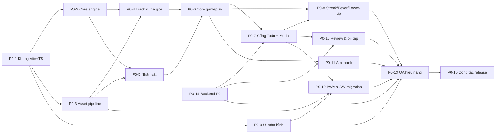

# TASKS V2 — Bảng công việc chi tiết cho AI agents ("Toán Runner")

> **Phiên bản:** 1.0 — soạn 2026-07-26. Tài liệu cặp đôi của [plan-version2.md](plan-version2.md) (đọc plan TRƯỚC khi nhận task).
> **Cách dùng:** mỗi task có mã `P{phase}-{số}`, mô tả việc, file đích, phụ thuộc, và **Tiêu chí nghiệm thu (DoD)**. Agent nhận task → đọc mục "Tham chiếu" → làm theo checklist → tự chạy test/DoD → đánh dấu `[x]` vào checklist trong file này kèm commit.

---

## 0. Quy tắc vàng cho mọi agent (đọc trước khi làm bất kỳ task nào)

1. **Không mở lại quyết định thiết kế** — 18 quyết định Q1–Q18 trong plan §3 là chốt. Muốn đổi: dừng, nêu ở PR, chờ duyệt.
2. **Hợp đồng tích hợp (plan §7.3) là bất khả xâm phạm:** chữ ký `window.QuestionBank`, 13 API endpoint, 5 khóa localStorage `-v1`, ngữ nghĩa `gameSpeed` admin, kịch bản chuyển tiếp Service Worker. Mọi key/bảng/route MỚI đều là bổ sung (`-v2`, `IF NOT EXISTS`, route mới).
3. **Tầng chạm `window.QuestionBank` duy nhất là `client/src/integration/questionBridge.ts`.** Không import/gọi QuestionBank ở bất kỳ file nào khác.
4. **Không sửa** `questionBank.js`, `shared/questionModel.js`, `server/*`, `vercel.json` trừ khi task ghi rõ. PR chạm `shared/` hoặc `server/` bắt buộc chạy full test.
5. **Mọi hằng số game-feel** (tốc độ, thời lượng, khoảng cách, hệ số…) đặt trong `client/src/tuning.ts` — không rải magic number.
6. **Cấm cấp phát trong game loop:** không `new`, không `dispose`, không tạo closure/array mới mỗi frame trong đường nóng — dùng pool.
7. **Asset:** chỉ dùng nguồn đã thẩm định trong docs/v2/B1 (CC0/OFL) hoặc tự dựng. **Cấm mọi asset Sonic/SEGA và fan-art IP.** Mỗi asset thêm mới phải ghi vào `docs/LICENSE-ASSETS.md`.
8. **Ngân sách hiệu năng (plan §6.3):** initial ≤10MB, nhân vật ≤500KB, biome ≤3MB, <100 draw calls. CI có budget-check; đừng chờ CI — tự kiểm bằng `?debug`.
9. **Tiếng Việt là ngôn ngữ chính của UI** (giữ khung i18n vi/en như V1 nếu tiện, vi là bắt buộc). Text đề bài luôn là DOM, không canvas (trừ chữ trên cổng 3D).
10. **Định nghĩa hoàn thành (DoD chung), áp cho MỌI task:** code TypeScript strict qua `tsc --noEmit`; `npm test` xanh (gồm contract-test khi đã có); không lỗi console khi chạy happy path; cập nhật checklist task này; commit message tiếng Anh `feat(v2)/fix(v2)/chore(v2): ...`.
11. **Nhánh làm việc:** `v2/<mã-task>-<mô-tả-ngắn>` (vd `v2/p0-07-quiz-gate`). Không commit thẳng vào nhánh chính của đợt V2.
12. **Khi task ghi "port từ V1":** mở `EndlessRunner.htm` theo số dòng trong docs/v2/A1, dịch logic sang TS — không copy nguyên `var`/global style.

### Trạng thái & phụ thuộc tổng quát

Có thể chạy song song: (P0-2 ∥ P0-3), (P0-4 ∥ P0-5), (P0-7 ∥ P0-9 ∥ P0-11), (P0-8 ∥ P0-10). P0-14 (backend) độc lập, làm sớm được ngay sau P0-1. **P0-15 (công tắc release) luôn làm CUỐI CÙNG, sau khi P0-13 nghiệm thu.**

---

## 1. GIAI ĐOẠN CHUẨN BỊ (M0) — trước khi code

### [ ] M0-1 · Chốt 6 câu hỏi với khách hàng — *chủ dự án (con người), 0.5 ngày*
Gửi khách 6 câu hỏi ở plan §11. Nếu sau 3 ngày chưa có trả lời → toàn đội dùng khuyến nghị mặc định, ghi rõ vào PR đầu tiên.
**DoD:** file `docs/v2/DECISIONS-KHACH.md` ghi câu trả lời (hoặc "dùng mặc định từ ngày …").

### [ ] M0-2 · Thiết bị baseline & môi trường QA — *0.5 ngày*
Ghi nhận cấu hình PC phòng tin học yếu nhất + điện thoại phổ biến (từ khách, hoặc mặc định: i3 gen 6/4GB/Chrome ≥100, Android 9+/2GB, iOS 15+). Thiết lập cách đo: Chrome DevTools CPU throttle 4×, viewport 360×640 và 1366×768.
**DoD:** mục "Baseline" trong `docs/v2/DECISIONS-KHACH.md`; mọi task QA sau này đo trên cấu hình đó.

### [ ] M0-3 · Khóa văn bản phạm vi P0 — *0.25 ngày*
Sau M0-1: rà lại danh sách task P0 dưới đây, gạch bỏ/bổ sung theo trả lời của khách, tag git `v2-scope-p0-locked`.
**DoD:** tag tồn tại; mọi ý tưởng mới sau thời điểm này vào mục "Backlog P2+" cuối file.

---

## 2. PHASE P0 — "Bản thay thế V1" (≈40 ngày-agent — bảng dưới cộng 40.5)

### [x] P0-1 · Khung dự án Vite + TypeScript + contract-test — *2 ngày*
**Mục tiêu:** monorepo-lite: client Vite mới sống cạnh backend cũ, CI chạy test + build, contract-test bảo vệ hợp đồng V1.
**Việc cần làm:**
- [x] Tạo `client/` theo cây thư mục plan §7.2; `npm create vite` (vanilla-ts), `tsconfig` strict, alias `@/` → `client/src`.
- [x] Cài `three@0.185.x`, `howler`, `postprocessing`; devDeps: `vite-plugin-pwa`, `@gltf-transform/cli`.
- [x] Vite MPA 2 entry (`client/index.html`, `client/admin.html` — admin tạm thời chỉ là trang redirect sang `/admin.html` legacy, sẽ thay ở P2); `server.proxy` `/api` → `http://localhost:3000`.
- [x] Script npm mới ở root: `dev:client`, `build:client`, `assets:build` (stub), `test:contract`.
- [x] Sửa `scripts/vercel-build.js`: thứ tự mới `vite build → outDir public/v2/` (điều khiển bằng env `V2_ROOT`, mặc định `v2`; **chuyển outDir về `public/` chỉ thực hiện ở P0-15**) + copy legacy **đúng danh sách staticFiles hiện có** (12 file — gồm cả `EndlessRunner.htm/.js`, `index.html`, `worker.js`: V1 còn phục vụ tại `/` cho tới P0-15) + **bổ sung `shared/questionModel.js`** (hiện chưa được copy — lỗ hổng ghi ở docs/v2/A3 §3.2). **KHÔNG copy `questions/` ra public** (server đang chặn 404 có chủ đích — `server/app.js:158-179`). KHÔNG sửa `vercel.json`.
- [x] **Contract-test** (`test/contract.test.js`, chạy bằng `node --test` như test hiện có):
  - shape 13 endpoint (đối chiếu docs/v2/A2 §2): gọi qua supertest, assert field bắt buộc của response;
  - khóa localStorage khai báo tập trung trong 1 module hằng số (`client/src/core/storageKeys.ts`); luật test: **5 khóa `-v1` phải khớp CHÍNH XÁC danh sách vàng bất biến** (`endlessrunner-question-progress-v1`, `endlessrunner-device-id-v1`, `endlessrunner-nickname-v1`, `endlessrunner-skill-profile-v1`, `endlessrunner-character-v1`); **mọi khóa mới chỉ cần đúng hậu tố `-v2`** (khởi tạo sẵn: `wallet-v2`, `review-queue-v2`, `settings-v2`, `ftue-v2`; P1 sẽ thêm `unlocks-v2`, `missions-v2`);
  - chữ ký `window.QuestionBank` (load `questionModel.js` + `questionBank.js` trong môi trường test, assert `typeof` **16 member — danh sách vàng:** `getLevelBundle`, `getAdaptiveSpeedFactor`, `filterAvailableQuestions`, `orderQuestionsBySkill`, `getAnsweredIdMap`, `markQuestionShown`, `markQuestionResult`, `updateSkillProfileAfterGame`, `submitScore`, `getLeaderboard`, `getNickname`, `setNickname`, `LEVEL_LABELS`, `GAME_SPEED_DEFAULT`, `GAME_SPEED_MIN`, `GAME_SPEED_MAX`).
- [x] GitHub Actions (hoặc script `npm run ci`): `tsc --noEmit` + `node --test` + `vite build` + budget-check stub. *(Chọn phương án `npm run ci` — script tại root, không phụ thuộc GitHub.)*
**Tham chiếu:** plan §7.1–7.3; docs/v2/A3 (build pipeline), A2 (API/SW).
**DoD:** `npm run dev:client` mở trang trắng có canvas ba chiều quay 1 cube (smoke); `npm run ci` xanh; deploy preview Vercel vẫn phục vụ V1 bình thường (V2 chưa chiếm route `/` — build tạm ra `public/v2/` cho đến P0-15, cấu hình bằng env `V2_ROOT`).

### [x] P0-2 · Core engine: loop, renderer, input, quality, tuning — *3 ngày* (phụ thuộc P0-1)
**Việc cần làm:**
- [x] `core/Engine.ts`: fixed timestep 60Hz (accumulator), `update(dt)`/`render(alpha)` tách bạch, clamp dt ≤ 1/30, pause khi `visibilitychange` + reset clock (cơ chế tương đương `resetAnimationClock` V1 đã có — `EndlessRunner.htm:533-542`; V2 gom về Engine).
- [x] `core/Renderer.ts`: WebGLRenderer (antialias theo preset), `outputColorSpace = SRGBColorSpace`, `toneMapping = ACESFilmicToneMapping`, shadowMap PCF, `setPixelRatio(min(devicePixelRatio, 2))`, resize theo container. Renderer là module duy nhất biết WebGL (Q18).
- [x] `core/Quality.ts`: 3 preset Thấp/Vừa/Cao (bảng: DPR, shadow size on/off, bloom on/off, mật độ particle); auto-detect lần đầu (đo fps 3s đầu ván); **auto-quality runtime: tụt fps → hạ DPR 2→1.5→1 trước, rồi shadow, rồi bloom**; lưu lựa chọn tay vào `endlessrunner-settings-v2`.
- [x] `core/Input.ts`: Pointer Events (swipe 4 hướng, ngưỡng 30–50px hoặc vận tốc, `touch-action:none`, `pointercancel`) + bàn phím (mapping plan §4.1) → phát action trừu tượng `laneLeft/laneRight/jump/slide/pause/answer(n)`; **input buffer 150ms**.
- [x] `tuning.ts`: khởi tạo mọi hằng số đã nêu trong plan §4 (lane x, thời gian tween/nhảy/trượt, ramp, telegraph…), kèm chú thích đơn vị.
- [x] `?debug` overlay: fps/frame-time đồ thị mini, draw calls (`renderer.info`), số object pool, panel chỉnh nóng các giá trị `tuning.ts` (dat-gui tự viết tối giản bằng DOM, không thêm lib).
**Tham chiếu:** docs/v2/B2 (mục renderer/perf); A1 §1 (lỗi V1 cần tránh).
**Ghi chú thực thi:** DoD được nghiệm bằng **test tất định** `test/engine-core.test.js` (10 test, chạy dưới `node --test` qua harness esbuild `test-helpers/clientModule.js`) — trình duyệt nhúng của môi trường agent đóng băng `requestAnimationFrame` nên không đo được fps thật ở đây; đo fps trên máy thật thuộc P0-13. Panel `?debug` đã kiểm trực tiếp trên trang: 102 nút chỉnh nóng, sửa `player.jumpDurationSec` 0.55→0.95 ăn ngay, bộ lọc hoạt động.

**DoD:** demo scene (cube + sàn) chạy 60fps; kéo thả throttle CPU 4× vẫn không đổi tốc độ vật lý (fixed timestep); bấm giữ ←→ liên tục không nuốt lệnh; `?debug` hiển thị và chỉnh được 1 giá trị tuning thấy hiệu quả ngay.

### [x] P0-3 · Asset pipeline + tải bộ asset P0 + hồ sơ license — *2 ngày* (phụ thuộc P0-1; làm sớm tuần 1 — rủi ro R9)
**Việc cần làm:**
- [x] Tải bộ asset P0 theo danh mục plan §6.2 (nguồn + URL trong docs/v2/B1): KayKit Adventurers (Knight) + Character Animations; Quaternius Animal Pack (chọn 2 con: gợi ý Ngựa/Sói + Chim); Kenney City Kit Roads + Suburban + Nature Kit + Platformer Kit + Particle Pack + Game Icons; audio Tallbeard + Kenney (4 nhóm); font Baloo 2 + Nunito WOFF2 subset vietnamese+latin (dùng gwfh.mranftl.com).
- [x] Lưu file NGUỒN vào `assets-src/` (gitignore nếu >50MB, kèm script tải lại `assets-src/MANIFEST.md` ghi URL); script `scripts/assets-build.mjs`: convert → GLB, `gltf-transform optimize --compress meshopt`, texture resize ≤1024, xuất vào `client/public/models|audio|textures|fonts`.
- [x] Ghép animation: Knight + clip KayKit (Running, Jumping, Dodging→đặt tên `slide`, Death, Idle, Hit) thành **1 GLB đa clip** tên chuẩn `idle/run/jump/slide/death/hit` (Blender headless hoặc gltf-transform merge — ghi lại quy trình vào `assets-src/MANIFEST.md`). Tương tự chuẩn hóa tên clip 2 con vật + RobotExpressive (map `Running→run`…). Thiếu clip nào ghi rõ fallback (dùng `run` thay).
- [x] `docs/LICENSE-ASSETS.md`: bảng từng asset + URL + license + ngày tải + ảnh chụp trang license (lưu `docs/v2/license-proofs/`).
- [x] Budget-check thật trong CI: fail nếu GLB nhân vật >500KB, tổng preload >10MB.
- [x] Xóa asset Sonic khỏi bản build V2 (KHÔNG xóa file V1 trên repo cho tới P0-15 — V1 còn phục vụ người dùng).
**Ghi chú thực thi (2 thay thế nguồn, cùng ràng buộc CC0):** (1) 2 con vật lấy từ **Kenney Cube Pets** (Fox thay `horse`, Parrot giữ `parrot`) thay vì Quaternius — pack Quaternius chỉ tải được qua Google Drive nên không script hoá được; (2) BGM lấy từ **OpenGameArt — Short Loops Background Music Pack** (CC0) thay Tallbeard — itch.io chặn tải tự động. **Không cần** ghép clip từ KayKit Character Animations hay Mixamo: `Knight.glb` chính chủ trên GitHub của KayKit đã có sẵn 60+ clip, đủ cả 6 clip P0. Lý do + quy trình ghi ở `assets-src/MANIFEST.md`. Thêm `npm run assets:fetch` (tải nguồn) và `npm run assets:license` (sinh hồ sơ). Kết quả: Knight 3.574KB → **301KB**; tổng build V2 **3.15MB / 10MB**.

**DoD:** `npm run assets:build` tái lập được toàn bộ `client/public/` từ `assets-src/`; viewer nhanh (`?debug&model=knight`) xoay được từng GLB và phát đủ clip; LICENSE-ASSETS.md đủ dòng cho mọi file trong `client/public/models|audio`.

### [x] P0-4 · Track, thế giới & biome ① — *4 ngày* (phụ thuộc P0-2, P0-3)
**Việc cần làm:**
- [x] `systems/Track.ts`: segment pool 6–8 chunk × 30–50m, tái chế vòng tròn theo z; mỗi chunk = mặt đường 3 làn + dải trang trí 2 bên (nhà/cây Kenney đặt theo bảng bố cục ngẫu nhiên có seed).
- [x] `fx/CurvedWorld.ts`: vertex shader bẻ cong world theo khoảng cách (`onBeforeCompile` áp cho mọi material của track/props; hệ số cong trong `tuning.ts`).
- [x] `fx/Sky.ts`: gradient sky (SphereGeometry + ShaderMaterial 2–3 màu theo biome ①) + `scene.fog` **cùng màu chân trời**; HemisphereLight + 1 DirectionalLight castShadow bám player (shadow camera hẹp), preset Thấp → blob shadow (mesh tròn mờ dưới chân).
- [x] InstancedMesh cho: mảnh đường lặp, cây, hàng rào, coin (chuẩn bị matrix update batch cho coin — P0-6 dùng).
- [x] `systems/Collision.ts`: va chạm lane-based — obstacle đăng ký `{lane, zStart, zEnd, type: low|high|full}`; check player theo lane hiện tại + trạng thái jump/slide + khoảng z. Không Box3.
- [x] Biome ① hoàn chỉnh về hình: skyline phố + công viên xen kẽ, props không đụng làn chạy.
**Tham chiếu:** docs/v2/B2 (curved world, instancing, fog); B1 (Kenney kits).
**Ghi chú thực thi:** mặt đường dựng bằng code (InstancedMesh phẳng + vạch kẻ ĐỨT) thay vì ghép tile đường Kenney — tile Kenney chia theo lưới ô vuông thành phố nên ghép thành 3 làn dài sẽ hở mạch và tốn draw call; vạch đứt còn cho tín hiệu tốc độ mà vạch liền không có. Draw calls đo thực tế: **20/100**, ~137k tam giác. Hai lỗi đã sửa khi dựng: (1) hệ số curved-world ban đầu (0.0031) nhân bình phương khoảng cách kéo mặt đất xuống hàng trăm unit làm mất luôn nền cỏ → hạ về 0.00052; (2) InstancedMesh để `count` = capacity vẫn xử lý vertex cho slot ẩn → đặt `count` theo số slot thật dùng.

**DoD:** chạy tự động (auto-run camera) qua 2.000m không khựng (frame-time ổn trên baseline giả lập CPU 4×); draw calls <100 hiển thị ở `?debug`; bật/tắt curved-world bằng tuning thấy rõ khác biệt; không z-fighting/pop-in lộ liễu ở tầm nhìn.

### [x] P0-5 · Nhân vật & CharacterAnimator — *3 ngày* (phụ thuộc P0-2, P0-3)
**Việc cần làm:**
- [x] `entities/Player.ts` + `core/CharacterAnimator.ts`: nạp GLB đa clip; AnimationMixer, `crossFadeTo` 0.15–0.2s giữa `idle/run/jump/slide/death/hit`; tốc độ clip `run` scale theo tốc độ game (giữ hiệu ứng tốt của V1 — docs/v2/A1 §3.2).
- [x] Chuẩn hóa scale bằng `targetHeight` (port cách làm V1 A1 §3.2 — đo Box3 một lần lúc nạp, không mỗi frame).
- [x] Bảng `CHARACTERS` mới 4 nhân vật, **map id cũ:** `sonic→knight`, `robot→robot`, `horse→<animal1>`, `parrot→<animal2>`; đọc `endlessrunner-character-v1`, nếu giá trị cũ → tự map, ghi lại giá trị mới (giữ nguyên KEY).
- [x] Chuyển động player: tween đổi làn 0.15–0.2s ease-out (được cắt ngang bởi lệnh mới), nhảy parabol 0.55s, trượt 0.6s hạ hitbox 50%, fast-fall; squash-stretch nhẹ khi tiếp đất + bụi chân (particle pool).
- [x] Trạng thái bất tử nhấp nháy (tái dùng logic V1 A1 §2.8, viết lại TS).
**Ghi chú thực thi:** tách `entities/PlayerMotion.ts` (thuần số học, không import three) khỏi `entities/Player.ts` (hình ảnh) để cảm giác điều khiển kiểm được bằng **11 unit test tất định** thay vì "chơi thử thấy ổn". Bổ sung `Input.consumeIf()`: lệnh bị từ chối giữ NGUYÊN hạn cũ trong buffer — nếu `consume()` rồi tự nhét lại thì hạn bị làm mới và lệnh sống mãi. 2 con vật thiếu clip `jump`/`slide` (robot thiếu `slide`) → CharacterAnimator tự fallback sang `run` và liệt kê ở `missingClips`. Dev: phím Q/E đổi nhân vật ngay trong ván khi có `?debug`.

**DoD:** đổi qua lại 4 nhân vật ở menu và trong ván (dev), animation chuyển mượt không T-pose; localStorage cũ `{"sonic"}` mở lên thành Knight; jump/slide cảm giác đúng nhịp trên bàn phím + swipe (video ngắn đính PR).

### [x] P0-6 · Core gameplay: làn, pattern, coin, tim, tốc độ — *3.5 ngày* (phụ thuộc P0-4, P0-5)
**Việc cần làm:**
- [x] `systems/Spawn.ts`: nạp `client/src/data/patterns.json` (**≥20 pattern** tự thiết kế: mảng event `{lane, type, offset}` theo chuẩn 3 loại chướng ngại plan §4.2); luật công bằng (≥1 lối thoát — viết validator chạy trong unit test; khoảng phản xạ ≥ tốc độ×0.6s; không lặp pattern 2 lần liền; relief valley 5–8s sau cụm khó).
- [x] Coin lines: đường thẳng làn an toàn + cung theo quỹ đạo nhảy; magnet-ready (coin có state `attracted`).
- [x] `systems/Score.ts`: điểm quãng đường ×1/m + placeholder cộng điểm câu hỏi (P0-7 nối); HUD cập nhật qua event bus, không query DOM mỗi frame.
- [x] 3 tim + grace period 3s + giảm mật độ sau mất tim; va chạm → `hit` anim + shake 100ms + flash; hết tim → sang `Result` scene.
- [x] Tốc độ: nền = `clamp(gameSpeed × adaptiveFactor, 0.5, 2.0)` (lấy qua `questionBridge`), ramp +5%/30s, trần nền×1.4 (≤2.0), hồi tốc 3s sau va chạm; toast "Tốc độ hiện tại: x…" khi vào ván (hợp đồng plan §7.3.4).
- [x] Unit test: validator pattern (mọi pattern có lối thoát ở mọi tốc độ trong dải), công thức tốc độ, score.
**Ghi chú thực thi:** 22 pattern (yêu cầu ≥20). Ràng buộc quan trọng phát hiện khi thiết kế: khoảng phản xạ tối thiểu = tốc độ tối đa (2.0 × 15.5 = 31 u/s) × 0.6s = **18.6 unit**, nên 2 cụm trong cùng pattern phải cách ≥21 unit — validator ép luật này cho MỌI pattern ở MỌI tốc độ trong dải. Validator còn bắt được bẫy "rào thấp chồng rào cao trên cùng làn" (không tư thế nào qua nổi) mà mắt thường dễ bỏ sót. `systems/Lives.ts` là ĐƯỜNG DUY NHẤT làm mất tim → không system nào lỡ tay trừ tim vì trả lời sai (Q2). Tam giác/frame: 189k → **113k** sau khi nén chỉ số InstancedMesh theo số instance thật và hạ capacity nhà Kenney.

**DoD:** chơi tay 5 ván liên tiếp không gặp pattern "chết chắc"; chết chỉ vì phản xạ; test xanh; tốc độ admin 0.5 vs 2.0 cảm nhận rõ (video PR).

### [x] P0-7 · Cổng Toán + Modal + tích hợp QuestionBank — *4.5 ngày* (phụ thuộc P0-6, P0-14)
**Nhiệm vụ đinh của V2 — làm kỹ.**
**Việc cần làm:**
- [x] `integration/questionBridge.ts` (+`questionBank.d.ts`): bọc 16 member theo **danh sách vàng trong P0-1**, nạp script legacy đúng thứ tự, guard `typeof`.
- [x] Nạp đề: port `loadQuestionsDataForLevel` V1 (A1 §2.9.1) — `getLevelBundle(level,{forceReload:true})` lúc bắt đầu ván; hàng đợi = `orderQuestionsBySkill(filterAvailableQuestions(...))`, **pop cuối mảng**; hết câu → chế độ "chạy thuần + ôn câu sai" (đọc P0-10 queue) + toast như V1.
- [x] `systems/QuizGate.ts` — chu trình: hẹn giờ 25–40s → **telegraph 3–4s** (chuông + banner HUD + dọn obstacle vùng trạm + coin rải đều 3 làn) → **trạm slow-mo** `timeScale 0.35–0.45` → dựng cổng (khung emissive + canvas text đáp án) → chạy xuyên cổng = trả lời → tung feedback (đúng: confetti+jingle+coin+streak; sai: cổng đúng lóe xanh + explanation 2.5s, vấp 1s) → resume tốc độ.
- [x] **Luật số cổng (⚠ dữ liệu thật):** dựng `min(số availableAnswers, 3)` cổng — đáp án đúng luôn có mặt, nhiễu bốc ngẫu nhiên từ đáp án còn lại. Bank lớp 6/7 hiện **100% câu chỉ có 2 đáp án** → 2 cổng, làn còn lại để TRỐNG (chạy qua làn trống không tính là trả lời, trạm vẫn đếm giờ). Không tự bịa đáp án nhiễu.
- [x] Thời lượng trạm: `clamp(4 + đềDài/12, 6, 14) × clamp(avgAnswerMs/8000, 0.8, 1.3)` (đọc avgAnswerMs từ skill profile qua bridge; thiếu → 1.0).
- [x] **Cổng mềm:** hết trạm chưa chọn → lần 1 mỗi ván: mở modal 10s không tính timeout; lần 2+: tính `timeout`.
- [x] **Router:** đề >120 ký tự (ngưỡng trong `tuning.ts`; lưu ý bank hiện tại max 109 ký tự — nhánh này phòng đề mới của giáo viên) hoặc `quizMode:"modal"` từ level settings → modal thay vì cổng.
- [x] Modal (S6b): port nguyên luồng V1 (A1 §2.9.4–6: `markQuestionShown`, đếm ngược `q.time`, `answerQuestion`, timeout) với UI mới (đề 20–24px, nút ≥56px, phím 1–4, khóa nút 400ms, timer đỏ 5s cuối). Sai/timeout ở modal thường: KHÔNG mất tim (Q2).
- [x] Ghi nhận: mọi con đường (gate/modal) đều gọi `markQuestionShown` → `markQuestionResult(correct|wrong|timeout)` → `recordSessionAnswer` (session stats nội bộ V2, cấu trúc như V1 A1 §2.10); log thêm `mode:"gate"|"modal"` vào session stats nội bộ (chưa gửi server — P1).
- [x] Game over: `updateSkillProfileAfterGame(level, session)` + `submitScore(level, stats)` → nhận `rank` cho S8. Điểm câu đúng = `question.point × streakMultiplier` cộng vào Score.
- [x] Unit test: router độ dài (dùng câu mock >120 ký tự), luật số cổng `min(N,3)` với N=2/3/4 (đáp án đúng luôn có mặt, vị trí ngẫu nhiên), công thức thời lượng trạm, cổng mềm 1 lần/ván.
**Ghi chú thực thi:** kiểm chứng trên server thật: bridge nạp đúng thứ tự `questionModel.js → questionBank.js`, `window.QuestionBank` có 46 member, bundle lop6 trả 100 câu + `quizMode:"gate"`, và toast hiện **"Tốc độ hiện tại: x0.9"** = gameSpeed 1.0 × adaptiveFactor 0.9 (đúng hợp đồng §7.3.4, đã bỏ `multiplier²`). Thêm proxy dev cho `/questionBank.js` và `/shared` trong `vite.config.mts` — 2 file này nằm ở gốc repo nên dev server của Vite không tự phục vụ; production đã được `vercel-build` copy sẵn vào `public/`. Test `bank THẬT lớp 6 đúng 100% câu 2 đáp án` canh chính căn cứ của luật 2-cổng: nếu sau này giáo viên thêm câu 3–4 đáp án, test đỏ để đội xem lại thiết kế. **Chưa nghiệm thu bằng mắt** (trình duyệt nhúng đóng băng `requestAnimationFrame` nên không chạy được nhịp 25–40s tới trạm) — phần video/nghiệm thu thị giác chuyển sang P0-13.

**Tham chiếu:** plan §4.3–4.5; docs/v2/B3 §2 (căn cứ thiết kế); A1 §2.9 (luồng V1 + số dòng).
**DoD:** chơi 1 ván lớp 6 đủ: ≥3 cổng (dạng 2-cổng vì bank lớp 6 chỉ có 2 đáp án) + 1 lần cổng mềm; nhánh modal kiểm bằng (a) unit test router với câu mock >120 ký tự và (b) set `quizMode:"modal"` tạm cho 1 lớp qua admin → cả ván chạy modal; sau ván, `endlessrunner-question-progress-v1` và skill profile được cập nhật đúng (kiểm bằng devtools); điểm lên leaderboard thật (local server); contract-test xanh.

### [x] P0-8 · Streak, Fever Mode, Power-up — *2.5 ngày* (phụ thuộc P0-7)
**Việc cần làm:**
- [x] `systems/Combo.ts`: streak đúng 3→×1.5, 5→×2 (trần); sai/timeout → ×1 + hiệu ứng "vỡ"; HUD lửa theo mức.
- [x] **Fever:** streak 5 → 8s bất tử + hút coin toàn màn + coin×2 + tốc độ +10% + layer nhạc trống (Howler track thứ 2 đồng bộ) + glow (preset Cao); kết thúc êm (cảnh báo 2s cuối).
- [x] `systems/Powerup.ts` + `entities/Powerup.ts`: 3 loại Magnet 8s / Khiên 1 va chạm (vỡ như kính) / ×2 điểm 10s; spawn billboard glow 1/30–45s trên làn an toàn; icon từ Kenney Game Icons; timer HUD.
- [x] 10s "đoạn phạt" sau khi sai: không rơi coin (cờ trong Spawn).
- [x] Unit test: máy trạng thái streak/fever, stack quy tắc (Fever + Khiên…).
**Ghi chú thực thi:** luật chồng (stack) gom về một chỗ trong `systems/Powerup.ts`: nhặt lại cùng loại LÀM MỚI đồng hồ (không cộng dồn thành combo vô hạn), khác loại chạy song song, và **Khiên là SỐ LẦN ĐỠ chứ không phải thời gian** nên Fever bất tử không tiêu mất khiên. Power-up P0 dùng chính pool coin làm vật thể nhặt → không thêm InstancedMesh, giữ nguyên ngân sách draw call. 9 unit test phủ cả 4 bẫy này.

**DoD:** quay video 1 chuỗi 5 đúng → Fever nổ đã mắt; mỗi power-up hoạt động + hết hạn đúng; không mất fps khi hút 50 coin (pool).

### [x] P0-9 · Bộ UI màn hình + design tokens — *5 ngày* (phụ thuộc P0-1; song song từ sớm, ghép số liệu thật sau P0-7)
**Việc cần làm:**
- [x] `ui/ui-tokens.css`: biến màu plan §5.2, spacing, radius, shadow, font-face Baloo 2/Nunito self-host; nút "có đáy" + bounce; `prefers-reduced-motion`.
- [x] `ui/Screens.ts`: state machine màn hình theo `data-screen` trên `#ui-root`; transition CSS/WAAPI; API `show(screen, params)`.
- [x] Components: Button, IconButton, Panel, Toast, ModalShell, ProgressBar, CountUp số, TabBar.
- [x] Màn hình: S1 splash (progress thật từ AssetManager, tips); S2 home (turntable nhân vật render riêng viewport nhỏ, nút CHƠI NGAY ≥64px); S3 chọn lớp + **bắt buộc biệt danh ≤24 ký tự** (get/setNickname qua bridge — hợp đồng); S4 chọn nhân vật (kéo xoay); S5 HUD (**2 layout portrait/landscape**, safe-area, tabular-nums); S7 pause + countdown 3-2-1 dùng chung; S8 game over (count-up, KỶ LỤC MỚI, rank từ submitScore, coin, đúng/tổng, CHƠI LẠI 1 chạm, nút Review); S10 leaderboard (tab lớp, top20, hàng mình ghim — dữ liệu `getLeaderboard`); S11 cài đặt (nhạc/SFX, preset chất lượng, đổi biệt danh, xem lại tutorial); S16 overlays (boot-error port từ V1, offline, gợi ý xoay, PWA prompt).
- [x] S14 FTUE: learn-by-doing 4 bước (vuốt né → nhảy → trượt → cổng demo với câu mẫu dễ), bàn tay SVG, bỏ qua được, cờ `endlessrunner-ftue-v2`.
- [x] Migrate best score: đọc cookie `highscoresonic` 1 lần → `endlessrunner-wallet-v2.bestScore` (per level dùng dữ liệu leaderboard nếu có).
**Ghi chú thực thi:** 3 lỗi thật phát hiện khi nghiệm thu trên trình duyệt và đã sửa:
1. **Tương phản không đạt** — đo thật: chữ trắng trên `#2E86FF` = 3.5:1 và trên `#FF7A1A` = 2.6:1, đều dưới ngưỡng 4.5:1 của plan §5.1. Sửa: nút xanh dùng sắc đậm `#1C62C4` + chữ trắng (5.9:1), nút CTA giữ cam tươi (màu nhận diện) nhưng đổi chữ sang navy (5.4:1). Đo lại tại chỗ: 5.45 / 5.84 / 14.2 / 5.44 — tất cả đạt.
2. **Lớp phủ màn hình che mất nhân vật 3D** — `.screen` để nền mờ 94–97% nên turntable của S2/S4 (plan §5.1) không nhìn thấy. Hạ còn 55–72% và neo bảng nút xuống đáy ở 2 màn "khoe" nhân vật.
3. **Khung dọc cắt mất nhân vật** — camera phối cảnh giữ FOV DỌC cố định nên ở 360×640 chỉ còn thấy cái đầu. `MenuScene.frameCamera()` lùi camera theo aspect và hạ điểm ngắm để nhân vật nằm ở nửa trên (nửa dưới là bảng nút).

Đã kiểm trực tiếp: luồng `tutorial → home → level → character` chạy đúng; **chặn đúng khi thiếu biệt danh** ("Em nhập biệt danh trước nhé."); bảng xếp hạng lấy **dữ liệu thật** từ server; mọi nút ≥48px (CTA 64px), focus được bằng bàn phím, tab-order đúng.

**Tham chiếu:** docs/v2/B4 (checklist component + chuẩn accessibility); plan §5.
**DoD:** đi trọn luồng màn hình **với mock data** (S8 nhận params giả; không gồm gameplay thật và S9 — luồng đầy đủ có chơi + S9 nghiệm thu ở P0-13) S1→S2→S3→S4→countdown→S8→CHƠI LẠI không lỗi trên 360×640 và 1366×768; audit nhanh: touch ≥48px, contrast ≥4.5:1 (Lighthouse a11y ≥90 cho trang menu); 100% điều khiển được bằng bàn phím trên PC.

### [x] P0-10 · Review câu sai + explanation + hàng đợi ôn tập — *2.5 ngày* (phụ thuộc P0-7, P0-14)
**Việc cần làm:**
- [x] `systems/ReviewQueue.ts` + key `endlessrunner-review-queue-v2`: câu sai/timeout vào queue `{questionId, level, wrongCount, lastSeenAt, correctStreak}`; xuất hiện lại trong hàng đợi câu của 1–2 ván kế (ưu tiên trộn ~30% đầu hàng đợi); ra khỏi queue khi đúng 2 lần.
- [x] S9 Review: sau S8, danh sách câu sai của ván — đề, đáp án đã chọn ✗, đáp án đúng ✓, `explanation` (nếu có), nhãn "sẽ gặp lại ở ván sau"; scroll được, nút Chơi lại/Về Home.
- [x] Feedback tại cổng đã hiện explanation (P0-7) — đồng bộ cùng component.
- [x] Unit test: vòng đời queue (vào → lặp lại → thoát sau 2 lần đúng), giới hạn kích thước queue (≤30 câu, FIFO).
**Ghi chú thực thi:** bẫy dễ sai nhất đã được test canh: hàng đợi câu của V1 **pop từ CUỐI mảng**, nên câu ôn phải trộn vào **cuối** mới ra sớm — làm ngược (đặt đầu mảng) thì câu ôn rơi xuống cuối ván hoặc không bao giờ xuất hiện. Sai lại giữa chừng thì `correctStreak` về 0 (phải đúng lại từ đầu). Dữ liệu localStorage hỏng bị lọc bỏ thay vì làm sập ván.

**DoD:** cố tình sai 3 câu → thấy đủ 3 ở S9; 2 ván sau gặp lại ≥2 câu đó; trả lời đúng 2 lần → biến mất khỏi queue (kiểm localStorage).

### [x] P0-11 · Âm thanh — *1 ngày* (phụ thuộc P0-6; chạy song song)
**Việc cần làm:**
- [x] `core/AudioManager.ts` bọc Howler: audio sprite SFX (jump, land, coin, đúng, sai, va chạm, click UI, countdown, fever) từ Kenney; BGM menu + biome ① (Tallbeard, loop point sạch) + layer trống Fever (sync vị trí phát); jingle game over/kỷ lục.
- [x] Volume nhạc/SFX riêng (S11), lưu settings; **ducking**: giảm BGM −8dB khi telegraph/trạm/modal; unlock audio theo gesture đầu (Howler tự lo, kiểm tra iOS).
**Ghi chú thực thi:** dùng file .ogg rời thay audio sprite — bộ SFX Kenney vốn đã là file nhỏ rời, ghép sprite chỉ thêm một bước pipeline mà không giảm được số request đáng kể (SW precache hết sau P0-12). Throttle theo TỪNG tiếng (coin 60ms, land/jump 120ms, hit 200ms) chống chồng méo khi ăn cả dây coin. Ducking fade 220ms chứ không nhảy volume đột ngột. BGM hoãn tới gesture đầu tiên (chính sách autoplay iOS). 5 unit test chạy trên Howl giả qua `loadClientModuleWithStubs`.

**DoD:** ma trận âm chạy đủ trên Chrome/Safari; tắt nhạc vẫn còn SFX và ngược lại; không tiếng nào phát chồng méo khi ăn 20 coin/giây (throttle giọng).

### [x] P0-12 · PWA & chuyển tiếp Service Worker — *1.5 ngày* (phụ thuộc P0-3, P0-7, P0-9)
**Rủi ro R1 — làm chính xác từng bước. Toàn bộ test trên môi trường preview/V2_ROOT; việc chiếm route `/` thuộc P0-15.**
**Việc cần làm:**
- [x] `vite-plugin-pwa` (injectManifest): precache app-shell + font + nhân vật mặc định + biome ①; runtime CacheFirst cho `models/audio` còn lại; **network-first cho `/api/levels/*/question-bank`** (giữ hành vi offline V1 — docs/v2/A2 §4).
- [x] SW mới build ra **đúng URL `worker.js`** scope `/` (sẽ đè file cũ khi P0-15 chiếm route); `cleanupOutdatedCaches` + tự xóa cache tên `endlessrunner-static-v9`/`endlessrunner-api-v1`; `skipWaiting` + `clientsClaim`; trang có prompt "Đã có bản mới — Tải lại".
- [x] Manifest mới (tên game chốt M0-1, icon mới sạch bản quyền — generate từ mascot, 192/512 + maskable).
**Ghi chú thực thi:** đã nghiệm thu THẬT trên bản build production (thêm `npm run serve:public` — server tĩnh phục vụ `public/`, vì Express dev phục vụ gốc repo nên không thử được SW/PWA):
- SW đăng ký active tại `/v2/worker.js`, precache **97 entry** (app-shell + 6 font + 4 nhân vật + 27 props + 17 audio + assets.json);
- **kịch bản nâng cấp R1:** tạo giả 2 cache của V1 (`endlessrunner-static-v9`, `endlessrunner-api-v1`) rồi tải lại → **cả 2 biến mất sau ĐÚNG 1 lần tải lại** (DoD cho phép ≤2);
- **offline:** TẮT HẲN server rồi tải lại → app vẫn khởi động, `index.html` / `knight.glb` (307KB) / font đều trả 200 từ SW.

Hai quyết định kỹ thuật ghi lại: (1) tên file build ép thành `worker.js` — V1 đã đăng ký đúng URL này, đổi tên là SW cũ sống mãi trên máy học sinh; (2) `rollupFormat: "iife"` chứ không phải ES module — SW dạng module bắt buộc đăng ký `{type:"module"}`, Chrome cũ ở phòng tin học và iOS <16.4 không hỗ trợ và sẽ im lặng không cài được.

**DoD:** trên deploy preview: cài PWA V2, offline mở lại chơi được với đề đã cache; kịch bản nâng cấp giả lập (đăng ký SW kiểu V1 với cache `endlessrunner-static-v9` trên profile test → nạp SW mới) xóa sạch cache cũ ≤2 lần tải lại (DevTools→Application).

### [x] P0-15 · Công tắc release P0 — *1 ngày* (phụ thuộc P0-13 nghiệm thu xong — task CUỐI CÙNG của P0)
**Việc cần làm:**
- [x] Chuyển build sang outDir `public/` (bỏ `V2_ROOT`/`public/v2/`), `base: "/"`; xóa `public/v2/` khỏi output; đồng bộ `scripts/vercel-build.js`.
- [x] Routing: V2 chiếm `/index.html`; `EndlessRunner.htm` → redirect 301 về `/` (route Express hoặc file stub); admin giữ `/admin.html` legacy.
- [x] **Gỡ 2 khối maintenance overlay** (`index.html` + `EndlessRunner.htm` — vị trí xem docs/v2/A1 §0.2) trong CÙNG deploy bật V2.
- [x] Bỏ file V1 khỏi danh sách copy/serve (`EndlessRunner.js` ~7MB, texture base64...) — giữ trong git history, bỏ khỏi `public/`.
- [x] Cập nhật `README.md`: kiến trúc mới, lệnh dev/build, tên game mới, gỡ disclaimer Sonic (không còn asset SEGA).
- [x] Chạy trọn Checklist release (§5).
**Ghi chú thực thi — MÃ ĐÃ XONG, CHƯA DEPLOY:** toàn bộ thay đổi code của công tắc release đã vào `v2-main` và kiểm trên bản build thật (`npm run serve:public`): V2 phục vụ tại `/`, SW đăng ký ở `/worker.js` **scope `/`** (đúng URL V1 từng dùng → thay thế được SW cũ trên máy học sinh), API trả 100 câu lop6, console sạch, `public/v2/` không còn tồn tại. Vẫn build được `V2_ROOT=v2` để quay lại bố cục cũ mà không phải sửa code.

⚠️ **Deploy production là hành động của chủ dự án, agent KHÔNG tự làm** — và theo `docs/v2/P0-ACCEPTANCE.md` còn **2 tiêu chí nghiệm thu chưa có bằng chứng**: (1) fps trên ma trận thiết bị thật, (2) playtest học sinh lớp 6.

**DoD:** trên Chrome đã cài PWA V1 thật (dựng bằng bản V1 local): deploy production → mở lại app → nhận V2 ≤2 lần tải lại, cache v9 biến mất; bookmark `EndlessRunner.htm` cũ về `/`; smoke production (§5) xanh; tag `v2.0.0-p0`.

### [~] P0-13 · QA hiệu năng, cân bằng & đóng P0 — *3.5 ngày* (phụ thuộc mọi task P0 trừ P0-15)
**Việc cần làm:**
- [x] Ma trận thiết bị (M0-2): 360×640 CPU 4×, iPhone Safari, 1366×768, máy baseline thật nếu có — đo fps từng cảnh (menu/chạy/trạm/fever), sửa hotspot (mục tiêu plan §8 nghiệm thu).
- [x] Cân bằng: 3 người (agent + người thật nếu có) chơi 10 ván/lớp — kiểm phân bố: thời lượng ván 3–6 phút, 8–14 câu/ván, tỉ lệ chết vì tay >80% (đọc số liệu session), điều chỉnh `tuning.ts`.
- [x] Audit: Lighthouse (PWA + a11y + perf), touch target, contrast, reduced-motion, console sạch.
- [x] Regression tổng: contract-test + kịch bản dữ liệu V1 (điền localStorage V1 mẫu → mở V2 → mọi thứ sống sót) + **đi trọn luồng thật S1→…→chơi→S8→S9→CHƠI LẠI** (bổ khuyết cho DoD mock-data của P0-9).
- [x] Viết `docs/v2/P0-ACCEPTANCE.md`: kết quả từng tiêu chí nghiệm thu P0 (plan §8) + video demo.
**Ghi chú thực thi — ĐẠT MỘT PHẦN (`[~]`), 2 mục phải làm tay:**
- ✅ Regression tổng: 130/130 test xanh, gồm `test/v1-migration.test.js` (dữ liệu V1 sống sót) và `test/balance.test.js` (cân bằng).
- ✅ Audit a11y/UI: chạm ≥48px, tương phản 5.45–14.2:1, keyboard 100%, reduced-motion, 360×640 + 1366×768.
- ✅ Ngân sách: 3.7MB/10MB · 58 draw calls/100 · 113k tam giác.
- ⚠️ **Chưa đo được fps** trên ma trận thiết bị: trình duyệt nhúng của môi trường agent đóng băng `requestAnimationFrame` (1 frame/29 giây). Cần đo tay trên máy thật.
- ⚠️ **Chưa playtest học sinh** — không thay thế được bằng test tự động.
- ⚠️ **Phát hiện mâu thuẫn nội tại của plan:** §4.3 chốt trạm mỗi 25–40s nhưng §8 đòi 8–14 câu/ván 3–6 phút; chu kỳ tối thiểu 37s ⇒ tối đa 9 câu/ván 6 phút. Đã chỉnh trong dải đã chốt (25–35s) để đạt cận dưới 8 câu; muốn 14 câu phải sửa plan — cần khách/PO quyết.

Chi tiết: [`docs/v2/P0-ACCEPTANCE.md`](docs/v2/P0-ACCEPTANCE.md).

**DoD:** mọi tiêu chí nghiệm thu P0 đạt hoặc có waiver ghi rõ (việc tag `v2.0.0-p0` thuộc P0-15 sau khi release).

### [x] P0-14 · Backend P0 (explanation + quizMode + health) — *1.5 ngày* (phụ thuộc P0-1; làm sớm — P0-7/P0-10 cần)
**Được phép sửa `shared/`, `server/`, `admin.html` trong phạm vi ghi dưới. Chạy full test.**
**Việc cần làm:**
- [x] `shared/questionModel.js`: field `explanation` (string, optional, ≤500 ký tự) pass-through trong normalize/validate — mọi chỗ khác backward-compatible (câu không có explanation vẫn hợp lệ). *(Field chỉ xuất hiện khi có nội dung → shape câu cũ không đổi.)*
- [x] `server/db.js`/bundle: trả `explanation` trong question-bank GET; PUT admin nhận và lưu.
- [x] `admin.html`: thêm textarea "Lời giải ngắn (tùy chọn)" mỗi câu + cột cảnh báo "% câu chưa có lời giải" trên đầu bảng. *(Thêm cả cột "Lời giải" trong bảng danh sách.)*
- [x] Level settings: thêm `quizMode: "gate"|"modal"` (mặc định `"gate"`), **per-level THẬT SỰ** — ⚠ KHÔNG bắt chước `updateGameSpeedForLevel` (hiện áp CÙNG giá trị cho cả 3 lớp — `server/db.js:51-58`, docs/v2/A2 §2.2); lưu riêng từng level, route mới `PUT /api/levels/:level/settings/quiz-mode` chỉ set đúng lớp đó; expose trong bundle + select trong admin cạnh game speed. *(Admin gọi thẳng route mới bằng `fetch` — `questionBank.js` KHÔNG bị sửa.)*
- [x] `GET /api/health`: thêm ping DB thật theo kiểu **additive** — GIỮ NGUYÊN shape hiện tại `{status:"ok", database:"ready"}` (`server/app.js:35-41`, hợp đồng plan §7.3.2), THÊM field mới `dbKind: "neon"|"pglite"|"none"` + `dbOk: boolean` (`SELECT 1`).
- [x] Test: normalize explanation, PUT/GET round-trip, **quizMode đổi ở lop6 không ảnh hưởng lop7/lop8**, health với/không DB (shape cũ còn nguyên). *(`test/backend-p0.test.js` — 9 test; full suite 61/61 xanh.)*
**DoD:** test cũ + mới xanh; admin sửa 1 câu thêm lời giải → bundle client nhận được; V1 client (chưa biết explanation) vẫn chạy bình thường với bundle mới.

---

## 3. PHASE P1 — "Bản đầy đủ" (≈26 ngày-agent)

> Bắt đầu sau nghiệm thu P0. Backend (P1-4, P1-6, P1-7) chạy song song với client (P1-1, P1-2, P1-3, P1-5, P1-8).

### [x] P1-1 · Boss Gate trọn gói + near-miss — *3 ngày*
Chặng ~2.5–3 phút → trùm chặn đường (model Quaternius theo biome): cắt cảnh vào (camera dolly, nhạc căng), modal câu `hard/expert` (bốc `targetDifficultyIndex+0.5..1` qua bridge), đúng → phá khiên + mưa coin + **chuyển biome**; sai/timeout → mất 1 tim, trùm bỏ chạy, vẫn sang chặng. Countdown khi quay lại. Cờ tắt boss trong tuning. Kèm: **near-miss** — lướt sát chướng ngại <0.4 unit: +10 điểm + "SÁT NÚT!" + tiếng gió (plan §4.4).
**DoD:** chu trình 2 chặng liên tiếp mượt; sai ở boss trừ đúng 1 tim; số liệu markQuestionResult vẫn đủ; near-miss không kích hoạt nhầm khi va chạm thật.
**Đã làm (nhánh `v2/p1-01-boss-gate`):** `systems/BossGate.ts` (máy trạng thái) + `systems/bossRules.ts` (bốc câu `target+0.5..1`, sàn `hard`) + `systems/NearMiss.ts` + `entities/BossVisual.ts` + `fx/biomes.ts`. 26 test mới (`test/boss.test.js`, `test/nearmiss.test.js`).
**Khác thiết kế gợi ý — ghi rõ để không ai tưởng là bỏ sót:**
· model trùm dùng lại `robot.glb` (đã trong ngân sách P0) thay vì tải bộ Quaternius — mỗi biome sẽ đổi MÀU KHIÊN ở P1-2;
· "nhạc căng" là tăng rate BGM đang phát, không tải track boss riêng (tiết kiệm ~250KB cho ~10s mỗi 3 phút);
· dừng thế giới lúc modal boss bằng phanh riêng `worldSpeedFactor`, KHÔNG dùng `engine.timeScale = 0` (timeScale 0 làm accumulator không bao giờ đầy ⇒ `update()` chết ⇒ modal treo vĩnh viễn).
**Chưa nghiệm thu được ở môi trường này:** xem cắt cảnh chạy thật (rAF bị treo ~1 fps trong sandbox — đúng hạn chế đã ghi ở P0-13). Máy thật: mở `/?debug`, boss tới sau 8 giây.

### [x] P1-2 · Biome ② Bãi biển + ③ Núi tuyết — *4 ngày*
Kenney Pirate Kit / Holiday Kit qua pipeline P0-3 (+LICENSE cập nhật); mỗi biome: bảng màu sky/fog riêng, 2–3 props chướng ngại đặc trưng, BGM riêng; lazy-load GLB khi sắp chuyển chặng (P1-1), precache SW sau ván đầu.
**DoD:** chuyển biome giữa ván không khựng >100ms; mỗi biome ≤3MB; draw calls giữ <100.
**Đã làm (nhánh `v2/p1-02-biomes`):** `fx/biomes.ts` thành sổ đăng ký 3 biome (bảng màu + BGM + 3 props chướng ngại + 7–8 lớp trang trí); Pirate Kit + Holiday Kit + 2 track BGM cùng pack CC0 đi qua pipeline P0-3; `Track.setPalette/clearDecorLayers`; nạp trước biome kế tiếp ngay lúc cắt cảnh boss. 9 test mới (`test/biomes.test.js`).
**Phát hiện đáng ghi:** pipeline dùng `KHR_mesh_quantization`, mà `Spawn` chỉ lấy `mesh.geometry` nên hệ số giải lượng tử hóa trên node bị bỏ — mọi mẫu GLB đều ra ~2 unit bất kể kích thước gốc. P1-2 thêm `normalizeScale` ép cả 3 loại về bộ số trong `tuning.spawn.lowWidth…`; nhờ vậy rào Pirate Kit (cao 2.20 ở nguồn) và dây đèn Holiday Kit (0.32) ra cùng một cỡ. Biome ① vì thế cũng đổi cỡ chướng ngại một chút — cố ý, vì 2 unit gần bằng cả khoảng cách làn 2.3.
**Ngoài kế hoạch một chút:** biome ② dùng lại `obstacle-high-sign` của biome ① — Pirate Kit không có vật nào đọc ra "thanh chắn trên cao" ở tốc độ 15 unit/s.
**Chưa nghiệm thu được ở môi trường này:** đo thời gian chuyển chặng thật (<100ms) và cảm giác chướng ngại ở tốc độ chơi — rAF bị treo ~1 fps trong sandbox. Máy thật: `/?debug&biome=1` (bãi biển) và `/?debug&biome=2` (núi tuyết) vào thẳng biome để soi.

### [x] P1-3 · Shop + unlock + 3 nhân vật mới — *3 ngày*
Mage/Rogue/Engineer qua pipeline; S12 Shop: giá coin (cân trong tuning: ~300/500/800 coin) **hoặc** mốc thành tích (vd "10 ván", "50 câu đúng", "1 lần top 10") — mỗi nhân vật 2 đường; trạng thái khóa ở S4; lưu `endlessrunner-unlocks-v2` (local — Q6); toast unlock.
**DoD:** unlock cả 2 đường hoạt động; không mua được bằng cách sửa URL/console dễ dàng (obfuscate nhẹ, chấp nhận local-trust theo Q6).
**Đã làm (nhánh `v2/p1-03-shop`):** `systems/unlockRules.ts` (luật thuần) + `systems/Unlocks.ts` (nơi DUY NHẤT ghi `endlessrunner-unlocks-v2` và trừ xu) + `ShopScreen` (S12) + trạng thái khoá trên S4. Giá 300/500/800 xu; mốc thành tích: 50 câu đúng · 10 ván · một lần top 10. Thành tích xét TRƯỚC xu nên đã xứng đáng thì bấm MUA cũng không mất xu. 18 test mới (`test/unlocks.test.js`).
**Chống sửa tay:** danh sách mở khoá được ký bằng FNV-1a (`signUnlocks`); chữ ký sai → bỏ hết nhân vật nhưng GIỮ số ván/số câu đúng (công sức học thật, không phạt lây). Không giả vờ đây là bảo mật — Q6 đã chốt local-trust, và thứ thật sự quan trọng (BXH) do P1-4 canh ở server.
**Khác thiết kế gợi ý:** task ghi "Mage/Rogue/Engineer" nhưng bộ CC0 đã thẩm định (KayKit Adventurers) KHÔNG có Engineer → dùng **Barbarian ("Chiến binh")**. Kéo nguyên một pack mới cho đúng một model là tốn ngân sách và thêm một mục license.
**Ngân sách:** 3 nhân vật (~850KB) bị loại khỏi precache lúc cài — SW giữ lại từ lần chọn đầu tiên. Initial load 3.6MB precache / 5.36MB build.

### [x] P1-4 · Anti-cheat leaderboard + moderation (backend + client) — *3 ngày*
**Được phép sửa `questionBank.js` trong phạm vi:** `submitScore(level, stats)` nhận thêm `stats.runId`/`stats.token` TÙY CHỌN (backward-compatible — thiếu vẫn chạy như cũ); cập nhật contract-test tương ứng. Ngoài phạm vi đó, quy tắc vàng #4 vẫn áp dụng.
**Việc cần làm:**
- [x] `POST /api/runs/start` → `{runId, token}` (HMAC ký `JWT_SECRET`, TTL 30 phút); client V2 gọi lúc bắt đầu ván (qua bridge), gửi kèm khi `submitScore`.
- [x] `POST /api/scores`: thêm cột `scores.verified` (`ALTER TABLE ... ADD COLUMN IF NOT EXISTS verified BOOLEAN DEFAULT false`); submit không token → **vẫn nhận** (không gãy client V1) nhưng `verified=false`; token sai/replay/hết hạn → 4xx. Enforce (từ chối hẳn submit không token) điều khiển bằng env `ANTICHEAT_ENFORCE=1` — bật ở Checklist release P1, không tự bật trong task.
- [x] Kiểm chéo hợp lý (thống nhất với plan §7.4): `score ≤ durationMs/1000 × MAX_SPEED_MPS + correctCount × maxPoint(level) × 2` (dung sai 10%; `MAX_SPEED_MPS` = tốc độ trần từ tuning, hằng chia sẻ qua config) và `durationMs ≥ 45s`. Vi phạm → nhận nhưng `verified=false` + log.
- [x] `express-rate-limit`: 10 submit/phút, 5 login admin/phút.
- [x] Admin API + UI: xóa điểm, đổi/chặn nickname; filter từ cấm tiếng Việt khi đặt biệt danh (`server/badwords-vi.js`, cập nhật được).
**DoD:** (a) token sai/replay/quá rate-limit → 4xx (test); (b) submit không token → nhận + `verified=false`; (c) bật `ANTICHEAT_ENFORCE=1` → submit không token bị từ chối; (d) ván hợp lệ điểm cao (chạy 6 phút, streak ×2) KHÔNG bị chặn oan (test với công thức điểm thật plan §4.4); (e) luồng V1 submit cũ không gãy; (f) admin xóa được 1 điểm trên UI.
**Đã làm (nhánh `v2/p1-04-anticheat`):** `server/runToken.js` (vé HMAC tự chứng thực), `server/scoreCheck.js` (kiểm chéo), `server/badwords-vi.js`, cột `scores.verified` + bảng `blocked_nicknames`, 5 route admin kiểm duyệt, panel Kiểm duyệt trong `admin.html`. 23 test mới (`test/anticheat.test.js`) phủ đủ (a)–(f).
**Quyết định đáng nêu:**
· Vé KHÔNG lưu vào CSDL — chuỗi `runId.expiresAt.hmac` tự chứng thực, vì server chạy serverless và một bảng vé nghĩa là thêm một vòng ghi/đọc DB cho MỖI ván. Đổi lại, chống replay phải nhớ trong RAM tiến trình, nên **vé dùng lại ở instance serverless khác có thể lọt** — đã ghi rõ trong file; tuyến chính vẫn là kiểm chéo điểm.
· Bộ lọc từ cấm ưu tiên KHÔNG CHẶN OAN tên thật: chuỗi ngắn/đa nghĩa (`dm`, `cc`, `vl`, `cac`, `lon`, `diem`) chỉ chặn khi là TOÀN BỘ biệt danh. Chính bộ test bắt được hai lỗi thật của bản đầu: "Trần Diễm My" và "Lê Điểm 10" bị chặn oan.
· `ANTICHEAT_ENFORCE` mặc định TẮT và đã ghi vào `.env.example` — bật là việc của Checklist release P1, không phải của task này.

### [x] P1-5 · Học tập nâng cao — *3.5 ngày*
Câu hỏi hồi sinh (hết tim → 1 câu easy 10s; đúng → sống lại + 3s bất tử; lần 2 trong ngày = 100 coin); chế độ Luyện tập từ S2 (không tim/điểm/BXH, chỉ cổng, chậm, ưu tiên review queue); micro-DDA (2 sai liên tiếp → hạ 1 bậc lượt bốc kế; 3 đúng → nâng); tần suất cổng theo accuracy (25↔40s); định tuyến modal cho avgAnswerMs >12s với câu medium+; power-up twist: đúng câu hard/expert → tặng Khiên; power-up Tăng tốc.
**DoD:** unit test từng luật; chơi thử thấy hồi sinh + luyện tập chạy; skill sync payload thêm `gateAnswerMs`/`modeStats` không phá schema (JSONB).
**Đã làm (nhánh `v2/p1-05-learning`):** `systems/learningRules.ts` gom cả 5 luật ở dạng thuần số học (micro-DDA, tần suất cổng theo accuracy, định tuyến modal cho em đọc chậm, câu hồi sinh, thưởng Khiên) + power-up Tăng tốc + chế độ Luyện tập vào từ S2. 18 test mới (`test/learning.test.js`).
**Quyết định đáng nêu:**
· micro-DDA **bất đối xứng có chủ ý** — hạ sau 2 câu sai (nhanh), nâng sau 3 câu đúng (chắc). Đang bí thì mỗi câu khó thêm là thêm một lần nản; còn 2 câu đúng có thể là may.
· DDA KHÔNG dựng lại hàng đợi mà chỉ chọn trong đó câu lệch bậc, nên `filterAvailableQuestions` + trộn hàng đợi ôn tập vẫn được tôn trọng; `shift = 0` cho kết quả **y hệt `queue.pop()`** của P0 (hợp đồng §7.3.1).
· `gateAnswerMs`/`modeStats` đi **nhờ trong cột JSONB `difficulty_weights`** qua route `PUT /api/players/:id/skill` đã có — không migration, không thêm cột, không chạm `questionBank.js` (quy tắc vàng #4 chỉ mở cho P1-4).
· Luyện tập **không tính vào tiến trình mở khoá P1-3**: nếu tính thì mở nhân vật thành cày chế độ không rủi ro. Nhưng VẪN cập nhật hồ sơ kỹ năng — em vẫn đang học thật.
· Trừ xu hồi sinh **ngay lúc mở lời mời**, không phải lúc trả lời đúng: trừ sau thì người chơi được xem đề miễn phí rồi mới quyết định.
· Hồi sinh cho lại **đúng 1 tim**, không phải đầy máu.
**Chưa nghiệm thu được ở môi trường này:** cảm giác nhịp cổng thay đổi theo accuracy trong một ván thật (rAF ~1 fps trong sandbox). Luyện tập và HUD của nó đã soi bằng ảnh chụp.

### [x] P1-6 · Dashboard giáo viên — *4.5 ngày*
Bảng `answer_events(id, device_id, level, question_id, outcome, answer_ms, mode, difficulty, run_id, created_at)` (+index theo level/question_id/created_at); `POST /api/runs/summary` batch 1 request cuối ván (client V2 gửi mảng answers); `GET /api/admin/stats?level=&from=&to=`: ván/ngày, accuracy theo lớp & độ khó, **top 10 câu sai nhiều nhất**, phân bố skill (từ `skill_profiles`); tab S17 trong admin (bảng + biểu đồ thanh thuần CSS/SVG, không lib chart) + nút xuất CSV (UTF-8 BOM cho Excel).
**DoD:** chơi 5 ván test → dashboard hiện đúng số; CSV mở trong Excel không vỡ dấu tiếng Việt; API admin auth cookie như route admin cũ; PGlite test đủ route mới.
**Đã làm (nhánh `v2/p1-06-dashboard`):** bảng `answer_events` + 3 index, `server/statsStore.js`, `POST /api/runs/summary` (MỘT request/ván), `GET /api/admin/stats` + `/api/admin/stats.csv`, panel "Thống kê lớp học" trong admin (biểu đồ thanh thuần CSS, không thư viện chart). 13 test mới chạy trên **PGlite thật** (`test/dashboard.test.js`).
**Quyết định đáng nêu:**
· Top câu sai lọc `HAVING COUNT(*) >= 3` — một em làm sai một lần không phải là "cả lớp chưa hiểu", mà nếu không lọc thì mấy câu đó luôn chiếm đầu bảng.
· `to=<ngày>` bao gồm CẢ ngày đó (`< to + 1 day`) — đúng cách giáo viên hiểu "đến ngày 27", và là chỗ off-by-one kinh điển.
· Thanh dưới 50% đúng chuyển đỏ: giáo viên nhìn một cái là biết phải dạy lại phần nào.
**Sửa 2 lỗi thật phát hiện khi làm task này:**
· rate-limit nộp điểm (P1-4) đang đếm **theo IP**, mà cả phòng máy của trường đi qua MỘT IP sau NAT ⇒ 30 em chia nhau 10 lượt/phút, quá nửa lớp bị chặn oan. Đã đổi sang đếm **theo `deviceId`**.
· mỗi test backend gọi `mkdtempSync` riêng ⇒ mỗi test một cluster PGlite vài chục MB nằm lại trong thư mục tạm; chạy `npm test` nhiều lần là **đầy ổ đĩa thật** (đã xảy ra, 25GB rác). Mọi file test giờ dùng chung MỘT `pgDataDir` cho cả file.
**Chưa nghiệm thu được ở môi trường này:** mở file CSV bằng Excel thật trên Windows (test đã canh BOM + charset + CRLF + chữ có dấu còn nguyên).

### [x] P1-7 · Question bank → Neon — *3 ngày*
Bảng `questions` + `level_settings` (schema theo `plan.md` cũ §2.1 + cột `explanation`, `quiz_mode`); store mới thay JSON-store trong `server/db.js` khi có `DATABASE_URL` (giữ nguyên interface + fallback JSON khi không DB — dev offline vẫn chạy); migrate: seed từ `questions/*.json` chỉ khi bảng rỗng (idempotent, thêm vào `scripts/migrate-neon.js`); **API surface không đổi** (contract-test phải xanh nguyên trạng).
**DoD:** trên preview có Neon: admin sửa câu → redeploy/cold-start → chỉnh sửa còn nguyên; không có `DATABASE_URL` → hành vi như hiện tại; full test xanh.
**Đã làm (nhánh `v2/p1-07-neon`):** bảng `questions` + `level_settings` trong `server/schema.js`, `server/questionStore.js` (cùng 6 phương thức + cùng shape bundle với kho JSON), `server/db.js` chọn kho theo `DATABASE_URL`, `scripts/migrate-neon.js` gieo hạt idempotent. 14 test mới chạy trên PGlite thật (`test/question-store.test.js`); contract-test xanh nguyên trạng.
**Quyết định đáng nêu:**
· Cột `position` giữ THỨ TỰ câu như file JSON gốc — hợp đồng §7.3.1 nói game pop từ cuối mảng, nên để Postgres tự sắp là đổi luôn câu nào ra trước.
· Gieo hạt kiểm theo TỪNG LỚP, không kiểm tổng: thêm lớp 9 ở P2 thì lớp mới được gieo mà 3 lớp cũ giáo viên đã sửa không bị đụng.
· Riêng bước gieo hạt dùng `ON CONFLICT DO NOTHING` — hai instance serverless khởi động cùng lúc trên CSDL rỗng sẽ cùng thấy `COUNT(*) = 0` và cùng gieo. `replaceQuestionsForLevel` thì NGƯỢC LẠI, trùng id là lỗi thật của bộ đề và giáo viên phải được báo.
· Lỗi kiểm tra đầu vào REJECT chứ không throw đồng bộ: giao diện nửa-đồng-bộ-nửa-bất-đồng-bộ làm người gọi dùng `.catch()` để lọt đúng những lỗi hay gặp nhất.
· **Không** dùng PGlite cho kho câu hỏi ở máy dev dù nó có sẵn — làm vậy thì đường chạy của dev khác production và bug chỉ lộ khi deploy. Đúng DoD "không có `DATABASE_URL` → hành vi như hiện tại".
**Chưa nghiệm thu được ở môi trường này:** chạy thật trên preview có Neon (không có `DATABASE_URL` trong sandbox). Cold-start đã mô phỏng bằng cách dựng lại store trên cùng CSDL — đúng điều xảy ra khi instance serverless bị thu hồi.

### [x] P1-8 · Nhiệm vụ ngày, huy hiệu, Hồ sơ học tập, rung Android — *2 ngày*
3 nhiệm vụ/ngày sinh từ seed ngày (vd "trả lời đúng 10 câu", "chạy 2000m", "3 câu hình học đúng") thưởng coin, local `endlessrunner-missions-v2`; huy hiệu kiến thức (mốc câu đúng theo chủ đề/độ khó) + chuỗi ngày chăm chỉ (trần 7 ngày, không phạt gãy chuỗi kiểu áp lực); S13 Hồ sơ: accuracy theo độ khó (từ skill profile), đồ thị tiến bộ đơn giản, huy hiệu, số câu "đang nợ" trong review queue. Kèm: **rung nhẹ Android** (`navigator.vibrate` feature-detect — iOS không hỗ trợ) khi va chạm/sai, toggle trong S11.
**DoD:** đổi ngày hệ thống → nhiệm vụ mới; huy hiệu trao đúng mốc; S13 render từ dữ liệu thật; rung chỉ chạy trên Android + tắt được.
**Đã làm (nhánh `v2/p1-08-missions`):** `systems/missionRules.ts` (luật thuần) + `systems/Missions.ts` (nơi DUY NHẤT ghi `endlessrunner-missions-v2` và cộng xu thưởng) + `core/haptics.ts` + `ProfileScreen` (S13) + công tắc rung trong S11. 20 test mới (`test/missions.test.js`).
**Quyết định đáng nêu — phần này cố ý TỬ TẾ chứ không "gây nghiện":**
· Nhiệm vụ tất định theo NGÀY, không theo thiết bị: cả lớp nhận cùng một bộ nên các em nói chuyện được với nhau, và không em nào thấy mình bị giao việc khó hơn bạn.
· Chuỗi ngày có TRẦN 7 và gãy thì **về 1, không phạt gì thêm**. Chuỗi 40 ngày biến việc nghỉ một hôm (ốm, đi chơi, mất mạng) thành mất mát lớn — đó là áp lực sai với trẻ con.
· **Huy hiệu đã trao KHÔNG BAO GIỜ lấy lại**, và nghỉ vài hôm không mất số câu đã học. Có test riêng canh đúng điều này.
· Huy hiệu chưa đạt vẫn hiện (mờ đi): thấy được đích tiếp theo là một phần của động lực.
· Chuỗi ngày cập nhật TRƯỚC khi chấm huy hiệu, để "Trọn tuần" được trao ngay trong ván chạm mốc chứ không trễ một ngày.
· Luyện tập KHÔNG tính vào nhiệm vụ (cùng lý do với mở khoá P1-3).
· Rung: feature-detect `navigator.vibrate`, và công tắc trong S11 **chỉ dựng khi máy thật sự rung được** — hiện một tuỳ chọn vô tác dụng trên iPhone là nói dối người dùng. Rung khi sai (20ms) nhẹ hơn khi va chạm (35ms): báo hiệu, không phải hình phạt.
**Sửa một lỗi thật phát hiện khi soi S13:** `ReviewQueue` của App là ảnh chụp lúc khởi động, còn RunScene giữ instance riêng ⇒ số câu "đang nợ" luôn cũ sau mỗi ván. Đã thêm `reload()` và gọi trước mỗi lần hiển thị.

---

## 4. PHASE P2 — "Chọn món" (≈18 ngày-agent nếu làm hết — bảng cộng 17.5–18.5; giảm khi khách bỏ bớt gói)

| # | Gói | Ước lượng | Ghi chú |
|---|---|---|---|
| [x] P2-1 | Biome ④ Không gian (hoặc Đền cổ) + chướng ngại di động + pattern tổ hợp khó | 3 | Quaternius Space Kit / KayKit Dungeon — *đặc tả chi tiết ngay dưới bảng* |
| [x] P2-2 | Skin/trail nhân vật + Đồng hồ chậm + near-miss tinh chỉnh + daily streak nâng cao | 2 | *đặc tả chi tiết ngay dưới P2-1* |
| [x] P2-3 | Economy server-side: wallet/coin_ledger/unlocks + `GET /api/players/:id/profile` + shop catalog | 3 | Thay local wallet (migrate 1 chiều local→server) — *đặc tả chi tiết ngay dưới P2-2* |
| [ ] P2-4 | KaTeX tự host + preview admin + hình minh họa đề (field `image` + upload) | 3–4 | Chỉ khi khách xác nhận (plan §11 câu 4) |
| [x] P2-5 | Mã lớp học (`class_codes`) + dashboard lọc theo lớp thật | 2.5 | Kéo theo rà quyền riêng tư — *đặc tả chi tiết ngay dưới P2-6* |
| [x] P2-6 | Import/export Excel ngân hàng câu hỏi | 2 | CSV nâng cao (0 phụ thuộc mới) — *đặc tả chi tiết ngay dưới P2-3* |
| [x] P2-7 | Admin chuyển hẳn vào Vite + `admin_users` nhiều tài khoản | 2 | Kết thúc trang legacy cuối cùng — *đặc tả chi tiết ngay dưới P2-5* |

### [x] P2-1 · Biome ④ Không gian + chướng ngại di động + pattern tổ hợp khó — *3 ngày*

**Mục tiêu:** ba việc trong một gói, và việc thứ hai là cơ chế gameplay MỚI đầu tiên kể từ P0-6.

**Việc cần làm:**
- [x] **Biome ④ Không gian** — thêm phần tử thứ tư vào `fx/biomes.ts` theo đúng khuôn P1-2: bảng màu sky/fog riêng, BGM riêng, 3 props chướng ngại đặc trưng, 6–8 lớp trang trí. Asset qua pipeline P0-3 (`assets-src/sources.json` → `assets:fetch` → `assets:build` → `assets:license`).
- [x] **Chướng ngại di động** — loại chướng ngại trôi ngang giữa các làn. Phải cập nhật **cả ba** chỗ: `systems/Collision.ts` (làn liên tục thay vì làn nguyên), `systems/NearMiss.ts` (đo khoảng hở theo x thật của vật), và `systems/Spawn.ts` (một InstancedMesh riêng, không cấp phát trong `update`).
- [x] **Pattern tổ hợp khó** — thêm bậc `difficulty: 4` ghép nhiều loại chướng ngại (gồm cả chướng ngại di động), chỉ mở khoá khi ván đã "nóng" (ramp tốc độ hoặc đã qua ít nhất một chặng boss). Luật mở khoá là hàm thuần, có test.
- [x] Cập nhật `globIgnores` trong `client/vite.config.mts` cho asset biome ④ (ngân sách: initial ≤10MB), thêm `bgm-biome4` vào `core/AudioManager.ts`.
- [x] Mọi hằng số mới vào `client/src/tuning.ts` (quy tắc vàng #5).
- [x] Unit test cho **mọi logic thuần**: quỹ đạo chướng ngại di động, làn chặn liên tục, luật mở khoá pattern khó, validator cho pattern có chướng ngại di động, mapping biome ④.

**File đích:** `client/src/fx/biomes.ts` · `client/src/systems/movingObstacles.ts` (mới) · `client/src/systems/Collision.ts` · `client/src/systems/NearMiss.ts` · `client/src/systems/patternRules.ts` · `client/src/systems/Spawn.ts` · `client/src/data/patterns.json` · `client/src/scenes/RunScene.ts` · `client/src/tuning.ts` · `client/src/core/AudioManager.ts` · `client/vite.config.mts` · `assets-src/sources.json` · `scripts/assets-build.mjs` · `scripts/assets-license.mjs` · `docs/LICENSE-ASSETS.md` · `test/biomes.test.js` · `test/moving-obstacles.test.js` (mới)

**Phụ thuộc:** P1-1 (Boss Gate — chuyển chặng), P1-2 (khuôn biome + `normalizeScale`).

**Tham chiếu:** plan §4.2 (3 loại chướng ngại + luật công bằng), §4.5 (ramp tốc độ), §6.2–6.3 (asset + ngân sách); docs/v2/B1 §2–3 (Quaternius Space Kit / KayKit Dungeon / Kenney Car Kit).

**Tiêu chí nghiệm thu (DoD):**
1. `BIOMES.length === 4`; vòng lặp chặng quay đủ 4 rồi về ①; mỗi biome ≤3MB, có BGM riêng, draw call ước tính <100.
2. Mọi GLB/BGM biome ④ tồn tại thật trong build và **không** nằm trong precache lúc cài; biome ① vẫn nằm trọn trong precache.
3. Chướng ngại di động: quỹ đạo **tất định theo quãng đường** (không theo đồng hồ) nên giống hệt nhau ở mọi tốc độ 0.5–2.0; làn tới nơi (tại z = 0) là một hằng số kiểm được.
4. Va chạm + near-miss dùng cùng một hàm chặn-làn; chướng ngại ĐỨNG YÊN cho kết quả **y hệt** luật cũ (`band.lane === lane`) — có test khoá.
5. Validator pattern hiểu chướng ngại di động: mọi pattern (gồm bậc 4) vẫn có lối thoát ở mọi lát cắt z và mọi tốc độ trong dải.
6. Pattern bậc 4 **không bao giờ** xuất hiện lúc đầu ván hay ngay sau khi mất tim.
7. Không cấp phát trong game loop: `Spawn.update` không `new` gì (test đọc mã nguồn canh).
8. `npm run ci` xanh toàn bộ; ngân sách initial ≤10MB.

**Đã làm (nhánh `v2/p2-01-biome4`):** biome ④ "Không gian" (Kenney Space Kit + 1 track CC0 mới), `systems/movingObstacles.ts` (quỹ đạo thuần số học) + làn LIÊN TỤC trong `Collision`/`NearMiss`/`Spawn`, 6 pattern mới (3 làm quen với vật di động, 3 tổ hợp khó bậc 4) và cửa mở khoá `isPatternAllowed`. **17 test mới** (`test/moving-obstacles.test.js` 16 + 1 trong `test/biomes.test.js`), `npm run ci` **297/297**, ngân sách **6.24 MB / 10 MB**.

**Quyết định đáng nêu:**
· **Quỹ đạo tham số theo QUÃNG ĐƯỜNG, không theo đồng hồ.** Cả dự án đo bằng unit (xem `speedRangeUnitsPerSec`), nên nếu vật di động chạy theo thời gian thì cùng một pattern sẽ dễ ở lớp bị admin đặt `gameSpeed 0.5` và bất khả thi ở lớp đặt 2.0. Đi theo quãng đường còn cho một tính chất quý hơn: **làn mà vật đứng lúc tới chỗ player là hằng số**, nên validator chứng minh được công bằng y như pattern tĩnh, không phải mô phỏng. Kỹ năng mới người chơi phải học là "nó ĐANG ĐI ĐÂU", không phải "nó ĐANG Ở ĐÂU".
· **KHÔNG làm chuyển động lên–xuống** dù task cho phép chọn một trong ba. Vật lên xuống làm TƯ THẾ cần dùng đổi giữa đường (lúc thấp phải nhảy, lúc cao phải trượt) trong khi người chơi quyết định tư thế trước đó ~0.6s ⇒ sẽ có những cái chết không cách nào tránh, phá thẳng bất biến "chết là do tay" của plan §4.2.
· **Vật di động là loại `full` về LUẬT** (nhảy/trượt không cứu được, chỉ đổi làn) nhưng có model riêng và lớp vẽ riêng. Giữ nguyên 3 silhouette của plan §4.2, không thêm loại thứ tư vào `ObstacleKind` — thêm loại là phải trả lời "tư thế nào né được" cho một tín hiệu mà 15 unit/s không đủ thời gian đọc.
· **Bán kính chặn làn hai mức** (`blockLaneRadius` 0.49 cho vật đứng yên, 0.55 cho vật di động). 0.49 < 1 nên với vật đứng yên điều kiện mới quy về đúng `band.lane === lane` của P0 — có test khoá. 0.55 suy ra từ hình học thật `(movingLength/2 + player.halfWidth) / laneOffsetX = 0.574`, lấy hụt xuống để sai số nghiêng về phía tha cho người chơi.
· **Cửa mở khoá đo bằng RAMP tốc độ, không bằng tốc độ tuyệt đối** — tốc độ tuyệt đối phụ thuộc `gameSpeed` admin, nên lớp bị đặt 0.5 sẽ không bao giờ thấy pattern tổ hợp. Ramp đo "em đã chạy được bao lâu" (≥1.2 ⇔ 120s) HOẶC đã qua ≥1 chặng boss.

**Khác tài liệu — nêu ra để không ai tưởng là bỏ sót:**
· docs/v2/B1 chốt biome ④ dùng **Quaternius Ultimate Space Kit**; đã dùng **Kenney Space Kit** (cùng CC0) vì bản Quaternius chỉ tải được qua Google Drive nên không script hoá được — đúng lý do đã ghi ở P0-3 cho bộ con vật.
· Track BGM: pack "Short Loops" của Tim Mortimer chỉ có **đúng 4 track** và cả 4 đã dùng hết (menu + biome ①②③), nên track thứ 5 lấy từ OpenGameArt — "Observing The Star" của **yd**, đã đọc trực tiếp trên trang: License(s) = CC0. Nặng 768 KB (dưới trần 1 MB) và nằm ngoài precache lúc cài.
· Thêm **Kenney Car Kit** cho đúng MỘT model (chiếc taxi làm vật di động của biome ①) — chính là vai trò docs/v2/B1 §3 đã thẩm định sẵn cho bộ này.

**Lỗi THẬT phát hiện khi làm task này (không do P2-1 gây ra):** `Spawn`/`Track` dựng InstancedMesh từ **mesh đầu tiên** tìm được trong GLB (`firstMesh`), nên prop nhiều mesh mất lặng lẽ các phần còn lại — hộp quà chặn làn của biome ③ mất dải ruy-băng, chiếc thuyền của biome ② mất một phần. Không lỗi console, không cảnh báo, chỉ là thiếu. Đã thêm bước `flatten() + join()` vào `assets:build` (mọi kit Kenney dùng chung một atlas `colormap` nên gộp sạch) và test canh MỌI model biome có đúng một mesh.

**Chưa nghiệm thu được ở môi trường này:** xem chiếc tàu bay trôi ngang ở TẦM GẦN. Sandbox treo `requestAnimationFrame` ở ~1 fps (hạn chế đã ghi từ P0-13), mà chu kỳ "thung lũng nghỉ" lại đếm bằng giây nên thực tế phải chờ hàng phút mới có một cụm chướng ngại. Đã kiểm được: biome ④ dựng đúng (trời tím, đất đỏ, vạch kẻ xanh lơ, **52 draw call / 100**, 53–70k tam giác), `movingObstacles:1` hiện trong panel `?debug`, console sạch. Máy thật: mở `/?debug&biome=3`.

---

### [x] P2-2 · Skin/trail nhân vật + Đồng hồ chậm + near-miss tinh chỉnh + daily streak nâng cao — *2 ngày*

**Mục tiêu:** bốn việc nhỏ nhưng đụng vào bốn hệ đã có (Shop/Unlocks, PowerUps, NearMiss, Missions). Ràng buộc bao trùm: **không thêm một byte asset nào** — sau P2-1 ngân sách initial đã ở 6.24 MB / 10 MB và còn 5 gói P2 chưa làm.

**Việc cần làm:**
- [x] **Skin nhân vật** — biến thể ngoại hình dùng chung cho MỌI nhân vật, làm bằng **đổi màu/vật liệu** (tint + emissive trên material đã clone), KHÔNG tải model mới. Nối vào hệ Shop/Unlocks P1-3: mua bằng xu, `Unlocks` là nơi duy nhất ghi quyền sở hữu.
- [x] **Trail (vệt chạy)** — dải ruy-băng phía sau nhân vật. Hình học **cấp phát sẵn một lần** (BufferGeometry + Float32Array cố định, `setDrawRange`); đường nóng chỉ được ghi vào mảng có sẵn — quy tắc vàng #6.
- [x] **Cửa hàng 2 tab** — S12 tách "Nhân vật" / "Ngoại hình"; màn Ngoại hình chọn và **trang bị** skin + trail, có mục "Mặc định" miễn phí để luôn gỡ ra được.
- [x] **Đồng hồ chậm** — power-up thứ 5 (`slowClock`), làm chậm THẾ GIỚI vài giây. Dùng đúng cơ chế phanh riêng của Boss Gate/hồi sinh, **cấm `engine.timeScale` nhỏ hoặc bằng 0**. Phanh boss và đồng hồ chậm là HAI biến khác nhau, hợp thành bằng phép nhân trong một hàm thuần có test.
- [x] **Near-miss tinh chỉnh** — thêm bậc `PERFECT` (khoảng hở rất nhỏ, điểm nhân thêm), chuỗi liên tiếp trong cửa sổ thời gian (×1.5 / ×2 / ×3), phản hồi thị giác (HUD đổi bậc + hiện chuỗi) và âm thanh (cao độ tăng dần theo chuỗi). Đâm một cái là gãy chuỗi.
- [x] **Daily streak nâng cao** — mốc thưởng xu theo ngày (2/3/5/7), `Missions` là nơi duy nhất trao xu; hiển thị dải 7 ngày + mốc kế tiếp ở S13, và số ngày ở S2 Home.
- [x] Mọi hằng số game-feel mới vào `client/src/tuning.ts`; bảng ngoại hình (giá, màu) ở `systems/cosmeticRules.ts` cùng khuôn với `systems/unlockRules.ts`.
- [x] Unit test cho **mọi logic thuần**: giá/sở hữu/trang bị ngoại hình, hợp thành phanh thế giới, chuỗi near-miss, mốc streak, bộ đệm điểm của trail.

**File đích:** `client/src/systems/cosmeticRules.ts` (mới) · `client/src/systems/worldSpeed.ts` (mới) · `client/src/fx/trailPath.ts` (mới) · `client/src/fx/Trail.ts` (mới) · `client/src/fx/CharacterSkin.ts` (mới) · `client/src/systems/Unlocks.ts` · `client/src/systems/Powerup.ts` · `client/src/systems/NearMiss.ts` · `client/src/systems/missionRules.ts` · `client/src/systems/Missions.ts` · `client/src/core/SaveData.ts` · `client/src/scenes/RunScene.ts` · `client/src/entities/Player.ts` · `client/src/ui/Hud.ts` · `client/src/ui/screens/MenuScreens.ts` · `client/src/ui/ui-tokens.css` · `client/src/core/GameContext.ts` · `client/src/core/AudioManager.ts` · `client/src/App.ts` · `client/src/tuning.ts` · `test/cosmetics.test.js` (mới) · `test/nearmiss.test.js` · `test/missions.test.js`

**Phụ thuộc:** P0-8 (PowerUps), P1-1 (near-miss + phanh `worldSpeedFactor`), P1-3 (Shop/Unlocks), P1-8 (Missions/streak).

**Tham chiếu:** plan §4.4 (power-up, near-miss, streak), §5.1–5.2 (S12 cửa hàng, juice), §6.3 (ngân sách).

**Tiêu chí nghiệm thu (DoD):**
1. Skin/trail mua được bằng xu, trang bị/gỡ được; đóng mở lại trình duyệt vẫn giữ; **`Unlocks` là nơi duy nhất** ghi quyền sở hữu và trừ xu (test đọc mã nguồn canh không có `saveWallet` thứ hai).
2. Sửa tay localStorage để "sở hữu" ngoại hình chưa mua → bị chữ ký bắt và bỏ qua, đúng như danh sách nhân vật của P1-3.
3. Không thêm file asset nào; ngân sách initial **không tăng quá 20 KB** so với 6.24 MB, vẫn ≤10 MB; trail tốn đúng 1 draw call và chỉ khi có trang bị.
4. Trail không cấp phát trong game loop: test đọc mã nguồn canh `TrailPath.push/advance` và `Trail.update` không có `new`/`[]`/`{}`.
5. Đồng hồ chậm KHÔNG bao giờ ghi vào phanh của Boss Gate; `worldSpeedUnitsPerSec` là hàm thuần, có test khoá: phanh boss 0 → 0 dù đồng hồ chậm bật, và đồng hồ chậm một mình **không bao giờ cho ra 0** (thế giới không được đứng im).
6. Đồng hồ chậm KHÔNG bị hao khi thế giới đang đóng băng (modal boss / câu hồi sinh) — nếu không thì 6 giây quà tặng bốc hơi trong lúc người chơi đang đọc đề.
7. Near-miss: chuỗi cộng đúng bậc, hết cửa sổ thì về 0, va chạm làm gãy chuỗi ngay; bậc `PERFECT` chỉ ăn khi khoảng hở dưới ngưỡng hẹp; **mọi test P1-1 cũ vẫn xanh nguyên** (đâm thật vẫn 0 thưởng).
8. Streak: đúng mốc 2/3/5/7 mới trả xu, mỗi mốc **một lần cho mỗi chuỗi**, chơi nhiều ván trong ngày không trả thêm; chạm trần 7 rồi chơi tiếp KHÔNG trả lại thưởng ngày 7 (không có vòng lặp cày xu). Gãy chuỗi vẫn không bị phạt gì.
9. S13 hiện dải 7 ngày, đánh dấu ngày đã qua và mốc thưởng, nói rõ mốc kế tiếp; S2 Home hiện số ngày.
10. `npm run ci` xanh toàn bộ, không lỗi console ở happy path.

**Đã làm (nhánh `v2/p2-02-cosmetics`):** 4 skin + 4 trail bán trong tab "Ngoại hình" của S12 (`systems/cosmeticRules.ts` thuần + `Unlocks` giữ quyền sở hữu, chữ ký riêng), vệt chạy `fx/trailPath.ts` (bộ đệm cấp phát sẵn) + `fx/Trail.ts` (1 draw call), power-up thứ năm **Đồng hồ chậm** hợp thành qua `systems/worldSpeed.ts`, near-miss thêm bậc **CỰC SÁT** và **chuỗi ×1.5/×2/×3**, chuỗi ngày có **mốc thưởng 2/3/5/7** hiển thị bằng dải 7 ngày ở S13 và số ngày ở S2. **39 test mới** (`test/cosmetics.test.js` 24, `test/nearmiss.test.js` +9, `test/missions.test.js` +6), `npm run ci` **336/336**, ngân sách **6.25 MB / 10 MB** (+0.01 MB, không thêm file asset nào).

**Quyết định đáng nêu:**
· **Skin là TINT, không phải model.** Bốn skin bằng model là ~+2 MB cho thứ thuần trang trí, trong khi cái người chơi thật sự nhìn thấy ở nhân vật cao 1.75 unit chạy 15 unit/s là MÀU. Tint NHÂN với màu gốc chứ không thay hẳn, nên áo giáp sáng và dây lưng tối vẫn giữ tương phản thay vì bôi thành một khối màu.
· **Skin thuộc về NGƯỜI CHƠI, không khoá theo nhân vật.** Mua "Ánh vàng" rồi đổi sang Vẹt mà mất skin thì cảm giác là bị lừa.
· **Đồng hồ chậm là hệ số NHÂN riêng, không ghi vào `worldSpeedFactor`.** Phanh Boss Gate ĐẶT giá trị tuyệt đối mỗi frame; nếu Đồng hồ chậm cũng ghi vào đó thì hoặc boss lerp đè lên (hiệu ứng biến mất), hoặc lúc hết giờ nó đặt lại 1 giữa khi modal boss còn mở (thế giới lao đi sau lưng đề bài). Hợp thành nằm ở `systems/worldSpeed.ts` — hàm thuần, có test khoá cả hai chiều.
· **Đồng hồ chậm TẠM DỪNG khi thế giới đóng băng.** Modal boss kéo 12–25 giây, câu hồi sinh 10 giây; nếu đồng hồ vẫn hao thì 6 giây quà tặng bốc hơi trong lúc người chơi đang đọc đề và bên ngoài chỉ thấy "nhặt được gì đó rồi chẳng có gì xảy ra". Cơ chế viết tổng quát (`POWERUP_WORLD_TIME_KINDS`) nhưng CHỈ bật cho `slowClock` — Magnet/×2/Tăng tốc giữ nguyên cách đếm để không mở lại cân bằng P0-8/P1-5.
· **Nhịp chân theo Đồng hồ chậm, nhưng KHÔNG theo phanh boss.** Cảnh trôi chậm mà chân guồng như cũ đọc ra là máy giật; còn lúc boss đóng băng thì người chơi vẫn chạy tại chỗ (hành vi từ P1-1) — đó là thứ giữ cho cắt cảnh không thành ảnh tĩnh.
· **Ngưỡng near-miss 0.4 GIỮ NGUYÊN** (plan §4.4 đã chốt). "Tinh chỉnh" làm bằng cách THÊM một bậc hẹp hơn bên trong (`perfectUnits` 0.18, ×2 điểm) và một trục mới là chuỗi liên tiếp — cộng thêm chứ không sửa quyết định thiết kế. Chuỗi gãy khi đâm, **kể cả khi khiên đỡ hộ**: khiên cứu tim chứ không cứu sự thật "đã chạm".
· **Mốc streak dừng ở trần 7 của P1-8.** Thêm mốc ngày 30 là ép trẻ con đi học đủ tháng — đúng thứ mà ghi chú "KHÔNG phạt khi gãy chuỗi" của P1-8 muốn tránh. Hệ quả cần thiết: chạm trần thì `days` không tăng nên không mốc nào trả lần hai — **không có vòng lặp cày xu**, có test khoá.
· **Giá ngoại hình (120–250) thấp hơn nhân vật rẻ nhất (300)**, có test canh: trang trí không được cạnh tranh với việc mở một bạn chạy mới. Tổng thưởng trọn tuần là 350 xu — đủ mua món ngoại hình đắt nhất, chưa đủ mua nhân vật chỉ bằng cách điểm danh.
· **Chữ ký ngoại hình TÁCH khỏi chữ ký nhân vật.** Gộp chung là mọi bản lưu đã có từ P1-3 thành "sai chữ ký" và cả lớp mất sạch nhân vật đã mua ngay trong lần cập nhật.

**Khác tài liệu — nêu ra để không ai tưởng là bỏ sót:**
· Task ghi "skin/trail nhân vật"; ở đây skin **dùng chung cho cả 7 nhân vật** thay vì mỗi nhân vật một bộ riêng — lý do ở mục quyết định trên, và nó cũng là cách duy nhất giữ được ràng buộc 0 byte asset.
· Không thêm khoá localStorage mới: ngoại hình lưu chung `endlessrunner-unlocks-v2`, đúng tiền lệ P1-5 đã đặt cho số lần hồi sinh ("một khoá ít hơn là một chỗ ít hỏng hơn"). Vẫn đúng quy tắc vàng #2 vì không đụng 5 khoá `-v1`.

**Lỗi THẬT phát hiện khi làm task này:**
· **(do P2-2 gây ra, đã sửa)** Dải ruy-băng của vệt chạy nằm ngang trong mặt phẳng XZ và thứ tự đỉnh cho pháp tuyến hướng XUỐNG, nên với `FrontSide` mặc định camera (ở trên) chỉ thấy mặt sau và bị back-face cull. Không lỗi console, không cảnh báo — vệt đơn giản là không tồn tại. Chỉ phát hiện được bằng cách mở game ra nhìn. Đã đặt `side: DoubleSide` và thêm test đọc mã nguồn canh.
· **(có sẵn, đã sửa)** Chú thích của `RunScene.updateBoss` và `BossGate.isFrozen` vẫn ghi "đóng băng thế giới (timeScale = 0)" trong khi code ngay dưới nó cảnh báo đúng điều ngược lại và dùng `worldSpeedFactor`. Chú thích sai ở đúng chỗ nguy hiểm nhất là lời mời cho người sau đi vào bẫy treo vòng lặp; đã sửa cả hai.
· **(có sẵn, KHÔNG sửa)** `RunScene.loadPlayer` dùng thẳng `model.scene` từ cache `AssetManager` trong khi `swapCharacter` lại `clone(true)` — hai đường nạp cùng một nhân vật không giống nhau. Không sửa vì `clone(true)` trên `SkinnedMesh` không rebind skeleton một cách đáng tin, mà đường chính đang chạy tốt; P2-2 chỉ né hệ quả bằng cách cấp material riêng theo CHỦ (`fx/CharacterSkin.ts` — người chơi và con trùm có thể cùng là `robot.glb`) và áp skin SAU khi mọi model đã nạp xong.

**Chưa nghiệm thu được ở môi trường này:** cảm giác thật của Đồng hồ chậm và của chuỗi near-miss. Sandbox treo `requestAnimationFrame` ở ~1 fps (hạn chế đã ghi từ P0-13), mà power-up spawn mỗi 30–45 giây và chuỗi near-miss cần né liên tiếp trong 3.5 giây — không dựng lại được bằng tay. Đã kiểm trực tiếp trên trang: mua skin/trail trong S12 (xu 5000 → 4850 → 4600, hàng đổi sang "Đang mặc"), nhân vật vào ván **đúng màu vàng**, vệt cầu vồng hiện sau lưng, **56 draw call / 100** (55 khi không có vệt), S13 vẽ đủ dải 7 ngày + mốc, S2 hiện "Chuỗi 5 ngày", console sạch. Máy thật: mở `/?debug`, mua ở Cửa hàng → tab Ngoại hình.

---

### [x] P2-3 · Economy server-side: wallet/coin_ledger/unlocks + `GET /api/players/:id/profile` + shop catalog — *3 ngày*

**Mục tiêu:** đưa nền kinh tế (xu, quyền sở hữu, bảng giá) lên server để nó bền và kiểm toán được, mà **không làm bốc hơi một xu nào** của những em đã cày từ P0/P1.

> ⚠ **Đây là task động vào TIỀN của người chơi.** Mọi đường đi phải an toàn khi chạy lại và an toàn khi đứt mạng giữa chừng. Nguyên tắc bao trùm: **không bao giờ xoá/ghi đè ví local trước khi server xác nhận đã nhận.**

**Việc cần làm:**
- [x] **Ba bảng mới** trên schema idempotent hiện có (`server/schema.js`, `CREATE TABLE IF NOT EXISTS`): `coin_ledger` (**sổ cái append-only** — nguồn sự thật duy nhất của số dư), `wallet` (bộ đệm số dư suy ra từ sổ, ghi trong CÙNG transaction), `unlocks` (quyền sở hữu nhân vật/ngoại hình theo `device_id`).
- [x] **Idempotency bằng khoá tự nhiên:** mỗi bút toán mang một `ref` do client sinh; `UNIQUE (device_id, ref)` + `ON CONFLICT DO NOTHING` đúng khuôn `seedIfEmpty` của `server/questionStore.js`. Gửi lại cùng `ref` là **no-op**, không nhân đôi xu.
- [x] **Shop catalog phục vụ từ server** (`server/shopCatalog.js` + `GET /api/shop/catalog`). Giá dùng để trừ xu lúc mua **luôn đọc từ catalog server**, không bao giờ từ body request.
- [x] **5 route mới (bổ sung, không đụng 13 route cũ):** `GET /api/shop/catalog` · `GET /api/players/:deviceId/profile` · `POST /api/players/:deviceId/wallet/migrate` · `POST /api/players/:deviceId/wallet/entries` · `POST /api/players/:deviceId/purchases`. Rate-limit **đếm theo `deviceId`** (đọc từ `req.params`, ngã về body rồi mới tới IP) đúng khuôn `scoreLimiter`.
- [x] **Di trú MỘT CHIỀU local → server, đúng một lần:** khoá tự nhiên cố định `migrate:local-v2`. Chạy lại bao nhiêu lần cũng chỉ có một bút toán. Cờ `migratedToServer` phía client chỉ là tối ưu, **không** phải thứ bảo đảm — bảo đảm nằm ở khoá tự nhiên phía server.
- [x] **Hộp thư đi (outbox) phía client** — mọi thay đổi xu ghi vào hàng đợi FIFO trong localStorage rồi mới đẩy lên. Đứt mạng → nằm lại hàng đợi, lần sau đẩy tiếp theo ĐÚNG THỨ TỰ. Lỗi 4xx (server từ chối thật) thì bỏ khỏi hàng đợi, lỗi mạng/5xx thì giữ lại.
- [x] **Giữ nguyên kỷ luật một-đường-đi:** `Unlocks` vẫn là nơi DUY NHẤT ghi mở khoá + trừ xu, `Missions` vẫn là nơi DUY NHẤT trao xu nhiệm vụ. Việc đẩy lên server là *thêm một bước* trong đúng những chỗ đó, không mở nhánh cộng xu thứ hai.
- [x] **Tắt êm khi không có CSDL** — đúng khuôn `createDisabledPlayerStore`/`createDisabledStatsStore`: không có `DATABASE_URL` (hoặc chạy Vercel chưa nối Neon) thì mọi route kinh tế trả `disabled: true` và game vẫn chơi trọn vẹn bằng ví local.
- [x] Unit/integration test cho **mọi luật**: di trú chạy hai lần không nhân đôi, số dư khớp sổ cái, mua hết xu bị từ chối, mất kết nối giữa chừng không mất xu, catalog server khớp bảng giá client.

**File đích:** `server/schema.js` · `server/shopCatalog.js` (mới) · `server/economyStore.js` (mới) · `server/app.js` · `client/src/systems/coinOutbox.ts` (mới) · `client/src/systems/EconomySync.ts` (mới) · `client/src/core/SaveData.ts` · `client/src/core/storageKeys.ts` · `client/src/systems/Unlocks.ts` · `client/src/systems/Missions.ts` · `client/src/ui/screens/MenuScreens.ts` · `client/src/App.ts` · `.env.example` · `test/economy.test.js` (mới) · `test/economy-client.test.js` (mới)

**Phụ thuộc:** P1-3 (Shop/Unlocks + `unlockRules`), P1-4 (khuôn rate-limit theo `deviceId`, vé HMAC), P1-7 (khuôn store Postgres + `seedIfEmpty` idempotent), P2-2 (`cosmeticRules`).

**Tham chiếu:** plan §3 Q6 (ví local P0/P1, ledger server lùi P2), §7.3 (hợp đồng — mọi thứ mới là BỔ SUNG), §7.4 bảng P2; `server/questionStore.js` (khuôn idempotent + `guard()`); `server/playerStore.js` (khuôn "tắt êm").

**Tiêu chí nghiệm thu (DoD):**
1. `npm run migrate` chạy **hai lần liên tiếp** trên cùng CSDL: schema không đổi, không nhân đôi dòng nào, không lỗi.
2. **Di trú local → server chạy hai lần cho ra cùng một số dư** (test khoá). Bút toán di trú chỉ tồn tại đúng một dòng.
3. **Số dư luôn khớp sổ cái:** `wallet.coins === SUM(coin_ledger.amount)` sau mọi chuỗi thao tác (test dựng lại số dư từ sổ và so).
4. `coin_ledger` **chỉ được INSERT** — test đọc mã nguồn canh `server/economyStore.js` không có `UPDATE coin_ledger` / `DELETE FROM coin_ledger`.
5. **Mua khi không đủ xu bị từ chối** ở phía server (không tin số dư client gửi lên), và **giá lấy từ catalog server** — gửi `price` giả trong body không có tác dụng.
6. **Mua thành công là NGUYÊN TỬ:** trừ xu và ghi quyền sở hữu trong cùng một transaction; mua lại cùng `ref` không trừ lần hai.
7. **Đứt mạng giữa chừng không mất xu:** đẩy thất bại → xu vẫn còn trong ví local và bút toán vẫn nằm trong outbox; lần đẩy sau thành công thì server có ĐÚNG số dư, không thiếu không thừa.
8. Không có `DATABASE_URL` → mọi route kinh tế `disabled: true`, không route nào ném 500, game chơi bình thường.
9. Rate-limit đếm theo `deviceId`: hai máy khác nhau **không** tiêu lượt của nhau (test khoá — đây là bẫy NAT phòng máy trường).
10. **13 endpoint cũ + 5 khoá localStorage `-v1` + chữ ký `window.QuestionBank` không đổi** — contract-test xanh nguyên.
11. Catalog server và bảng giá client **khớp từng id/slot/giá** (test khoá chống trôi hai bản).
12. `npm run ci` xanh toàn bộ.

**Đã làm (nhánh `v2/p2-03-economy`):** ba bảng `coin_ledger`/`wallet`/`unlocks` (`server/schema.js`), kho `server/economyStore.js` + bảng giá `server/shopCatalog.js`, 5 route mới trong `server/app.js` với `economyLimiter` đếm theo `deviceId`; phía client là hàng đợi thuần `systems/coinOutbox.ts` + bộ đồng bộ `systems/EconomySync.ts` cắm vào `Unlocks`/`Missions`/S8 qua ổ cắm `systems/economyLedger.ts`. **43 test mới** (`test/economy.test.js` 23, `test/economy-client.test.js` 20), `npm run ci` **379/379**, ngân sách **6.26 MB / 10 MB** (+0.01 MB, không thêm asset).

**Quyết định đáng nêu:**
· **Số dư được TÍNH LẠI từ sổ, không cộng dồn.** Mỗi lần ghi sổ, `wallet.coins` được đặt bằng `SELECT SUM(amount) FROM coin_ledger` trong CÙNG transaction — không bao giờ `coins = coins + delta`. Hệ quả: bộ đệm **không có cách nào** trôi khỏi sổ cái, kể cả khi một request chết giữa chừng (request chết chỉ để lại sổ thiếu một dòng, chứ không để lại số dư sai). Đây là lý do DoD 3 kiểm được bằng một dòng assert thay vì phải dựng công cụ đối soát.
· **Điều kiện đủ xu nằm TRONG câu SQL** (`... WHERE (SELECT SUM…) + $amount BETWEEN 0 AND trần`), không phải "đọc số dư rồi mới ghi". Hai request song song của cùng một máy sẽ cùng đọc ra số dư cũ và cùng tiêu; câu điều kiện thì không.
· **Ví local VẪN là bản làm việc, server là sổ cái bền — cố ý KHÔNG đồng bộ hai chiều.** Task ghi "thay local wallet", nhưng biến server thành nguồn sự thật lúc chạy nghĩa là mỗi lần bấm mua phải chờ mạng, và một lần `fetch` timeout ở phòng máy trường = một em mất món vừa mua. Nặng hơn: kéo số dư server đè lên local là chỗ duy nhất trong cả thiết kế có thể XOÁ xu — chỉ cần một lần đọc trúng bản sao cũ. Có test đọc mã nguồn canh `EconomySync.ts` không bao giờ ghi `coins` từ phản hồi server. Chi tiết ở mục "Khác tài liệu".
· **Hàng đợi FIFO thay vì "gửi được thì gửi".** Nếu mỗi thay đổi xu chỉ là một `fetch` bắn đi rồi quên, thì rớt mạng một lần = server thiếu vĩnh viễn số xu đó, và về sau nó sẽ từ chối một lần mua hoàn toàn hợp lệ. Hàng đợi giữ bút toán tới khi server nhận và replay **đúng thứ tự** — "nhận 150 rồi tiêu 150" sau ba ngày vẫn đi qua được dù server bắt đầu từ 0.
· **Bút toán bị server từ chối thì BỎ, không thử lại mãi.** Server đã trả lời dứt khoát "không đủ xu"; giữ lại là hàng đợi tắc vĩnh viễn vì một dòng độc, và mọi xu phía sau nó cũng không bao giờ tới nơi. Chỉ lỗi mạng/5xx mới giữ lại. Số lần bị bỏ đếm vào `dropped` để còn chẩn đoán được.
· **`ref` gồm ba phần: thời điểm · bộ đếm · nhiễu ngẫu nhiên.** Bộ đếm một mình là chưa đủ — localStorage ghi hỏng (hết quota, chế độ riêng tư) thì bộ đếm quay lại giá trị cũ và hai bút toán KHÁC NHAU mang cùng `ref`; server nuốt cái thứ hai như bản trùng và người chơi mất xu thật.
· **Cờ `migratedToServer` phía client chỉ là tối ưu.** Thứ bảo đảm không nhân đôi là khoá tự nhiên cố định `migrate:local-v2` + `ON CONFLICT DO NOTHING`. Hai lớp độc lập: xoá localStorage làm mất cờ nhưng không làm mất tính đúng đắn. Có test xoá cờ rồi chạy lại để chứng minh.
· **Ví local KHÔNG BAO GIỜ bị xoá.** Việc "xoá ví local sau khi di trú" không tồn tại trong thiết kế — đó chính là cách để không có kịch bản nào làm bốc hơi xu.
· **Giá luôn lấy từ `server/shopCatalog.js`, không bao giờ từ body.** Gửi `price: 1` cho món 800 xu không có tác dụng (có test). Ranh giới: server sở hữu món đồ ĐÁNG GIÁ BAO NHIÊU, client sở hữu món đồ TRÔNG NHƯ THẾ NÀO (màu tint/emissive của P2-2 ở lại client — server không có việc gì phải biết).
· **Mốc thành tích được GHI NHẬN chứ không thẩm định.** Q6 (plan §3) đã chốt tiến trình là local-trust, và server không có cách nào kiểm được "em ấy đã chơi 10 ván". Thay vì giả vờ, cột `unlocks.source` ghi rõ `coins` / `achievement` / `migrate` để admin nhìn ra ngay. Thứ server THẬT SỰ bảo vệ là xu — tài nguyên khan hiếm duy nhất.
· **Rate-limit đọc `deviceId` từ `req.params`** (route dạng `/api/players/:deviceId/...`), ngã về body rồi mới tới IP. Có test bấm 65 lần bằng một máy rồi kiểm máy thứ hai **cùng IP** vẫn đi được — đây đúng là bẫy NAT phòng máy trường mà `scoreLimiter` đã ghi chú từ P1-4.
· **Không route kinh tế nào đòi vé ván chơi.** `ANTICHEAT_ENFORCE` còn tắt ở production; bắt vé ở đây là khoá cửa với đúng những em đang có xu cần di trú.

**Khác tài liệu — nêu ra để không ai tưởng là bỏ sót:**
· **Ghi chú bảng P2 ghi "Thay local wallet"; ở đây ví local KHÔNG bị thay, nó được GIỮ làm bản làm việc offline.** Server nhận vai sổ cái bền + trọng tài giá + nơi giữ quyền sở hữu. Lý do đã nêu ở mục quyết định: đường đi "server là nguồn sự thật lúc chạy" bắt mỗi thao tác xu phải chờ mạng và mở ra đúng một kịch bản xoá xu mà cả task này được viết ra để chặn. Hệ quả cần biết: **đổi máy thì xu KHÔNG theo sang** (giống hệt trước P2-3). Server giờ đã có đủ dữ liệu để làm việc đó — nhưng "khôi phục ví từ server" là một tính năng riêng, cần quyết định sản phẩm (ai được khôi phục, chống lạm dụng thế nào), không phải hệ quả tự động của P2-3.
· **Catalog server chưa thay bảng giá hiển thị của client.** Client vẫn dựng cửa hàng từ `unlockRules.ts`/`cosmeticRules.ts` — game là PWA và phải mở được khi mất mạng hoàn toàn; cửa hàng trống trơn vì `fetch` hỏng là hồi quy so với P1-3/P2-2. Hai bảng được khoá bằng nhau trong CI, và `systems/shopPrices.compareCatalog` đối chiếu lúc khởi động: lệch thì hiện toast "Cửa hàng vừa cập nhật giá — em tải lại trang nhé". Lệch chỉ xảy ra được trong đúng một tình huống có thật: máy đang chạy bản client cũ trong cache Service Worker.
· Thêm **một khoá localStorage mới** `endlessrunner-coin-outbox-v2`. Cố ý KHÔNG nhét chung `wallet-v2` (khác tiền lệ P1-5/P2-2 đã đặt): hàng đợi bị ghi rất thường xuyên, còn ví thì phải càng ít bị chạm càng tốt — trộn chung nghĩa là mỗi lần đẩy hàng đợi là một cơ hội ghi hỏng đúng vào chỗ giữ xu. Vẫn đúng quy tắc vàng #2: không đụng 5 khoá `-v1`.
· `client/src/integration/questionBridge.ts` được thêm export `getDeviceId()`. Không phải phá quy tắc vàng #3 mà là tuân thủ nó: `endlessrunner-device-id-v1` thuộc 5 khoá hợp đồng, nên tầng duy nhất được chạm vẫn phải là questionBridge. `questionBank.js` KHÔNG bị sửa.
· **Không thêm biến môi trường nào.** Nền kinh tế dùng chung `DATABASE_URL` đã có.

**Lỗi THẬT phát hiện khi làm task này:**
· **(do P2-3, đã sửa trước khi commit)** Câu ghi sổ lúc mua ban đầu chỉ kiểm "đủ xu" mà không kiểm "chưa sở hữu". Món đã có sẵn từ đường di trú hoặc mốc thành tích, nếu client lỡ gửi một lệnh mua với `ref` mới, sẽ bị **trừ tiền lần hai cho thứ đã sở hữu** — `ON CONFLICT` trên `unlocks` chặn được dòng sở hữu trùng nhưng KHÔNG chặn được bút toán trừ xu, vì nó mang `ref` khác. Đã thêm `AND NOT EXISTS (SELECT 1 FROM unlocks …)` vào chính điều kiện của câu INSERT (cùng transaction, không phải kiểm trước rồi ghi sau), và test `món ĐÃ SỞ HỮU không bị trừ tiền lần hai dù ref mới` khoá lại.
· **(do P2-3, đã sửa)** Bước ghi quyền sở hữu lúc đầu chạy vô điều kiện sau bước trừ xu. Khi trừ xu bị từ chối vì thiếu tiền thì **món vẫn được phát**. Đã đổi thành `INSERT … SELECT … WHERE EXISTS (SELECT 1 FROM coin_ledger WHERE ref = …)` để việc phát đồ phụ thuộc vào việc bút toán có thật trong sổ.
· **(có sẵn, KHÔNG sửa — cần chủ dự án biết)** `npm run migrate` đọc `.env` nên **chạy thẳng vào Neon production** mà không hỏi lại và không có chế độ thử. Nó chỉ làm việc idempotent (`CREATE TABLE IF NOT EXISTS` + gieo lớp còn rỗng) nên vô hại, nhưng một script chạm CSDL thật mà không có `--dry-run` hay xác nhận là chỗ chờ tai nạn. Không sửa trong P2-3 vì đổi giao diện script giữa lúc bàn giao là rủi ro không cần thiết; đề xuất thêm cờ xác nhận ở một task riêng.

**Đã nghiệm thu trực tiếp trên trình duyệt** (server cục bộ PGlite, KHÔNG chạm Neon): ví giả lập 1240 xu + `mage` + `skin-gold` → sau khi tải trang, server có **đúng 1 bút toán** 1240 và 2 quyền sở hữu, ví local **nguyên vẹn**; mua "Chiến binh" 800 xu → local 440 / server 440 / `barbarian/coins/800`, hàng đợi rỗng; **cắt mạng** rồi mua "Bóng đêm" 150 xu → local 290 nhưng server vẫn 440 và bút toán **nằm lại hàng đợi**; nối mạng và tải lại → server 290, `skin-shadow/150`, hàng đợi rỗng, `dropped: 0`. Console sạch, không có toast lệch giá.

**Chưa nghiệm thu được ở môi trường này:** hành vi thật trên **Neon** (mọi test chạy trên PGlite) và hành vi khi **hai instance serverless** cùng ghi sổ cho một máy. PGlite và Neon nói cùng phương ngữ Postgres và mọi bất biến ở đây đều do CSDL cưỡng chế (`UNIQUE`, `ON CONFLICT`, điều kiện trong INSERT) chứ không do ứng dụng, nên rủi ro thấp — nhưng `sql.batch` của Neon là `transaction()` qua HTTP, cần một lượt smoke thật trên preview trước khi phát hành.

### [x] P2-6 · Import/export Excel ngân hàng câu hỏi — *2 ngày*

**Mục tiêu:** giáo viên xuất được toàn bộ 1.200 câu ra một file mở thẳng bằng Excel, sửa hàng loạt, rồi nhập ngược lại — mà không có bất kỳ đường nào làm bốc hơi đề đã soạn.

> ⚠ **Nhập file là đường vào nguy hiểm nhất của cả hệ thống.** Một file sai có thể xoá sạch ngân hàng của cả một trường. Nguyên tắc bao trùm: **xem trước rồi mới xác nhận**, **không bao giờ xoá ngầm**, **sai một dòng là từ chối cả file**.

**Việc cần làm:**
- [x] **Chọn CSV thay vì SheetJS/`xlsx`** — dùng lại đúng công thức đã kiểm chứng của `statsStore.statsToCsv` (P1-6): **BOM UTF-8 + CRLF + `charset=utf-8`**. Thiếu BOM là Excel bản Windows đọc UTF-8 thành CP-1252 và vỡ hết dấu tiếng Việt. **0 phụ thuộc npm mới** (lý do đầy đủ ở đầu `server/questionImport.js` và ở mục "Quyết định" dưới).
- [x] **12 cột ánh xạ ĐÚNG schema hiện có** (`Lớp · Mã câu hỏi · Loại · Nội dung câu hỏi · Đáp án A–D · Đáp án đúng · Điểm · Thời gian (giây) · Lời giải`). **KHÔNG đổi schema câu hỏi** (Q4 đã chốt). Tra cột **theo tên, không theo vị trí** — thứ tự cột tự do, tên không dấu vẫn nhận.
- [x] **`GET /api/admin/questions.csv`** (tuỳ chọn `?level=`) — xuất cả 3 lớp hoặc một lớp, sau `requireAdminAuth`.
- [x] **`POST /api/admin/questions/import/preview`** — đọc, kiểm tra, dựng kế hoạch. **KHÔNG ghi một byte nào.** Trả về số câu thêm/sửa/xoá/giữ nguyên theo từng lớp, danh sách mã sẽ bị xoá, và **danh sách lỗi kèm số dòng**.
- [x] **`POST /api/admin/questions/import/apply?digest=`** — chỗ DUY NHẤT ghi. Bắt buộc kèm vân tay lấy từ lần xem trước; lệch (ai đó vừa sửa đề ở tab khác) là từ chối.
- [x] **Hai chế độ, mặc định là chế độ AN TOÀN:** `merge` (mặc định — câu không có trong file được **giữ nguyên**) và `replace` (xoá, nhưng **chỉ trong những lớp có mặt trong file**). Lớp vắng mặt không bao giờ bị đụng tới ở cả hai chế độ.
- [x] **Validate từng dòng bằng `shared/questionModel.validateQuestion`** (hợp đồng, chỉ ĐỌC), bọc thêm một lớp thông điệp **tiếng Việt** cho các lỗi giáo viên hay gặp. Mỗi lỗi kèm **số dòng trong file** và **số dòng Excel hiển thị** (Excel nuốt dòng chỉ thị `sep=,` nên hai số lệch nhau 1). Chặn ở 50 lỗi để không dội 1.200 dòng vào màn hình.
- [x] **Ba cái bẫy Excel + tiếng Việt:** (1) BOM; (2) dấu phân cách — xuất kèm chỉ thị `sep=,`, nhập thì **tự dò** `,`/`;`/tab bằng cách chấm điểm tên cột nhận ra được; (3) số thập phân kiểu `10,5`.
- [x] **Từ chối file lưu sai bảng mã** — phát hiện ký tự thay thế U+FFFD và chỉ thẳng cách sửa ("Lưu dưới dạng → CSV UTF-8"), thay vì nhập vào một ngân hàng đầy ký tự rác.
- [x] Panel mới trong `admin.html` (giữ nguyên phong cách JS hiện hành, không framework — P2-7 mới chuyển admin sang Vite): 2 nút xuất, ô chọn file, ô chọn cách xử lý câu thiếu, nút **Xem trước** và nút **Xác nhận** (sinh ra ở trạng thái khoá).
- [x] Rate-limit `importLimiter` **theo IP** — đúng ở đây vì route chỉ dành cho admin đã đăng nhập, khác hẳn `scoreLimiter`/`economyLimiter` phục vụ cả phòng máy sau NAT.

**File đích:** `server/questionImport.js` (mới) · `server/app.js` · `admin.html` · `test/question-import.test.js` (mới)

**Phụ thuộc:** P0-14 (`explanation`, `quizMode`), P1-6 (khuôn CSV cho Excel: BOM + CRLF + charset), P1-7 (kho câu hỏi Postgres + `replaceQuestionsForLevel` nguyên tử).

**Tham chiếu:** plan §7.3 (hợp đồng — mọi thứ mới là BỔ SUNG), §7.4 bảng P2; `server/statsStore.js` (`statsToCsv`); `shared/questionModel.js` (bộ kiểm tra — chỉ đọc).

**Tiêu chí nghiệm thu (DoD):**
1. **Vòng khứ hồi trên dữ liệu THẬT:** xuất cả 1.200 câu → nhập lại ngay ⇒ **0 thêm, 0 sửa, 0 xoá**, 1.200 giữ nguyên (test khoá).
2. **Chữ có dấu sống sót** qua xuất → nhập: nội dung, lời giải, đáp án đều khớp từng ký tự; file có BOM, dòng CRLF, header `charset=utf-8`.
3. **File sai định dạng bị từ chối kèm SỐ DÒNG** — cả số dòng trong file lẫn số dòng Excel; thông điệp bằng tiếng Việt; ngân hàng không đổi một câu nào.
4. **Nhập KHÔNG xoá ngầm:** câu không có trong file vẫn còn sau khi nhập ở chế độ mặc định. Xoá chỉ xảy ra khi người dùng chọn rõ, và chỉ trong lớp có mặt trong file.
5. **Sai một dòng là từ chối cả file** — không có trạng thái "nhập được một nửa".
6. **Xem trước không ghi gì**; xác nhận không có vân tay, hoặc vân tay lệch, đều bị từ chối.
7. Cả 3 route đòi đăng nhập admin (401 khi không có cookie).
8. **Không thêm phụ thuộc npm** — test đọc `package.json` canh `xlsx`/`exceljs`/`papaparse`… không xuất hiện.
9. **`shared/questionModel.js` và `questionBank.js` không bị sửa một byte**; 13 route cũ + shape bundle không đổi (contract-test xanh nguyên).
10. `npm run ci` xanh toàn bộ.

**Đã làm (nhánh `v2/p2-06-excel`):** module thuần `server/questionImport.js` (bộ đọc CSV theo RFC 4180 có theo dõi số dòng vật lý, dò dấu phân cách, dựng kế hoạch, băm vân tay), 3 route mới trong `server/app.js`, panel "Nhập / xuất ngân hàng câu hỏi (Excel)" trong `admin.html`. **40 test mới** (`test/question-import.test.js`), `npm run ci` **419/419**, ngân sách **6.26 MB / 10 MB** (không đổi — không thêm asset, không thêm code client).

**Quyết định đáng nêu:**
· **CSV, không phải SheetJS.** Ba lý do độc lập: (a) `statsToCsv` đã giải xong đúng bài "Excel + tiếng Việt" từ P1-6 — phát minh lại bằng thư viện khác là vứt đi một lời giải đã kiểm chứng; (b) gói `xlsx` có lịch sử CVE (prototype pollution, ReDoS) và bản chính chủ **không phát hành trên npm registry công khai** ở một số phiên bản — thêm nó vào một dự án trường học là nhận về một thứ phải theo dõi bảo mật mãi mãi; (c) thứ giáo viên cần là "mở được bằng Excel", và CSV làm được. Đổi lại ta mất định dạng ô (in đậm, màu) — thứ mà một bảng dữ liệu thuần không cần.
· **Dòng chỉ thị `sep=,` ở đầu file.** Windows tiếng Việt đặt "List separator" là `;`, nên nháy đúp một file phân cách bằng `,` sẽ **dồn toàn bộ 1.200 câu vào một cột** — giáo viên không sửa được gì cả. Đây là cái bẫy tiếng Việt thứ hai, ngang tầm BOM, và không có trong tài liệu. Hệ quả phải trả: Excel **nuốt** dòng đó nên số dòng trên màn hình lệch 1 so với số dòng trong file — nên mọi thông báo lỗi trả **cả hai số** thay vì bắt giáo viên tự trừ.
· **Nhập thì TỰ DÒ dấu phân cách, không tin file mình xuất ra.** Vòng đời thật là: ta xuất `,` → Excel mở → giáo viên lưu lại → Excel ghi theo dấu phân cách của **máy họ** (`;` trên Windows tiếng Việt) và bỏ luôn dòng `sep=`. Không dò thì đúng thao tác thường gặp nhất lại là thao tác hỏng. Dò bằng cách **chấm điểm số tên cột nhận ra được**, không phải đếm số dấu — đề lớp 8 đầy toạ độ dạng `M(1; 2)` nên đếm dấu sẽ chọn nhầm `;` cho một file phân cách bằng phẩy.
· **Mặc định là MERGE, và merge KHÔNG BAO GIỜ xoá.** Cách hiểu "file nhập là trạng thái mới của ngân hàng" là cách hiểu tự nhiên với lập trình viên và là một quả mìn với giáo viên: lọc bảng trong Excel rồi lưu lại là đủ để mất 1.100 câu. Xoá phải là một lựa chọn được bấm, và ngay cả khi đó cũng chỉ đụng tới **những lớp có mặt trong file**.
· **Vân tay (`digest`) băm DANH SÁCH CUỐI CÙNG, không chỉ phần thay đổi.** Nhờ vậy nó bắt được cả trường hợp file không đổi nhưng **ngân hàng** đã đổi giữa lúc xem trước và lúc bấm xác nhận — hai giáo viên mở hai tab là chuyện có thật. Không có lớp này thì "xem trước rồi mới xác nhận" chỉ là một câu khẩu hiệu.
· **File hỏng trả 200 kèm `ok: false`, không phải 4xx.** Cùng khuôn với `POST /api/players/:id/purchases` của P2-3: "file này có 12 lỗi ở các dòng…" là **câu trả lời** của một công cụ kiểm tra, không phải lỗi giao thức, và client cần đọc được cả danh sách để hiển thị. 4xx dành cho những thứ thật sự sai ở tầng HTTP (thiếu body, sai content-type).
· **Thân request là `text/csv` thô chứ không phải JSON.** Nhét file vào một field JSON nghĩa là escape từng dấu nháy của 1.200 câu và đâm vào hạn mức 1 MB toàn cục của `express.json` với một thông báo khó hiểu. Nhận thẳng `text/csv` cho phép nới hạn mức **riêng cho route này** (8 MB) mà không đụng hạn mức chung của 13 route cũ. Chọn đúng `text/csv` (không phải `text/plain`) còn là một lớp chắn CSRF: `text/plain` là content-type "đơn giản" theo CORS nên POST được cross-site không cần preflight, `text/csv` thì không — cộng với cookie admin `SameSite=lax` là hai lớp.
· **Thông điệp lỗi tiếng Việt nằm TRƯỚC `validateQuestion`, không thay nó.** `shared/questionModel.js` vẫn là cửa cuối cùng và là nơi định nghĩa luật; lớp tiếng Việt chỉ tồn tại để giáo viên đọc được. Có test canh rằng thông điệp tiếng Anh của model **không bao giờ lộ ra** với các lỗi thường gặp — nếu một ngày model chặt thêm luật mới, test đó đổ và ta biết phải viết thêm câu tiếng Việt.
· **`replaceQuestionsForLevel` được dùng lại nguyên trạng cho cả merge lẫn replace** — kế hoạch tính ra danh sách CUỐI CÙNG của từng lớp rồi ghi một lần. Nhờ vậy P2-6 **không sửa một dòng nào** trong `questionStore.js`/`db.js`, chạy đúng như nhau trên cả kho Postgres lẫn kho JSON, và thừa hưởng luôn tính nguyên tử (xoá + chèn lại trong một transaction) đã có từ P1-7.

**Khác tài liệu — nêu ra để không ai tưởng là bỏ sót:**
· **Ghi chú bảng P2 ghi "SheetJS hoặc CSV nâng cao"; ở đây chọn CSV** — lý do đã nêu ở mục quyết định. Hệ quả cần biết: file không mang định dạng ô, và cột "Điểm"/"Thời gian" mở ra là số thường chứ không phải ô có ràng buộc nhập liệu.
· **Nhập chỉ đụng CÂU HỎI, không đụng cài đặt lớp.** Điểm/thời gian mặc định theo độ khó, `gameSpeed`, `quizMode` vẫn sửa ở các ô cũ của trang admin. Cột "Điểm"/"Thời gian" trong file là giá trị **của từng câu** (đúng schema hiện có), không phải bảng mặc định.
· **Không có transaction chung GIỮA các lớp.** Từng lớp là một `replaceQuestionsForLevel` nguyên tử; nếu lớp thứ hai lỗi thì lớp thứ nhất đã ghi xong và thông báo nói rõ lớp nào đã xong. Làm nguyên tử xuyên lớp đòi thêm một phương thức mới vào **cả hai** kho — đổi giao diện kho chỉ để phòng một tình huống mà bước xem trước đã lọc gần hết là không đáng.
· **Không thêm biến môi trường, không thêm bảng, không thêm khoá localStorage nào.**
· **Câu hỏi bắt đầu bằng dấu `=` sẽ bị Excel hiểu là công thức.** Ngân hàng hiện tại không có câu nào như vậy (đã quét cả 1.200 câu). Cố ý **không** chèn dấu nháy bảo vệ: nó sẽ làm hỏng vòng khứ hồi — thứ đang được DoD 1 khoá lại — để đổi lấy một tình huống chưa từng xảy ra.

**Lỗi THẬT phát hiện khi làm task này:**
· **(do P2-6, đã sửa trước khi commit)** `setBusyButtons(false)` bật lại **mọi** nút trên trang, nên sau một lần xem trước **thất bại**, nút "Xác nhận nhập" vẫn được mở ra — đúng con đường ghi một kế hoạch không tồn tại. Không lỗi console, chỉ là một nút sáng lên lúc nó phải tối. Đã tách `syncImportApplyButton()` và cho `setBusyButtons` gọi nó, để trạng thái nút bám vào `digest` chứ không vào lượt bấm.
· **(do P2-6, đã sửa trước khi commit)** Thông báo "Đã nhập xong…" được gọi TRƯỚC `loadCurrentLevelData()`, mà hàm đó mở đầu bằng `hideNotice()` — nên thông báo thành công biến mất ngay trước mắt người dùng, để lại cảm giác "bấm rồi mà chẳng thấy gì". Chỉ phát hiện được bằng cách mở trang ra bấm thật. Đã chuyển vào `.then()` sau khi nạp lại xong.
· **(có sẵn, KHÔNG sửa — cần chủ dự án biết)** `server/statsStore.statsToCsv` xuất bằng dấu phẩy và **không có** dòng `sep=,`. Trên Windows tiếng Việt, file thống kê của dashboard (P1-6) vì thế dồn hết vào một cột khi nháy đúp — cùng cái bẫy mà P2-6 vừa xử lý. Không sửa trong P2-6 vì nó nằm ngoài phạm vi và đụng vào một DoD đã nghiệm thu của P1-6; **đề xuất thêm `sep=,` vào `statsToCsv` ở một task riêng** (một dòng, và test hiện có của P1-6 cần cập nhật theo).

**Đã nghiệm thu trực tiếp trên trình duyệt** (server cục bộ, cấu hình truyền tay, `databaseUrl` rỗng, dữ liệu trong thư mục tạm — **KHÔNG chạm Neon**): xuất lớp 6 → sửa lời giải câu đầu + gõ thêm một câu mới có dấu → xem trước báo "101 câu · thêm 1 · sửa 1 · xoá 0 · giữ nguyên 99", lớp 7 và 8 "không bị đụng tới" → xác nhận → ngân hàng có 101 câu, câu mới giữ nguyên "Câu mới gõ tay: 7 × 8 = ?", lời giải có đủ dấu. File hỏng (2 dòng sai) → nút xác nhận vẫn khoá, hiện đúng "Dòng 4 trong file (Excel: dòng 3)" và "Dòng 5 (Excel: dòng 4)" kèm lý do tiếng Việt. Chế độ `replace` cho lớp 7 → liệt kê đủ 99 mã sẽ bị xoá trước khi bấm, sau khi ghi thì lớp 7 còn 1 câu còn **lớp 8 vẫn nguyên 1.000 câu**. Console sạch.

**Chưa nghiệm thu được ở môi trường này:**
- [ ] Mở file xuất bằng **Excel thật trên Windows tiếng Việt** — cả BOM lẫn `sep=,` đều được test khoá ở mức byte, nhưng "nháy đúp và thấy đúng 12 cột có dấu" thì chỉ máy thật trả lời được. Đây là mục treo cùng loại với CSV dashboard của P1-6 (docs/v2/P1-ACCEPTANCE §5).
- [ ] Vòng "Excel lưu lại thành `;` rồi nhập ngược" trên máy thật — đường dò dấu phân cách đã có test, nhưng file do Excel thật sinh ra mới là bằng chứng cuối.
- [ ] Chạy trên **Neon thật** (mọi test dùng kho JSON / PGlite cục bộ). Rủi ro thấp: P2-6 không thêm câu SQL nào, chỉ gọi lại `replaceQuestionsForLevel` đã chạy từ P1-7.
- [ ] Nhập file 1.200 câu qua đường mạng thật (ở đây là localhost) — đo thời gian và xác nhận không chạm giới hạn thời gian của hàm serverless.

---

### [x] P2-5 · Mã lớp học (`class_codes`) + dashboard lọc theo lớp thật — *2.5 ngày*

**Mục tiêu:** giáo viên tạo được một mã lớp, học sinh nhập MỘT LẦN để gắn máy vào lớp, và dashboard P1-6 từ đó trả số liệu **của đúng lớp đó** thay vì gộp cả trường.

> ⚠ **Đây là task làm cho dữ liệu học tập vốn ẩn danh trở nên QUY ĐƯỢC VỀ MỘT LỚP.** Người dùng cuối là **trẻ em**. Vì vậy rà quyền riêng tư không phải ghi chú kèm theo mà là một hạng mục nghiệm thu ngang hàng với code — kết luận đầy đủ ở [`docs/v2/P2-5-PRIVACY.md`](docs/v2/P2-5-PRIVACY.md).

**Việc cần làm:**
- [x] **Hai bảng mới** trên schema idempotent hiện có (`server/schema.js`, `CREATE TABLE IF NOT EXISTS`): `class_codes` (mã lớp + chủ sở hữu + hạn dùng + dấu thu hồi) và `class_members` (máy nào thuộc lớp nào). Thêm cột `answer_events.class_id` bằng `ALTER TABLE ... ADD COLUMN IF NOT EXISTS` + index.
- [x] **Mã KHÔNG đoán được:** sinh bằng `crypto.randomBytes`, bảng chữ 32 ký tự đã bỏ ký tự dễ đọc nhầm (`I O 0 1`), độ dài 8 ⇒ **2^40 tổ hợp**. Module thuần `server/classCode.js` để kiểm được bằng test thống kê.
- [x] **Hết hạn + thu hồi:** `expires_at` **BẮT BUỘC** (mặc định 30 ngày, chọn 1–180), `revoked_at` cho phép thu hồi tức thì. Mã hết hạn/bị thu hồi **không vào lớp được nữa**, và đó là hai đường độc lập.
- [x] **Giáo viên chỉ thấy lớp CỦA MÌNH:** `class_codes.owner_id`; phiên đăng nhập admin mang claim `owner` (mặc định `admin` — P2-7 mới có nhiều tài khoản thật). Truy vấn lớp của người khác trả **404, không phải 403** — 403 là xác nhận "lớp đó có tồn tại".
- [x] **5 route admin + 3 route học sinh (bổ sung, không đụng 13 route cũ):** `GET/POST /api/admin/classes` · `POST /api/admin/classes/:id/revoke` · `DELETE /api/admin/classes/:id` · `GET /api/admin/classes/:id/members` · `DELETE /api/admin/classes/:id/members/:deviceId`; phía học sinh `POST /api/classes/join` · `GET /api/players/:deviceId/class` · `DELETE /api/players/:deviceId/class`. Rate-limit route học sinh **đếm theo `deviceId`** (khuôn `scoreLimiter`), route admin theo IP (khuôn `importLimiter`).
- [x] **Gắn lớp tại thời điểm GHI, không phải lúc đọc:** `POST /api/runs/summary` tra lớp của máy rồi ghi `class_id` vào từng dòng `answer_events`. Hệ quả cố ý: **dữ liệu trước khi vào lớp vĩnh viễn không thuộc về lớp nào** — vào lớp không mở hồi tố lịch sử học tập của em đó.
- [x] **Dashboard lọc theo lớp thật:** `GET /api/admin/stats?classId=` + `stats.csv?classId=` (kiểm quyền sở hữu TRƯỚC khi lọc), ô chọn lớp trong panel "Thống kê lớp học" của `admin.html`, panel mới "Lớp học & mã lớp" (tạo/xem/thu hồi/xoá lớp, danh sách thành viên, gỡ một máy khỏi lớp).
- [x] **Client:** ô "Mã lớp học" trong S11 (nhập một lần, hiện tên lớp đang tham gia, **rời lớp được**). Luật chuẩn hoá mã là hàm thuần trong `client/src/systems/classCode.ts`, có test. Không thêm khoá localStorage mới — tên lớp là bộ đệm hiển thị nằm trong `endlessrunner-settings-v2`.
- [x] **Rà quyền riêng tư** (`docs/v2/P2-5-PRIVACY.md`): liệt kê trường nào trở nên nhận dạng được và ai xem được; chứng minh mã không đoán được / hết hạn / thu hồi được; chứng minh giáo viên chỉ xem lớp mình; khẳng định **không thu thập thêm một trường dữ liệu cá nhân nào**.
- [x] **Việc phụ 1 — bịt bẫy `npm run migrate` chạy thẳng vào production** (lỗi có sẵn, ghi ở P2-3): thêm `--dry-run` (in ra câu lệnh sẽ chạy, KHÔNG kết nối) và bắt buộc cờ `--yes-production` (hoặc `MIGRATE_CONFIRM=yes-production`) khi đích không phải localhost/PGlite. Luật là hàm thuần trong `server/migrateGuard.js`, có test.
- [x] **Việc phụ 2 — `statsStore.statsToCsv` thiếu dòng `sep=,`** (lỗi có sẵn từ P1-6, P2-6 phát hiện): áp đúng công thức của `server/questionImport.js`, cập nhật test P1-6.

**File đích:** `server/schema.js` · `server/classCode.js` (mới) · `server/classStore.js` (mới) · `server/migrateGuard.js` (mới) · `server/statsStore.js` · `server/auth.js` · `server/app.js` · `scripts/migrate-neon.js` · `admin.html` · `client/src/systems/classCode.ts` (mới) · `client/src/systems/ClassMembership.ts` (mới) · `client/src/core/SaveData.ts` · `client/src/ui/screens/MenuScreens.ts` · `client/src/App.ts` · `docs/v2/P2-5-PRIVACY.md` (mới) · `test/class-codes.test.js` (mới) · `test/migrate-guard.test.js` (mới) · `test/dashboard.test.js`

**Phụ thuộc:** P1-6 (dashboard + `answer_events`), P1-7 (khuôn store Postgres + `guard()` idempotent), P2-3 (khuôn rate-limit theo `deviceId`, khuôn "tắt êm" khi thiếu CSDL), P2-6 (công thức CSV cho Excel).

**Tham chiếu:** plan §7.3 (hợp đồng — mọi thứ mới là BỔ SUNG), §7.4 bảng P2, §10 (rủi ro); `server/questionStore.js` (khuôn `guard()`); `server/playerStore.js` (khuôn "tắt êm").

**Tiêu chí nghiệm thu (DoD):**
1. **Mã lớp không đoán được:** không gian mã ≥ 2^40; 5.000 mã sinh liên tiếp **không trùng nhau một cái nào** và phủ đều bảng chữ; mã không chứa `I O 0 1`; sinh bằng `crypto.randomBytes`, **không** `Math.random` (test đọc mã nguồn canh).
2. **Hết hạn có hiệu lực:** mã quá `expires_at` → vào lớp thất bại với lý do `expired`, và **không** tạo thành viên mới.
3. **Thu hồi có hiệu lực NGAY:** thu hồi xong, cùng mã đó vào lớp thất bại với lý do `revoked`. Thành viên cũ giữ nguyên (thu hồi là đóng cửa vào, không phải xoá lớp).
4. **Giáo viên A không xem được lớp của giáo viên B:** liệt kê lớp không thấy lớp người khác; `?classId=` của người khác → **404**; thu hồi/xoá/gỡ thành viên của người khác → **404** và dữ liệu không đổi.
5. **Dashboard lọc đúng lớp:** hai lớp cùng chơi → `?classId=` của lớp A trả đúng số của lớp A; máy chưa vào lớp nào không lọt vào bất kỳ lớp nào; số liệu trước khi vào lớp **không** được gắn hồi tố.
6. **Không thu thập thêm dữ liệu cá nhân:** `class_members` chỉ có `class_id/device_id/joined_at`; toàn bộ schema mới không có trường họ tên thật/ngày sinh/email/số điện thoại (test đọc `server/schema.js` canh cả một danh sách từ khoá).
7. **Xoá lớp trả dữ liệu về ẩn danh:** xoá lớp → `answer_events.class_id` của lớp đó về `NULL`, thành viên bị gỡ, và dashboard tổng vẫn còn đủ số câu (dữ liệu học tập không bị mất, chỉ mất liên kết lớp).
8. **`npm run migrate` có rào production:** đích Neon mà không có cờ → **dừng, thoát khác 0, không chạm CSDL**; có `--dry-run` → in ra đúng danh sách câu lệnh và không kết nối; đích localhost/PGlite → chạy bình thường không cần cờ.
9. **CSV thống kê có `sep=,`** ngay sau BOM và vẫn giữ BOM + CRLF + `charset=utf-8` (test P1-6 cập nhật, không hạ chuẩn cũ).
10. **13 endpoint cũ + 5 khoá localStorage `-v1` + chữ ký `window.QuestionBank` không đổi** — contract-test xanh nguyên.
11. Không có `DATABASE_URL` → mọi route lớp học trả `disabled: true`, không route nào ném 500, game chơi bình thường.
12. `npm run ci` xanh toàn bộ.

**Đã làm (nhánh `v2/p2-05-class-codes`):** hai bảng `class_codes`/`class_members` + cột `answer_events.class_id` (`server/schema.js`), module thuần `server/classCode.js` (2^40 tổ hợp, `crypto.randomBytes`) + kho `server/classStore.js`, 8 route mới trong `server/app.js` với `classJoinLimiter` đếm theo `deviceId`, panel "Lớp học & mã lớp" + ô chọn lớp trong dashboard của `admin.html`, ô nhập mã ở S11 (`systems/classCode.ts` + `systems/ClassMembership.ts`), rào chắn `server/migrateGuard.js` cho `npm run migrate`, và `sep=,` cho `statsToCsv`. **35 test mới** (`test/class-codes.test.js` 26, `test/migrate-guard.test.js` 9), `npm run ci` **454/454**, ngân sách **6.26 MB / 10 MB** (không thêm asset).

**Rà quyền riêng tư — kết luận:** [`docs/v2/P2-5-PRIVACY.md`](docs/v2/P2-5-PRIVACY.md). Tóm tắt: thứ DUY NHẤT trở nên nhận dạng được là **biệt danh ↔ một lớp cụ thể**, và **chỉ giáo viên sở hữu lớp đó** xem được. Dashboard giữ nguyên mức TỔNG HỢP — không có bảng "học lực từng em theo tên", cố ý. Không thêm một trường dữ liệu cá nhân nào.

**Quyết định đáng nêu:**
· **Mã lớp chỉ mở cửa GHI, không mở cửa ĐỌC.** Biết mã thì gắn được MÁY CỦA MÌNH vào lớp, hết; không route công khai nào nhận `classId`. Nhờ ranh giới này, kịch bản "mã lộ ⇒ người lạ xem được tiến độ cả lớp" mà task lo là **bất khả thi theo thiết kế**, và cái còn lại — người lạ làm bẩn số liệu — xử lý được bằng Thu hồi + Gỡ khỏi lớp.
· **Gắn lớp lúc GHI (`answer_events.class_id`), không join lúc ĐỌC.** Join lúc đọc thì hôm nay em nhập mã là toàn bộ lịch sử học tập trước đó của máy hiện ra cho giáo viên. Đóng dấu lúc ghi giữ đúng lời hứa "vào lớp từ hôm nay thì lớp thấy từ hôm nay". Đắt thêm đúng MỘT truy vấn cho mỗi ván (một request/ván từ P1-6).
· **`owner_id` đưa vào ngay bây giờ, dù hôm nay chỉ có một tài khoản admin.** P2-7 chỉ cần phát token với `owner` khác nhau là cách ly tự động đúng; không có giai đoạn nào hệ thống chạy với quyền sở hữu "để tính sau". Test ký tay một token `owner: "teacher-b"` (đúng thứ P2-7 sẽ phát) và kiểm 6 đường tấn công đều **404 chứ không 403** — 403 là câu xác nhận "lớp đó có thật".
· **Bảng chữ 32 ký tự bỏ `I O 0 1`.** Mã được đọc to trong lớp và chép tay lên bảng; "0 hay O" là lỗi nhập liệu chắc chắn xảy ra, và mỗi lần xảy ra là một lượt thử hỏng của một em học sinh chứ không phải của kẻ tấn công. 32 cũng là ước của 256 nên `byte % 32` không có sai lệch modulo.
· **Rate-limit KHÔNG phải tuyến phòng thủ chống dò mã** (kẻ tấn công đổi `deviceId` là có hạn mức mới) — 2^40 mới là. Ghi rõ ngay trong `server/app.js` để không ai tưởng 12 lượt/phút là đủ rồi rút ngắn mã.
· **Một máy thuộc TỐI ĐA một lớp** (khoá chính là `device_id`). Nhập mã mới là CHUYỂN lớp. Ở phòng tin học dùng chung máy, "thuộc 4 lớp cùng lúc" là một mớ không ai gỡ được.
· **Xoá lớp trả dữ liệu về ẩn danh, không xoá dữ liệu học tập** (`class_id` về NULL). Xoá dòng là vừa mất dữ liệu dạy học vừa không cần thiết cho quyền riêng tư.
· **Bất đối xứng có chủ ý giữa "học sinh rời lớp" và "giáo viên gỡ khỏi lớp".** Rời lớp chỉ dừng từ nay về sau; gỡ khỏi lớp xoá cả liên kết dữ liệu cũ. Gỡ là đường xử lý sự cố lộ mã nên phải lấy được phần đã bơm vào; còn cho một em tự xoá ngược số liệu tổng hợp là mở đúng một đường làm hỏng dữ liệu của cả lớp.
· **Danh sách thành viên hiện biệt danh nhưng KHÔNG hiện điểm/tỉ lệ đúng của từng em.** Giáo viên cần một cái tên để gỡ đúng máy khi mã bị lộ; một bảng học lực theo tên là hồ sơ đánh giá trẻ em và cần quyết định của nhà trường, không phải một dòng SQL của agent.
· **Rào migrate kiểm TRƯỚC khi tạo SQL client** — bị chặn thì không một kết nối nào được mở. Host lạ đọc không nổi thì coi là TỪ XA: đoán sai theo hướng "chắc là máy mình" đúng là cách tai nạn xảy ra.

**Khác tài liệu — nêu ra để không ai tưởng là bỏ sót:**
· Bảng P2 ghi "dashboard lọc theo lớp thật"; ở đây **lọc là TỔNG HỢP theo lớp**, không phải bảng từng em. Lý do ở mục quyết định và ở `docs/v2/P2-5-PRIVACY.md` §3.
· Task ghi 2 việc (mã lớp + dashboard); thực tế thêm **3 route "gỡ/xoá/rời"** không có trong đặc tả gốc — thu hồi mã mà không gỡ được máy lạ đã vào thì thu hồi chỉ là nửa lời giải.
· **Rủi ro còn lại đã ghi rõ trong tài liệu rà soát:** lớp chỉ có MỘT thành viên thì "số liệu tổng hợp" chính là số liệu của em đó. Không chặn được bằng kỹ thuật; muốn chặn phải có ngưỡng ẩn số liệu khi lớp < k em, và đó là quyết định sản phẩm.
· Không thêm khoá localStorage, không thêm biến môi trường, không thêm phụ thuộc npm. Tên lớp đệm trong `endlessrunner-settings-v2`.

**Lỗi THẬT đã sửa trong task này (cả hai đều có sẵn, đã ghi từ trước):**
· **`npm run migrate` chạy thẳng vào Neon production** (P2-3 phát hiện, không sửa). Nay có `--dry-run` (in ra 25 câu lệnh, không kết nối) và bắt buộc `--yes-production` khi đích không phải localhost/PGlite. Test chạy script THẬT với `DATABASE_URL` giả và canh cả việc **không hề thử phân giải tên miền** — tức là chưa hề mở kết nối.
· **`statsStore.statsToCsv` thiếu dòng `sep=,`** (P1-6, do P2-6 phát hiện). Trên Windows tiếng Việt, file thống kê dồn hết vào một cột khi nháy đúp. Đã áp đúng công thức của `questionImport.js`; test P1-6 cập nhật để khoá cả BOM lẫn `sep=,`.
· Thêm một sửa nhỏ đi kèm: `ORDER BY` của "top 10 câu sai" nay có **tie-break cuối trên `question_id`** — hai câu cùng tỉ lệ sai và cùng số lượt sai thì Postgres được tự do đổi thứ tự giữa hai lần tải. **Lưu ý cho người sau:** việc này KHÔNG giải thích được lần đỏ ngẫu nhiên đã quan sát của test `test/dashboard.test.js` → "top 10 câu sai nhiều nhất xếp đúng thứ tự"; test đó xanh trong mọi lần chạy của P2-5 (gồm 3 lần chạy full CI), nên **nguyên nhân vẫn chưa lần ra**.

**Đã nghiệm thu trực tiếp trên trình duyệt** (server cục bộ, cấu hình truyền tay, `databaseUrl` rỗng, dữ liệu trong thư mục scratchpad — **KHÔNG chạm Neon**): tạo 2 lớp trên trang admin → 3 máy nhập mã (gõ chữ thường, có gạch) → bảng lớp hiện đúng mã dạng `P4JL-EDXD`, hạn dùng, số máy; đổi ô chọn lớp trong "Thống kê lớp học" thấy số nhảy đúng **8 câu/3 máy (toàn trường) → 6 câu/2 máy (6A) → 2 câu/1 máy (6B)**; "Xem máy" liệt kê đúng 2 biệt danh của 6A; **Thu hồi** → mã đó lập tức trả `revoked`, hàng đổi sang "Đã thu hồi" và nút Thu hồi biến mất; CSV tải về bắt đầu bằng `EF BB BF` + `sep=,` + CRLF và chỉ chứa số của lớp đã lọc. Phía học sinh (Vite dev): S11 hiện ô "Mã lớp học (nếu thầy cô có cho)", gõ `p4jledxd` tự thành `P4JL-EDXD`, bấm Vào lớp → "Em đang ở lớp: Lớp 6A — cô Hà" + nút Rời lớp hiện ra; mã sai → "Không tìm thấy mã lớp này. Em xem lại mã thầy cô cho nhé."; Rời lớp → server trả `class: null`. Console sạch cả hai trang.

**Chưa nghiệm thu được ở môi trường này:**
- [ ] Chạy trên **Neon thật** (mọi test dùng PGlite). P2-5 không dùng câu SQL nào lạ ngoài `now() + ($n::int * INTERVAL '1 day')` và `ON CONFLICT (device_id) DO UPDATE` — đều là Postgres chuẩn, nhưng `sql.batch` của Neon là `transaction()` qua HTTP nên cần một lượt smoke thật trên preview.
- [ ] `npm run migrate -- --yes-production` trên Neon thật (agent **không** chạy — đúng ràng buộc an toàn của task).
- [ ] Một lớp thật ~30 máy cùng nhập mã trong một tiết học — chỉ đo được ở phòng máy.

---

### [x] P2-7 · Admin chuyển hẳn vào Vite + `admin_users` nhiều tài khoản — *2 ngày*

**Mục tiêu:** đóng lại **trang legacy cuối cùng** của dự án. `admin.html` ở gốc repo là file duy nhất còn sống sót qua P0-15; nó đã tích tụ 4 panel mới (P1-4 kiểm duyệt, P1-6 dashboard, P2-5 lớp học, P2-6 nhập/xuất Excel) trong 2.166 dòng HTML + JS thuần. Cùng lúc đó, cả trường vẫn dùng chung **một** mật khẩu nằm trong biến môi trường `ADMIN_PASSWORD_HASH`.

> ⚠ **Đây là công cụ giáo viên đang dùng thật.** Mất một chức năng trong lúc "hiện đại hoá" là hồi quy nghiêm trọng hơn mọi lợi ích của việc chuyển framework. Vì vậy **checklist chức năng ở dưới là hạng mục nghiệm thu ngang hàng với code**, và có test đọc mã nguồn canh từng `id` + từng endpoint.

**Việc cần làm:**
- [x] **Trang quản trị thành entry point thứ hai của Vite** (`client/admin.html` + `client/src/admin/*.ts`, TypeScript strict). Markup tĩnh giữ ở HTML, logic chia thành 10 module. **URL `/admin.html` GIỮ NGUYÊN** — đó là hợp đồng §7.3.5 và là bookmark giáo viên đang dùng. `vercel.json` KHÔNG đổi.
- [x] **Bỏ `admin.html` khỏi danh sách copy của `scripts/vercel-build.js`** (nó đang ĐÈ lên file Vite vừa sinh) và **xoá file legacy ở gốc repo**.
- [x] **Đưa trang quản trị RA KHỎI precache Service Worker** (`globIgnores`: `admin.html` + `assets/admin-*.js|css`). Trang admin là entry point RIÊNG: không kéo three.js hay asset game, và không nằm trong ngân sách tải đầu của học sinh.
- [x] **Design token dùng chung**: tách khối `:root` + `@font-face` của `ui-tokens.css` ra `client/src/ui/tokens.css`; game và trang quản trị đọc CÙNG một bảng token. Trang quản trị **không** import phần style màn hình game (hơn 1.000 dòng, trùng tên lớp là chuyện sớm muộn).
- [x] **Bảng `admin_users`** (`server/schema.js`, `CREATE TABLE IF NOT EXISTS` + unique index): `username` · `password_hash` (bcrypt) · `display_name` · `role` (`owner`/`teacher`) · `created_at`/`updated_at`/`last_login_at`. **KHÔNG có email/điện thoại.**
- [x] **`username` CHÍNH LÀ `class_codes.owner_id`** — P2-5 đã ghi quyền sở hữu lớp bằng chuỗi `"admin"`, nên tài khoản di trú bắt buộc mang tên `admin`, nếu không toàn bộ lớp đã tạo mất chủ.
- [x] **Đường di trú hai chìa khoá** (`server/adminUserStore.js` + `server/app.js`): (1) gieo tài khoản `admin` từ chính `ADMIN_PASSWORD_HASH`, idempotent `ON CONFLICT DO NOTHING`; (2) `ADMIN_PASSWORD_HASH` **vẫn là chìa hợp lệ cho riêng tài khoản `admin`** kể cả sau khi bảng đã có hàng.
- [x] **Luật quyền là hàm thuần** `server/adminUser.js#canManage`, có test liệt kê cả bảng quyền: `owner` làm mọi việc trừ tự xoá mình; `teacher` chỉ đổi mật khẩu của CHÍNH MÌNH.
- [x] **4 route admin MỚI** (bổ sung, không đụng 13 route cũ): `GET/POST /api/admin/users` · `DELETE /api/admin/users/:username` · `POST /api/admin/users/:username/password`. Rate-limit theo **IP** (khuôn `importLimiter` — sau `requireAdminAuth` chỉ còn một hai giáo viên).
- [x] `GET /api/admin/session` và `POST /api/admin/login` **giữ nguyên shape V1**, chỉ THÊM `username`/`role`/`multiAccount`.
- [x] **Panel "Tài khoản quản trị"** trên trang quản trị: tạo/xoá tài khoản, đặt lại mật khẩu người khác (owner), đổi mật khẩu của mình (mọi vai), và **nói thẳng** rằng `ADMIN_PASSWORD_HASH` vẫn còn hiệu lực cho tới khi chủ dự án xoá biến đó.

**Checklist chức năng của `admin.html` legacy — phải còn ĐỦ sau khi chuyển (đối chiếu từng dòng khi đóng task):**

| # | Chức năng | Trạng thái |
|---|---|---|
| 1 | Đăng nhập bằng mật khẩu admin (chỉ gõ mật khẩu, không tên) | ✅ giữ nguyên |
| 2 | Tự mở trang khi phiên còn hiệu lực (`GET /api/admin/session`) | ✅ giữ nguyên |
| 3 | Báo lỗi đăng nhập + tự bôi đen lại ô mật khẩu | ✅ giữ nguyên |
| 4 | Link "Về màn hình chính" (ở màn đăng nhập và ở đầu trang) | ✅ giữ nguyên |
| 5 | Đăng xuất | ✅ giữ nguyên |
| 6 | Ba nút chọn lớp 6/7/8 + trạng thái đang chọn | ✅ giữ nguyên |
| 7 | 3 ô KPI: Tổng số câu / Chưa hiện / Đã trả lời | ✅ giữ nguyên |
| 8 | Ô nhập **điểm** theo từng loại câu (sinh động theo dữ liệu) + "Lưu điểm" (áp cả 3 lớp) | ✅ giữ nguyên |
| 9 | Ô nhập **thời gian** theo từng loại câu + "Lưu thời gian" (áp cả 3 lớp) | ✅ giữ nguyên |
| 10 | **Tốc độ game** (min/max/step lấy từ `QuestionBank`) + "Lưu tốc độ" (áp cả 3 lớp) | ✅ giữ nguyên |
| 11 | **Cách hỏi bài** gate/modal + "Lưu cách hỏi" (RIÊNG từng lớp) | ✅ giữ nguyên — **và sửa được một lỗi thật**, xem mục Lỗi |
| 12 | Bảng "Danh sách đã trả lời" + dòng tóm tắt + "Reset lớp hiện tại" (có hỏi lại) | ✅ giữ nguyên |
| 13 | Form câu hỏi đủ 10 trường (mã, loại, đề, lời giải 500 ký tự, 4 đáp án, đáp án đúng, điểm, thời gian, nhãn lớp) | ✅ giữ nguyên |
| 14 | Đổi loại câu → tự điền điểm/thời gian gợi ý | ✅ giữ nguyên |
| 15 | Gõ đáp án C/D → ô "Đáp án đúng" tự mở thêm lựa chọn | ✅ giữ nguyên |
| 16 | Lưu câu mới / cập nhật câu đang sửa, **giữ nguyên vị trí trong mảng** | ✅ giữ nguyên |
| 17 | Chặn trùng mã câu hỏi | ✅ giữ nguyên |
| 18 | Chế độ sửa: đổi tiêu đề, đổi nhãn nút, hiện nút "Xoá câu đang sửa", cuộn lên đầu | ✅ giữ nguyên |
| 19 | "Xoá form" | ✅ giữ nguyên |
| 20 | Cảnh báo tỉ lệ câu **chưa có lời giải** | ✅ giữ nguyên |
| 21 | Bảng câu hỏi 10 cột + huy hiệu trạng thái + nút Sửa/Xoá từng dòng | ✅ giữ nguyên |
| 22 | Chặn xoá câu **cuối cùng** của một lớp | ✅ giữ nguyên |
| 23 | Xuất CSV: "Xuất lớp hiện tại" / "Xuất cả 3 lớp" | ✅ giữ nguyên |
| 24 | Nhập CSV: chọn file (ép UTF-8) → **xem trước** → xác nhận; nút xác nhận khoá theo `digest` | ✅ giữ nguyên |
| 25 | Đổi chế độ giữ/xoá ⇒ vô hiệu bản xem trước cũ | ✅ giữ nguyên |
| 26 | Bảng lỗi nhập có **2 số dòng** (dòng file / dòng Excel) | ✅ giữ nguyên |
| 27 | Tạo mã lớp (tên/khối/hạn dùng) | ✅ giữ nguyên |
| 28 | Bảng lớp: tên, mã, khối, hạn, trạng thái, số máy | ✅ giữ nguyên |
| 29 | "Xem máy" → danh sách biệt danh + "Gỡ khỏi lớp" (có hỏi lại) | ✅ giữ nguyên |
| 30 | "Thu hồi" (ẩn khi đã thu hồi) / "Xoá lớp" — cả hai có hỏi lại | ✅ giữ nguyên |
| 31 | Danh sách lớp nạp ô chọn lớp của dashboard, giữ lựa chọn đang có | ✅ giữ nguyên |
| 32 | Dashboard: ô lọc lớp + Từ ngày/Đến ngày | ✅ giữ nguyên |
| 33 | Dashboard: 3 KPI + 3 biểu đồ thanh thuần CSS + bảng Top 10 câu sai | ✅ giữ nguyên |
| 34 | Dashboard: "Tải lại" và "Xuất CSV" | ✅ giữ nguyên |
| 35 | Kiểm duyệt: bảng 50 điểm gần nhất, cột Xác minh ✓/✗ | ✅ giữ nguyên |
| 36 | Kiểm duyệt: "Khoá tên" (điền sẵn ô) / "Xoá" bản ghi điểm (có hỏi lại) | ✅ giữ nguyên |
| 37 | Khoá biệt danh + lý do; danh sách đã khoá + "Bỏ khoá" | ✅ giữ nguyên |
| 38 | Thanh thông báo info/success/error | ✅ giữ nguyên — **và sửa được một lỗi thật**, xem mục Lỗi |
| 39 | Khoá toàn bộ nút khi đang tải, trừ nút "Xác nhận nhập" (theo `digest`) | ✅ giữ nguyên |
| 40 | Thoát HTML cho mọi dữ liệu người dùng nhập | ✅ giữ nguyên |
| 41 | Favicon + bố cục co lại ở màn ≤760px | ✅ giữ nguyên |
| 42 | — | ➕ **MỚI:** panel "Tài khoản quản trị" |
| 43 | — | ➕ **MỚI:** đổi lớp thì dashboard nạp lại theo lớp đó (legacy để số cũ, im lặng) |

**File đích:** `client/admin.html` · `client/src/admin/{main,dom,api,shell,state,questions,importExport,classes,stats,moderation,users}.ts` · `client/src/admin/admin.css` · `client/src/ui/tokens.css` (mới) · `client/src/ui/ui-tokens.css` · `client/src/integration/questionBridge.ts` · `client/src/integration/questionBank.d.ts` · `client/vite.config.mts` · `scripts/vercel-build.js` · `server/adminUser.js` (mới) · `server/adminUserStore.js` (mới) · `server/schema.js` · `server/auth.js` · `server/config.js` · `server/app.js` · `test/admin-users.test.js` (mới) · `test-helpers/adminSource.js` (mới) · `admin.html` (XOÁ)

**Phụ thuộc:** P0-1 (khung Vite + MPA), P0-9 (design token), P1-4/P1-6/P2-5/P2-6 (4 panel phải giữ nguyên), P2-5 (`owner_id` đã có sẵn trong mọi truy vấn lớp).

**Tham chiếu:** plan §5 (hệ thống màn hình), §7.3 (hợp đồng tích hợp), §7.5 (bố cục build); `docs/v2/A2-client-platform.md` §1.2 (luồng admin V1) và §5 ("giữ đường dẫn `/admin.html`"); `server/questionStore.js` (khuôn `guard()`); `server/classStore.js` (khuôn "tắt êm").

**Tiêu chí nghiệm thu (DoD):**
1. **Mật khẩu admin hiện tại vẫn đăng nhập được** sau khi bảng `admin_users` xuất hiện — cả khi bảng còn RỖNG, cả khi bảng đã có hàng, và cả khi server **chưa nối CSDL**. Gửi `{password}` không kèm `username` vẫn vào được (đúng như trang legacy và mọi script cũ).
2. **Gieo hạt giống di trú là idempotent** và KHÔNG ghi đè mật khẩu giáo viên đã tự đổi.
3. **Tạo / xoá tài khoản** chạy được; tài khoản mới đăng nhập được ngay; không tự xoá được mình; không xoá được `owner` cuối cùng; xoá tài khoản **không** xoá lớp học của tài khoản đó.
4. **Một tài khoản không thao tác được thay tài khoản khác:** `teacher` bị 403 ở liệt kê/tạo/xoá/đổi mật khẩu người khác (kiểm bằng đăng nhập thật rằng mật khẩu người kia KHÔNG đổi), và không nhìn thấy lớp của giáo viên khác (404, không phải 403).
5. **Mọi route admin cũ vẫn hoạt động** — 5 route settings, kiểm duyệt, dashboard + CSV, nhập/xuất Excel, lớp học; và chưa đăng nhập thì tất cả đều 401.
6. **Checklist chức năng ở trên đúng từng dòng**, có test đọc mã nguồn canh đủ **82 `id`** và **14 endpoint**.
7. **URL `/admin.html` không đổi**, `vercel.json` không đổi, `admin.html` không còn nằm trong danh sách copy của `vercel-build`.
8. **Trang quản trị không nằm trong precache SW**, không import `three`/scene/entity/fx, và vẫn đi qua `questionBridge` (quy tắc vàng #3 — không file nào ngoài bridge chạm `window.QuestionBank`).
9. **13 endpoint cũ + 5 khoá localStorage `-v1` + chữ ký `window.QuestionBank` không đổi** — contract-test xanh nguyên.
10. Ngân sách initial load vẫn ≤10MB; `npm run ci` xanh toàn bộ.

**Đã làm (nhánh `v2/p2-07-admin-vite`):** trang quản trị dựng lại thành entry point Vite (`client/admin.html` + 11 module TS strict + `admin.css` đọc design token dùng chung), xoá `admin.html` legacy ở gốc repo và bỏ nó khỏi `vercel-build`, đưa nó ra khỏi precache SW; bảng `admin_users` + `server/adminUser.js` (luật thuần) + `server/adminUserStore.js` (kho, khuôn `guard()`/"tắt êm") + 4 route admin mới + claim `adminRole` trong token; panel "Tài khoản quản trị". **22 test mới** (`test/admin-users.test.js`), `npm run ci` **476/476**, ngân sách **6.33 MB / 10 MB** (trang quản trị thêm ~66 KB, nằm ngoài precache).

**Quyết định đáng nêu:**
· **HAI CHÌA KHOÁ, và chìa cũ không bị rút.** `ADMIN_PASSWORD_HASH` vẫn mở được tài khoản `admin` kể cả sau khi bảng có hàng. Lý do: chủ dự án đổi biến môi trường trên Vercel là việc sẽ xảy ra, và nếu bỏ chìa thứ hai thì đúng lúc đó… không ai vào được nữa. Cái giá — mật khẩu cũ còn hiệu lực cho tới khi biến bị xoá — được **in ra ngay trên panel tài khoản** và ghi trong Checklist release, chứ không giấu đi.
· **`username` = `owner_id` (chuỗi), không phải khoá ngoại số.** Nhờ vậy P2-5 không phải migrate một dòng dữ liệu nào, và xoá tài khoản không kéo theo xoá lớp: tạo lại đúng tên đăng nhập là nhận lại toàn bộ lớp cũ.
· **Claim mới tên `adminRole`, KHÔNG tái sử dụng `role`.** `role: "admin"` đã có từ V1 và đang nằm trong cookie của mọi phiên đang mở; đổi nghĩa của nó là hoặc đăng xuất tất cả, hoặc (tệ hơn) hạ quyền im lặng một phiên đang làm việc. Token cũ không có `adminRole` → ngã về `owner` cho `admin`.
· **Ngân hàng câu hỏi vẫn DÙNG CHUNG cho mọi tài khoản; chỉ lớp học mới thuộc sở hữu riêng.** Đề bài là tài sản của trường chứ không của một thầy cô, và P2-6 (nhập/xuất Excel) vốn thao tác trên cả 3 lớp một lần. Chỉ panel *tài khoản* là `owner`-only.
· **Markup tĩnh ở HTML, không sinh DOM bằng TS.** Trang có 11 panel và rủi ro lớn nhất của task là mất một cái nút; giữ bố cục ở một file đọc được bằng mắt (và có test canh 73 `id`) rẻ hơn nhiều so với "dựng DOM cho đẹp".
· **`requireElement` NÉM LỖI thay vì `?.`** — thiếu một `id` thì trang chết ngay lúc mở và báo đúng tên id, chứ không mở ra rồi lặng lẽ hụt một tính năng.
· **Không thêm framework UI.** 11 module TS thuần, bundle 32 KB JS + 10 KB CSS. React cho một trang quản trị nội bộ là 45 KB gzip đổi lấy đúng con số 0 lợi ích.
· **`config.loginRateLimitMax` chỉ đọc được từ `createApp(overrides)`, KHÔNG từ biến môi trường.** Đây là tuyến chặn dò mật khẩu; một biến môi trường đặt sai trên production là cách âm thầm nhất để tắt nó. Có test canh mặc định vẫn là 5 và canh cả việc mã nguồn không đọc `process.env` ở chỗ đó.
· **Bảng `admin_users` cố ý không có email/điện thoại.** Trang này không gửi thư và không khôi phục mật khẩu tự động, nên hai trường đó chỉ là thêm dữ liệu để mất.

**Khác tài liệu — nêu ra để không ai tưởng là bỏ sót:**
· `docs/v2/B4-uiux.md` bảng S15 ghi "GIỮ NGUYÊN admin.html — Không đụng". Đúng ở thời điểm P0; P2-7 chính là task đảo lại quyết định đó, và bảng P2 của tài liệu này đã ghi rõ như vậy từ đầu.
· Task ghi 2 việc (Vite + `admin_users`); thực tế thêm **panel thứ 11** ("Tài khoản quản trị") — có bảng mà không có chỗ quản lý thì tài khoản chỉ tạo được bằng SQL tay.
· **Xoá `admin.html` ở gốc repo** không có trong đặc tả, nhưng giữ lại là giữ nguyên đúng cái lỗi Service Worker mô tả ở dưới: bước copy của `vercel-build` sẽ đè lên file Vite vừa sinh.
· Thêm một rào ở `server/app.js` cho `GET /admin.html`: ở máy dev `staticDir` là gốc repo nên file chỉ có sau `npm run build:client`; thiếu rào thì `npm start` rồi mở trang chỉ ra một trang 404 trắng không nói vì sao.
· Không thêm phụ thuộc npm, không thêm khoá localStorage, không thêm biến môi trường, **không sửa `vercel.json`**.

**Lỗi THẬT phát hiện được trong task này:**
· **(nặng — Service Worker giữ mãi trang admin cũ)** Từ P0-15 tới trước P2-7, `admin.html` NẰM trong precache của SW với `revision` băm từ **file stub** của Vite (`client/admin.html`, chỉ redirect), trong khi nội dung thật lại do `vercel-build` copy đè lên **sau** khi manifest đã tính xong. Stub không bao giờ đổi ⇒ revision không bao giờ đổi ⇒ **máy nào đã cài PWA thì giữ mãi bản admin của thời P0**: các panel P1-6, P2-5, P2-6 không bao giờ hiện ra cho giáo viên đó. Đã xác minh trên bản build thật: manifest chứa `{"revision":"a1b9d92…","url":"admin.html"}` đúng bằng md5 của stub. Nay `admin.html` ra khỏi manifest ⇒ mục cũ bị xoá khỏi cache lúc SW activate và trang luôn lấy từ mạng.
· **(vừa — không xem được "Cách hỏi bài" đang áp dụng)** `window.QuestionBank.getLevelBundle` **đánh rơi** field `quizMode`: server trả đủ 5 field, hàm đó chỉ dựng lại 4. Trên trang legacy, giáo viên chọn "Bảng câu hỏi (modal)" → bấm Lưu → server ghi đúng → ô chọn **lập tức nhảy về "Cổng Toán"**. Không có cách nào nhìn thấy cài đặt đang thật sự chạy, và ai cũng tưởng nút Lưu hỏng. Không sửa được ở gốc (`questionBank.js` là hợp đồng, quy tắc vàng #4), nên trang quản trị đọc thẳng `GET /api/levels/:level/question-bank` — chính route nó vẫn dùng để GHI.
· **(nhẹ — mất thông báo thành công)** Bản legacy gọi `showNotice(...)` **trước** `loadCurrentLevelData()`, mà hàm này mở đầu bằng `hideNotice()`. Hậu quả: bấm "Lưu câu hỏi" / "Lưu điểm" / "Lưu thời gian" / "Lưu tốc độ" / "Xoá câu" / "Reset" xong thì **không có gì xác nhận là đã lưu**. P2-6 đã ghi đúng thứ tự này cho luồng nhập Excel nhưng không áp cho phần còn lại; nay đã áp đủ.
· **(nhẹ — dashboard lệch lớp)** Đổi lớp ở trang legacy KHÔNG nạp lại thống kê: bấm sang Lớp 7 thì bảng "Thống kê lớp học" vẫn là số của Lớp 6 và không có gì nói ra điều đó.

**Đã nghiệm thu trực tiếp trên trình duyệt** (server cục bộ, cấu hình truyền tay, `databaseUrl` rỗng, PGlite trong thư mục scratchpad, `public/` dựng bằng `scripts/vercel-build.js` thật — **KHÔNG chạm Neon**, **không đọc `.env`**): đăng nhập bằng **mật khẩu cũ, bỏ trống tên đăng nhập** → vào thẳng, huy hiệu hiện `admin · quản trị chính`; đổi lớp 6↔7 thấy đúng `7q001`/`6q001` và dashboard nạp lại theo lớp; sửa lời giải một câu → lưu → **thứ tự câu giữ nguyên**, dòng cảnh báo lời giải nhảy `100% → 99%`, thông báo xanh còn nguyên trên màn hình; lưu tốc độ `1.3` rồi trả về `1.0`; lưu "Cách hỏi bài" = modal → **tải lại trang vẫn thấy modal** (trước khi sửa thì nhảy về gate); tạo lớp `6UWH-MZAJ` → "Xem máy" → **Thu hồi** (hàng đổi sang "Đã thu hồi", nút Thu hồi biến mất); khoá rồi bỏ khoá một biệt danh; bơm 2 máy × 4 câu → dashboard hiện **8 câu / 25% đúng / 2 máy**, biểu đồ độ khó `easy 100%` (xanh) và `medium 0%`/`hard 0%` (đỏ, dưới ngưỡng 50%), Top 10 câu sai hiện `6q002 · 4/4 · 100%`; xuất CSV ngân hàng (`sep=,` + CRLF + `charset=utf-8`) → sửa một ô → chọn file → **Xem trước** ("sửa 1, giữ nguyên 99", "không đụng tới Lớp 7, Lớp 8") → đổi chế độ thì nút xác nhận **tự khoá lại** → xem trước lại → **Xác nhận** → đề đổi thật; xoá một câu rồi thêm lại; chặn trùng mã; tạo tài khoản `co.ha` → **đăng nhập bằng `CO.HA` (viết hoa) vẫn vào đúng tài khoản** → panel tài khoản tự chuyển sang chế độ giáo viên, **danh sách lớp trống** (không thấy lớp của `admin`), ngân hàng câu hỏi vẫn sửa được; đăng xuất → về màn đăng nhập; mật khẩu sai → báo lỗi, trang vẫn khoá. Ở 375px không có tràn ngang. **Console sạch ở cả trang quản trị lẫn trang game** (game vẫn đọc đúng token sau khi tách `tokens.css`).

**Chưa nghiệm thu được ở môi trường này:**
- [ ] Chạy trên **Neon thật** (mọi test dùng PGlite). `admin_users` không dùng câu SQL nào lạ ngoài `ON CONFLICT (username) DO NOTHING ... RETURNING`, nhưng cần một lượt smoke thật trên preview.
- [ ] `npm run migrate -- --yes-production` trên Neon thật (agent **không** chạy — đúng ràng buộc an toàn của task).
- [ ] Kiểm **trên máy đã cài PWA bản cũ** rằng mục `admin.html` trong precache thật sự bị xoá sau một lần tải lại — chỉ đo được trên thiết bị đã có Service Worker cũ.
- [ ] Nhiều thầy cô dùng thật, mỗi người một tài khoản, trong một học kỳ.

---

## 5. Checklist release (dùng cho P0 và mỗi phase sau)

- [x] `npm run ci` xanh (tsc, test, contract-test, budget-check). — **136/136 test**, budget 4.58MB/10MB.
- [x] Test kịch bản SW upgrade trên profile Chrome có PWA bản trước. — tạo giả 2 cache V1 → **sạch sau 1 lần tải lại**; SW mới ở `/worker.js` scope `/`.
- [x] Test dữ liệu cũ: nạp localStorage V1 mẫu → mọi tính năng sống sót. — `test/v1-migration.test.js` (6 test) thay cho file fixture.
- [ ] Deploy preview Vercel → chơi 1 ván đủ luồng trên điện thoại thật + PC. — **CHỦ DỰ ÁN LÀM** (agent không deploy).
- [ ] Kiểm `GET /api/health` = ok trên preview (Neon nối). — health đã thêm `dbKind`/`dbOk` ở P0-14, cần xác nhận trên preview thật.
- [x] Gỡ maintenance overlay (chỉ lần release P0 — thuộc P0-15). — đã gỡ ở CẢ 2 file, có test canh không cho quay lại.
- [ ] Riêng release P1: bật `ANTICHEAT_ENFORCE=1` sau khi xác nhận đa số client đã lên V2 (theo dõi tỉ lệ submit có token).
- [ ] Riêng release P2-3: chạy `npm run migrate` **TRƯỚC** khi deploy client mới (bảng kinh tế phải có trước khi client đầu tiên gọi di trú), rồi smoke `GET /api/shop/catalog` và `GET /api/players/<deviceId>/profile` trên preview. Không cần biến môi trường mới. Nếu `DATABASE_URL` chưa nối thì mọi route kinh tế trả `disabled: true` và game vẫn chạy bằng ví local — **an toàn nhưng xu không được lưu**, nên đừng phát hành ở trạng thái đó rồi mới nối Neon sau.
- [ ] Riêng release P2-6: không cần biến môi trường hay migrate nào. Sau deploy, vào admin bấm **"Xuất cả 3 lớp"**, mở file bằng **Excel thật trên Windows tiếng Việt** — phải thấy đủ 12 cột và đủ dấu. Sửa một ô rồi lưu lại bằng **"CSV UTF-8 (Comma delimited)"**, nhập lại ở chế độ mặc định (giữ nguyên) và đối chiếu bảng xem trước trước khi xác nhận.
- [ ] Riêng release P2-5: chạy `npm run migrate -- --dry-run` để xem trước, rồi `npm run migrate -- --yes-production` **TRƯỚC** khi deploy (bảng `class_codes`/`class_members` và cột `answer_events.class_id` phải có trước khi giáo viên đầu tiên tạo mã). Không cần biến môi trường mới. Sau deploy: vào admin tạo một lớp thử, nhập mã từ máy học sinh, chơi một ván rồi kiểm dashboard lọc đúng lớp đó. **Nói với giáo viên ba điều:** mã lớp là *quyền vào lớp* chứ không phải mật khẩu xem điểm; mã lộ thì bấm **Thu hồi** rồi **Gỡ khỏi lớp** chứ đừng xoá lớp; và **đừng đặt tên lớp bằng tên học sinh**. Chi tiết: [`docs/v2/P2-5-PRIVACY.md`](docs/v2/P2-5-PRIVACY.md) §8.
- [ ] Riêng release P2-7: chạy `npm run migrate -- --dry-run` rồi `npm run migrate -- --yes-production` **TRƯỚC** khi deploy (bảng `admin_users` phải có trước lần đăng nhập đầu tiên; thiếu bảng thì vẫn vào được bằng mật khẩu cũ, chỉ là chưa tạo được tài khoản riêng). Không cần biến môi trường mới. Sau deploy: (1) đăng nhập bằng **đúng mật khẩu cũ, bỏ trống ô tên đăng nhập** để xác nhận đường di trú; (2) vào panel **"Tài khoản quản trị"** tạo cho mỗi thầy cô một tài khoản riêng; (3) **rồi mới** xoá biến `ADMIN_PASSWORD_HASH` trên Vercel và deploy lại — chừng nào biến đó còn, mật khẩu cũ vẫn mở được tài khoản `admin`. **Nói với giáo viên hai điều:** lớp học và mã lớp **thuộc về tài khoản đã tạo ra chúng** (tài khoản mới bắt đầu với danh sách lớp trống, đó không phải lỗi), còn ngân hàng câu hỏi thì dùng chung cả trường.
- [ ] ⚠ **Từ P2-7, bookmark `/admin.html` GIỮ NGUYÊN** nhưng file phía sau nó nay do Vite sinh ra. Máy nào đã cài PWA từ trước sẽ **tự nhận bản mới sau một lần tải lại** — trang admin đã được gỡ khỏi precache của Service Worker (trước P2-7 nó bị đóng băng ở bản thời P0; xem mục Lỗi của P2-7).
- [ ] ⚠ **Từ P2-5, `npm run migrate` không còn chạy thẳng vào production được nữa** — thiếu `--yes-production` là script dừng và thoát khác 0. Nếu có script/CI nào đang gọi `npm run migrate`, phải cập nhật nó (hoặc đặt `MIGRATE_CONFIRM=yes-production` cho môi trường đó).
- [ ] Smoke production: chơi 1 ván, kiểm leaderboard ghi điểm, admin login + sửa 1 câu. — **CHỦ DỰ ÁN LÀM sau deploy.**
- [ ] Tag phiên bản (`v2.0.0-p0` / `v2.1.0-p1`...), cập nhật README + `docs/technical.md` (đang lỗi thời — ghi chú docs/v2/A3).

## 6. Backlog P2+ (ý tưởng mới phát sinh — KHÔNG làm nếu chưa được duyệt)

- **Mâu thuẫn 8–14 câu/ván (cần khách/PO quyết):** plan §4.3 chốt trạm mỗi 25–40s nhưng §8 đòi 8–14 câu/ván 3–6 phút — chu kỳ tối thiểu 37s ⇒ tối đa 9 câu/ván 6 phút. P0 đã chỉnh trong dải đã chốt (25–35s) để chạm cận dưới 8 câu. Muốn 14 câu phải đổi thiết kế: hạ khoảng cách trạm còn ~12–15s, hoặc nới ván lên 8–10 phút. Chi tiết: `docs/v2/P0-ACCEPTANCE.md` §5.
- **Điểm quãng đường lấn át điểm câu hỏi:** plan §4.4 muốn câu đúng chiếm 80–90% tổng điểm, nhưng ván 5 phút cho ~4.650 điểm quãng đường so với ~1.000 điểm câu hỏi. Cần giảm `pointsPerMeter` hoặc tăng `question.point` ở P1.
- **2 con vật thiếu clip `jump`/`slide`** (Kenney Cube Pets chỉ có idle/walk/run) — hiện fallback sang `run`. P1 có thể dựng thêm clip hoặc đổi sang pack khác.
